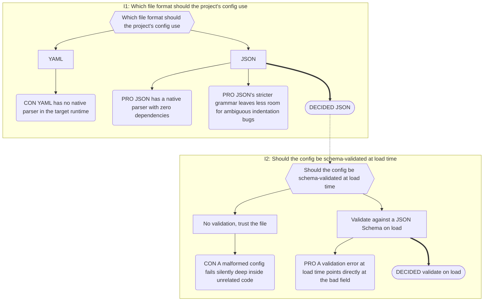
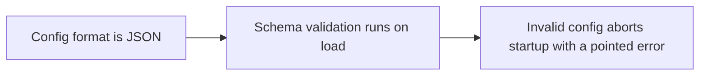

# Decision records (IBIS diagrams)

## Legend

This skill is the authoritative source for this notation — update it
directly if the legend ever changes.

| Shape           | IBIS role                                                         |
| --------------- | ----------------------------------------------------------------- |
| `{{ hexagon }}` | **Issue** — a question that had to be answered                    |
| `[ rectangle ]` | **Position** — a candidate answer                                 |
| `( rounded )`   | **Argument** — PRO or CON, attached to a position                 |
| `([ stadium ])` | **Decision** — the position taken. Reached by a thick `==>` arrow |

A dotted arrow (`-.->`) means _this decision forced that issue to be reopened_.

## Where records live

Decision records stay **embedded** in whichever design-doc file already
covers the topic, inside a `## Decision Record` section, as one or more
`## <N> <Title>` subsections (e.g. a file about a config-file format
decision would have `## Decision Record` → `## 1 Choosing a config format`).
If the project has no per-topic design-doc structure yet, keep them in a
dedicated project decision log instead.

**Never extract a decision record to a separate file, regardless of
size.** This is an intentional, confirmed design choice — legibility
problems are handled by the conventions below (subgraphs, orientation,
chain summaries), not by moving content out of its topic file.

## Creating a new decision record

1. Check the numbering registry for the next available number, wherever
   the project keeps one (a table of assigned IDs/titles/files, plus a
   "next available number" line, typically at the top of a decisions
   index file — or simply the highest existing number in the project if
   no such registry exists yet).
2. Add `## <N> <Title>` at the end of the topic file's existing
   `## Decision Record` section (create that section, right after the
   file's prose, if this is the file's first record).
3. Write one `flowchart TD` (or `LR` if 3+ issues from the start — see
   orientation rule below) Mermaid block following the legend and ID
   convention below.
4. Add the chain-summary line if the diagram has 2+ Issue nodes.
5. If the project keeps a numbering registry or a cross-topic index,
   update it with the new record's number, title, and file.
6. If the decision is load-bearing (later decisions would break if this
   one were reversed), add or extend its chain — see "Load-bearing
   chains" below.
7. Cross-check, optionally: if the project also keeps a plain table of
   ideas rejected without a full IBIS diagram, check any new CON node
   against it — add a row there if it's missing.

## Revising an existing decision

**Do not edit existing nodes or edges** beyond the one permitted
exception below (see "Maintaining records").

1. Add a new `subgraph` for the new Issue, continuing the Issue-scoped ID
   prefix (see below).
2. Draw a dotted arrow (`-.->`) from the old Decision node to the new
   Issue node.
3. **Permitted exception:** relabel the superseded Decision node in
   place — `D1([SUPERSEDED — see D6 — DECIDED ...])`. This is the only
   in-place edit allowed; every other change is additive.
4. Re-check whether the decision being revised is part of a load-bearing
   chain (see "Load-bearing chains" below). If so, flag the downstream
   decisions that may need re-justification before proceeding.
5. Update the rejected-ideas table (if the project keeps one) if a
   previously-accepted position is now rejected.

## Legibility rules

Apply all of these to new and revised diagrams.

1. **Chain summary line.** Immediately above any diagram with 2+ Issue nodes, add one
   plain-prose line naming the chain in order:
   `**Chain:** I1 file format → I2 schema validation → I3 migration strategy.`
   Skip this for single-issue diagrams — it adds no value there.

2. **Per-Issue `subgraph` grouping.** Wrap each Issue's cluster (its Issue node, its
   Positions, Arguments, and Decision) in a titled Mermaid `subgraph`:

   ```
   subgraph S1["I1: How wide is an alias rename allowed to reach"]
       I1{{...}}
       P1[...]
       ...
   end
   ```

   Subgraph IDs (`S1`, `S2`, ...) must be unique across the whole diagram, not just
   within one issue's cluster. Dotted "forced reopening" arrows cross subgraph
   boundaries freely in Mermaid — draw them **outside** the subgraph blocks, after the
   subgraph they originate from.

3. **Orientation.** Diagrams with 3+ issues use `flowchart LR` so the chain reads
   left-to-right like a timeline instead of growing indefinitely tall. Diagrams with 1–2
   issues keep `flowchart TD` (matches the single/double-issue examples).

4. **ID convention.** The first Issue keeps plain global IDs (`I1`, `P1`, `P2`, `C1`,
   `A1`, `D1`, `M1`, ...). Every subsequent Issue's cluster uses that issue's number as a
   prefix with a lettered suffix instead of continuing the global counter: `I2`, `P2a`,
   `P2b`, `C2a`, `A2a`, `M2a`. Decision nodes use just the issue number (`D2`) unless an
   issue has more than one Decision, in which case letter them too (`D2a`, `D2b`). This
   keeps each subgraph's contents self-describing without cross-referencing a flat
   `P1..P11` counter.

5. **Superseded-decision marking.** When a past Decision is genuinely overturned — not
   just "forced a new issue," which is the normal forward-consequence case — relabel the
   old stadium node in place: `D1([SUPERSEDED — see D6 — DECIDED ...])`. This is the one
   edit allowed alongside adding the new Issue node. Apply it only when a decision is
   truly reversed, not extended.

### Worked example

A minimal 2-issue diagram about choosing a config-file format, demonstrating the
subgraph/chain-summary/ID conventions in practice:

**Chain:** I1 config format → I2 schema validation.



## Load-bearing chains

Some decisions are load-bearing — later decisions assume them and would
break if reversed in isolation. Track these as a small `flowchart LR`
chaining short decision-name nodes with `-->`, kept wherever the
project's numbering registry lives (or alongside the decision records
themselves if no registry exists).



Before overturning any decision, check whether it appears in one of these
chains — reversing it in isolation may silently break every decision
downstream of it.

## Maintaining records

Do not edit an existing graph in place — add a new Issue node whose
incoming dotted arrow comes from the decision that forced the reopening,
and mark the superseded Decision node in place (the one permitted
exception). The value is the trail, not just the current state.

If the project keeps a separate rejected-ideas table, every entry there
should resolve to a CON node somewhere; if it doesn't, the rejection was
never actually argued.

## Checklist

Before committing a new or revised decision record, confirm:

- [ ] Numbering checked against the project's own registry, if one exists
- [ ] Legend shapes correct (hexagon/rectangle/rounded/stadium)
- [ ] Chain summary line present if 2+ issues
- [ ] Subgraphs present if 2+ issues, with unique IDs
- [ ] Orientation correct for issue count (`TD` for 1–2, `LR` for 3+)
- [ ] Project's own numbering registry updated, if one exists
- [ ] Cross-topic index updated, if the project keeps one
- [ ] Load-bearing chains checked and updated if relevant
- [ ] Rejected-ideas table cross-checked for any newly-argued rejection, if the project keeps one
