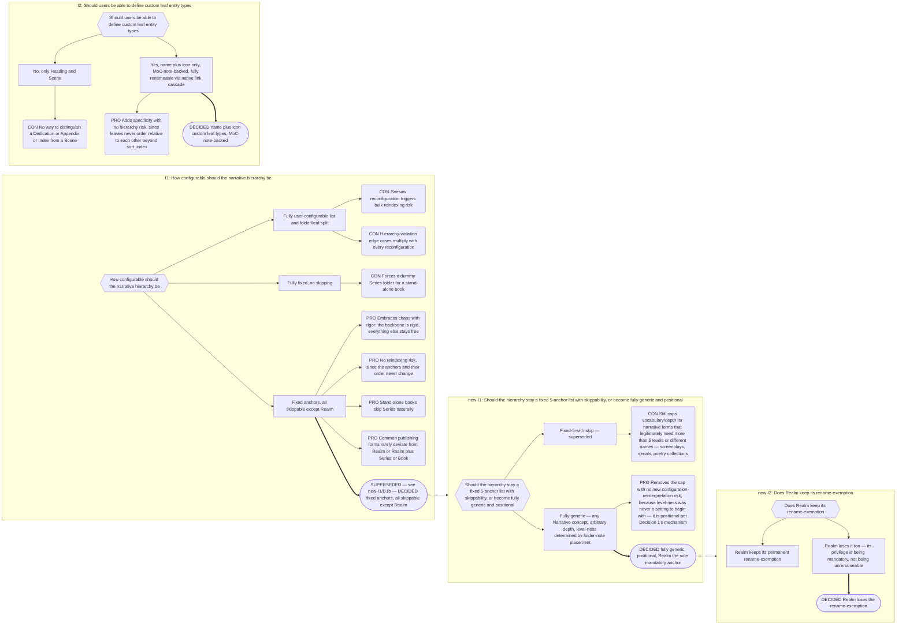

# Part 2: Configuration Model

## Part 2: Configuration Model

### 2.1 Ontology

- Type-marker property key. Default `is`.
- Per-category lists of concept links, grouped: **Narrative**, **Companion**,
  **Player**, **Plot**, **System**.
- **Narrative is structurally distinct from the other four categories, but no longer by
  a fixed folder/leaf split.** Folder-vs-leaf role is **positional**: determined
  per-instance by whether a given note matches the configured folder-note filename
  template for its folder (§4.1), not fixed by category. Any Narrative concept —
  **Scene and Heading included** — is eligible to become a boundary if placed as a
  matching folder note. **Realm remains the sole mandatory anchor** — the one thing that
  must exist for Narradin to do anything at all (§1, "The Realm Is the Universe of
  Discourse"). No fixed count or order of intermediate levels; depth is arbitrary and
  author-determined. `[OPEN Q-18]` — whether Scene/Heading eligibility should ever be
  restricted is explicitly left open (§15); this rewrite states the mechanism, not a
  restriction on it.
- **User-definable custom leaf types** remain: name and icon only — no hierarchy
  participation beyond what any other Narrative concept gets from folder-note placement.
  A custom leaf type not placed as a matching folder note is a leaf note for every
  purpose §7 defines, on equal footing with every other Narrative concept.
- **The names, icons, and relative order of every Narrative concept are configured, not
  locked.** Every Narrative concept — Realm included — is fully renameable via the
  existing native link-cascade mechanism (§2.4). Realm's privilege is being mandatory,
  not being unrenameable.
- **Universal MoC-note requirement.** Every `is` value configured anywhere in
  settings — every Narrative concept and every Companion/Player/Plot/System concept,
  with no exception — must have (or is auto-given) a concept note at
  `_narradin/entities/<Concept Name>.md`, resolved via Obsidian's link resolver/metadata
  cache exactly as any other `is` value (§2.4). This is not negotiable: there is no
  string-matched `is` value anywhere in Narradin, for any category.
- Shipped defaults:
  - Narrative — `Realm, Series, Book, Act, Chapter, Heading, Scene`, no custom leaf
    types shipped. These are ordinary, fully renameable Narrative concepts now — the
    shipped list is a starting point, not a fixed set.
  - Companion — Prose (default suffix `__prose`)
  - Player — Character, Object, Lore, Location, Other
  - Plot — Plot, Thread, Theme, Arc
  - System — Outtake

### 2.2 Hierarchy

- **Fully generic, arbitrary depth — no fixed list.** Any Narrative concept may act as
  a folder-level boundary purely by being placed as a matching folder note (§4.1);
  level-ness is **positional**, not a fixed property of the concept. There is no
  settings surface for a fixed hierarchy because there is no fixed hierarchy to
  configure.
- **Realm is the sole mandatory anchor.** Every other Narrative concept, at any depth,
  in any combination, is entirely author-determined. A vault may have no intermediate
  levels at all (`Realm/Scene 1.md`), or a deep custom chain the shipped Realm/Series/
  Book/Act/Chapter names were never designed to describe (screenplays, serials, poetry
  collections).
- **Transparent intermediate folders** — any folder containing no matching folder note —
  may appear anywhere in the tree, at any depth, without consequence. They contribute
  nothing to boundary resolution (§4.2) and never participate in the advisory order
  comparison (§2.3); a downward walk simply passes through them as if they were not
  there.
- **Order is advisory only, never structural.** A captured (but never enforced)
  expected order (§2.3) drives a purely informational comparison via the status-overlay
  mechanism (§12) — it never discards a candidate, never severs a subtree, and never
  gates resolution. See Decision Record B.2, I4, and B.17.

### 2.3 Other Settings

**Folder-note filename template** — one vault-wide setting: a template string
optionally containing a `{{folder}}` placeholder. Default `{{folder}}`, reproducing
today's name-matched behavior exactly. A placeholder-free string (e.g. `index`) mimics
a static-site-generator convention; `_{{folder}}` mimics the `_narradin` prefix.
**Recommended granularity: vault-wide**, matching Notebook Navigator's own setting
scope. This assumption about NN's actual settings surface is unconfirmed — worth a
quick check against real NN behavior/documentation during implementation, before this
locks in (tracked as an implementation-time check, not a spec-content open question;
see §15's "Open Items Carried Forward"). Consequences:

- A placeholder-free (fixed) template makes §4.3 Name Synchronisation **inapplicable**:
  a folder note's name never depends on the folder's name, so there is nothing to sync.
- Changing this setting after folder notes already exist requires a **bulk rename** via
  `fileManager.renameFile` (mirroring the concept-rename cascade, §2.4), a blast-radius
  confirmation modal (a third entry alongside §2.5's existing two), a **preview step**
  (mirroring §17.8's restore preview), and **per-file skip-and-report collision
  handling** (mirroring §4.3/§6.2/§6.6) rather than an all-or-nothing abort.
- A fixed template reintroduces vault-wide wikilink basename ambiguity for a link that
  must target one specific folder note (§8.4's Player/Plot compile Companion `for` link
  is the concrete case) — an accepted, documented trade-off, not a blocker (Decision
  Record B.1, new-I2).

**Captured (advisory) narrative level order** — an ordered list of Narrative concepts,
purely comparative, never consulted by boundary or scope resolution. Vault-wide, to
match the filename template's granularity. Feeds the `StatusOverlayProvider` (§12) as
its first consumer, via `HierarchyProvider`. See Decision Record B.2, I4.

**Indexing** — **Configurable keys** `sort_index` (must match Notebook Navigator's
configured property) and `folder_index`. Both are semantically mandatory; only their
names are user-configurable. See §9.0 ("Three Kinds of File Property Key") for the full
three-way file-property taxonomy.

**Positional values** — Configurable keys `pov` and `setting`. Neither is mandatory (a
note or host group may have no POV/setting at all, §16.4) — unlike `sort_index`/
`folder_index`, only the _name_ is reconfigurable while presence is optional, not
semantically mandatory.

**Companions** — suffix separator (default `__`); per-type suffixes; **companion type
order**. No companion type is mandatory; `__prose` ships as a default, nothing more.
Both the `is` value and the suffix are user-changeable, for i18n among other reasons.

> ⚠️ **Companion type order is semantically load-bearing.** It governs both compilation
> order (Part 8) and positional value resolution (§16.4). Reordering it changes which
> POV governs a companion that carries no declaration of its own. The settings UI must
> say so.

**Generated Companions** — the set of generated types. Default: one, `manuscript`,
suffix `__manuscript`.

**Context Vocabulary** — per Realm. Each entry: normalised context, display label, Icon
Registry key, and `role: opens | closes | none` (§9.6).

**Reserved Keys** — never interpreted as an Entity Property subject (§9.0). Configurable,
so an author whose character is genuinely named "Tags" can reclaim it.

**Alias Manager** — Source Note `is` values, selectable **only from already-configured
`is` values**, defaulting to all Player and Plot concepts. Master on/off toggle, **off by
default**. Owning device id. Conflict/report log location. Plain-text evidence toggle for
the Mention Index. There is no per-run tuning.

**Advisory thresholds** — POV segments per note before the Rashomon report fires
(default 3). Compile word count before confirmation.

**Icon Registry** — per-Realm overrides of shipped semantic-key bindings (§16.7). The
Icon Registry is the source of truth for a concept's icon; the per-note `icon`
frontmatter property (Part 11) is a denormalized cache of that binding, kept in sync by
the icon-change batch write (§2.4).

**System** — `_narradin` folder path. Default `_narradin` at vault root, **visible**.
Hide it via Notebook Navigator's folder exclusion; it must remain a real,
Obsidian-indexed folder (§2.4).

### 2.4 Concept Renames (Settings Migration)

Concept `is` values are wikilinks _specifically_ so renaming a concept can be delegated
to Obsidian. Changing `[[A Story Realm]]` to `[[Universe]]`:

1. Resolve `A Story Realm`. If no note exists anywhere, create
   `_narradin/entities/A Story Realm.md`.
2. Call Obsidian's rename API: `A Story Realm.md` → `Universe.md`.
3. Obsidian's native link updater cascades into every `is` property vault-wide,
   including path-qualified forms.

Consequences to honour:

- Because the target lives in `_narradin/entities`, a pre-existing user note named
  `Universe` causes no collision — Obsidian disambiguates by path.
- Therefore **all `is` reading resolves links through the metadata cache**, tolerating
  path prefixes (`[[_narradin/entities/A Story Realm]]`) and aliases. Never string-match
  the raw value.
- `_narradin` must be a normal indexed folder or the whole mechanism fails.

**Every Narrative concept, Realm included, is uniformly renameable.** Each still gets a
MoC note under `_narradin/entities/` per §2.1's universal requirement, and every concept
now shares this exact mechanism, unchanged, with full rename capability (Decision Record
B.17, new-I2). Realm's privilege is being mandatory, not being unrenameable — retiring
the old rename-exemption carve-out for the five former fixed anchors. No manual mass-
frontmatter rewrite is ever needed for a name change: the native link-rename cascade is
the entire mechanism, for every renameable concept alike.

**Icon changes.** Icon is a separate concern from renaming. Changing a concept's icon in
settings updates its binding in the Icon Registry (§16.7) and triggers a **batch
frontmatter write** of the `icon` property to every note carrying that concept's `is`
value, one `processFrontMatter` transaction per note. This applies uniformly, to every
Narrative concept and every other concept alike — icon changes are never blocked for
any of them. Per Idempotent Ingest (§1), this batch write needs no suppression of any
kind: events are idempotent, so reprocessing a note whose `icon` was just written is
safe (§12.1).

**Filename-template migration** (Decision 3, §2.3). Changing the folder-note filename
template after folder notes already exist is a distinct migration from a concept rename,
handled the same way structurally:

1. Enumerate every current Folder Note against the new template.
2. Present the same blast-radius confirmation modal pattern as §2.5, quantifying how
   many folder notes will be renamed.
3. Preview the full rename list (mirroring §17.8's restore preview) before committing.
4. Execute via `fileManager.renameFile`, one note at a time.
5. **Per-file skip-and-report collision handling** (mirroring §4.3/§6.2/§6.6): a
   collision on one file is skipped and logged, not an all-or-nothing abort — the rest
   of the migration proceeds.

### 2.5 Configuration Change Impact

The narrative hierarchy's _shape_ can change at any depth an author chooses simply by
placing or removing folder notes (§4.1) — this is ordinary authoring, not a
configuration change, and carries no settings-level blast radius of its own. Three
configuration surfaces have genuinely vault-wide interpretive reach:

- **Reserved Keys.** Adding or removing a Reserved Key changes which Entity Property
  subjects are excluded from resolution (§9.0) across the entire vault — a word that
  used to name a character can suddenly resolve, or vice versa.
- **Companion type order.** Reordering it changes which Companion governs positional
  value resolution (§16.4) for every host note that has more than one Companion and no
  explicit declaration of its own (§2.3).
- **Folder-note filename template.** Changing it reinterprets which existing notes are
  Folder Notes vault-wide, changing boundary status wherever a note's basename no longer
  (or newly) matches — see §2.4's migration procedure above.

Before committing a change to any of the three, Narradin presents a modal quantifying the
blast radius in terms specific to that surface — e.g. _"12 Entity Property subjects will
change resolution. Continue?"_, _"8 companions will resolve a different governing POV.
Continue?"_, or _"23 folder notes will be renamed to match the new template. Continue?"_
— rather than the old note-visibility framing, which no longer fits any of the three.
Narradin never deletes notes as a result of any of these changes.

**Decision: the settings-history snapshot mechanism survives, rescoped again.** All
three surfaces have interpretive blast radius wide enough, and hard enough to manually
reconstruct after the fact, that a reversal path is worth keeping cheap. Prior settings
are still snapshotted to `_narradin/settings-history/` before any of the three commits,
exactly as before — the set of settings this applies to has grown back to three.

---

## Decision Record

## B.17 Narrative Hierarchy Structure

**Chain:** I1 how fixed should the narrative hierarchy be → I2 should custom leaf types
be allowed → new-I1 should the hierarchy stay a fixed 5-anchor list with skippability,
or become fully generic/positional → new-I2 does Realm keep its rename-exemption.

**Why fixed-with-skippability lost the second time.** It solved the reconfiguration-risk
and empty-Series problems the first pass worried about, but it did so by capping every
vault to the same five names and depth — a cost that only became visible once narrative
forms outside the vanilla-novel case (screenplays, serials, poetry collections) were
considered. Once boundary status was redefined to require a matching folder note
(Decision 1, B.1), level-ness stopped needing to be a _setting_ at all: it is simply
whatever the author places. The reconfiguration risk the first pass fixed disappears for
a different reason — there is no "reconfiguration" left, only ordinary authoring.
