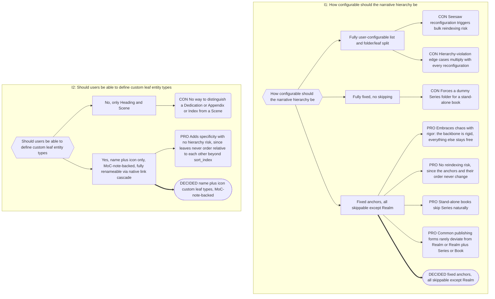

# Part 2: Configuration Model

## Part 2: Configuration Model

### 2.1 Ontology

- Type-marker property key. Default `is`.
- Per-category lists of concept links, grouped: **Narrative**, **Companion**,
  **Player**, **Plot**, **System**.
- **Narrative is structurally distinct from the other four categories.** It is not a
  flat list of concepts; it has three fixed parts:
  1. **Five fixed folder anchors**, in mandatory order: `Realm → Series → Book → Act →
Chapter`. Only Realm is mandatory; any of the other four may be skipped (§2.2).
  2. **Two fixed leaf types:** `Heading` and `Scene`. Never folder-level, never
     ordered relative to each other beyond `sort_index` (§7.3).
  3. **User-definable custom leaf types.** Name and icon only — no ordering capability
     of their own, no hierarchy participation. A custom leaf type is a leaf note for
     every purpose §7 defines, on equal footing with Heading and Scene.
  - The names, icons, and relative order of the 5 folder anchors and the 2 fixed leaf
    types are **locked, permanently.** No rename UI exists, and no code path ever
    invokes one for these 7 concepts. Custom leaf types, and every Companion/Player/
    Plot/System concept, remain fully renameable via the existing mechanism (§2.4).
- **Universal MoC-note requirement.** Every `is` value configured anywhere in
  settings — the 5 folder anchors, the 2 fixed leaf types, every custom leaf type, and
  every Companion/Player/Plot/System concept, with no exception — must have (or is
  auto-given) a concept note at `_narradin/entities/<Concept Name>.md`, resolved via
  Obsidian's link resolver/metadata cache exactly as any other `is` value (§2.4). This
  is not negotiable: there is no string-matched `is` value anywhere in Narradin, for
  any category, fixed or custom.
- Shipped defaults:
  - Narrative — folder anchors `Realm, Series, Book, Act, Chapter`; fixed leaf types
    `Heading, Scene`; no custom leaf types shipped.
  - Companion — Prose (default suffix `__prose`)
  - Player — Character, Object, Lore, Location, Other
  - Plot — Plot, Thread, Theme, Arc
  - System — Outtake

### 2.2 Hierarchy

- **Fixed order, not configured:** `Realm → Series → Book → Act → Chapter`. There is no
  settings surface for reordering, adding, removing, or renaming a folder anchor — the
  five above are the whole set, permanently.
- **All optional except Realm.** Any of Series, Book, Act, Chapter may be skipped.
  `Realm/Book A/` is valid with no Series; `Realm/Series/Act/Chapter` is valid with no
  Book. Order is constrained; completeness is not (§1).
- **Transparent intermediate folders** — any folder carrying no folder-anchor `is` and
  no folder note — may appear anywhere in the tree, at any depth, without consequence.
  They carry no `is`, so they contribute nothing to boundary resolution (§4.2) and never
  participate in order checks; a downward walk simply passes through them as if they
  were not there.
- Because the hierarchy is fixed, there is no configuration-change blast radius for it
  at all (contrast the old §2.5, now narrowed — see below): the 5 anchors and their
  order can never change, so no note's hierarchy interpretation can ever shift as a
  side effect of a settings change.

### 2.3 Other Settings

**Indexing** — **Configurable keys** `sort_index` (must match Notebook Navigator's
configured property) and `folder_index`. Both are semantically mandatory; only their
names are user-configurable. See §9.0 ("Three Kinds of File Property Key") for the full
three-way file-property taxonomy.

**Positional values** — Configurable keys `pov` and `setting`. Neither is mandatory (a
note or host group may have no POV/setting at all, §16.4) — unlike `sort_index`/
`folder_index`, only the _name_ is reconfigurable while presence is optional, not
semantically mandatory.

**Companions** — suffix separator (default `__`); per-type suffixes; **companion type
order**. No companion type is mandatory; `__prose` ships as a default, nothing more.
Both the `is` value and the suffix are user-changeable, for i18n among other reasons.

> ⚠️ **Companion type order is semantically load-bearing.** It governs both compilation
> order (Part 8) and positional value resolution (§16.4). Reordering it changes which
> POV governs a companion that carries no declaration of its own. The settings UI must
> say so.

**Generated Companions** — the set of generated types. Default: one, `manuscript`,
suffix `__manuscript`.

**Context Vocabulary** — per Realm. Each entry: normalised context, display label, Icon
Registry key, and `role: opens | closes | none` (§9.6).

**Reserved Keys** — never interpreted as an Entity Property subject (§9.0). Configurable,
so an author whose character is genuinely named "Tags" can reclaim it.

**Alias Manager** — Source Note `is` values, selectable **only from already-configured
`is` values**, defaulting to all Player and Plot concepts. Master on/off toggle, **off by
default**. Owning device id. Conflict/report log location. Plain-text evidence toggle for
the Mention Index. There is no per-run tuning.

**Advisory thresholds** — POV segments per note before the Rashomon report fires
(default 3). Compile word count before confirmation.

**Icon Registry** — per-Realm overrides of shipped semantic-key bindings (§16.7). The
Icon Registry is the source of truth for a concept's icon; the per-note `icon`
frontmatter property (Part 11) is a denormalized cache of that binding, kept in sync by
the icon-change batch write (§2.4).

**System** — `_narradin` folder path. Default `_narradin` at vault root, **visible**.
Hide it via Notebook Navigator's folder exclusion; it must remain a real,
Obsidian-indexed folder (§2.4).

### 2.4 Concept Renames (Settings Migration)

Concept `is` values are wikilinks _specifically_ so renaming a concept can be delegated
to Obsidian. Changing `[[A Story Realm]]` to `[[Universe]]`:

1. Resolve `A Story Realm`. If no note exists anywhere, create
   `_narradin/entities/A Story Realm.md`.
2. Call Obsidian's rename API: `A Story Realm.md` → `Universe.md`.
3. Obsidian's native link updater cascades into every `is` property vault-wide,
   including path-qualified forms.

Consequences to honour:

- Because the target lives in `_narradin/entities`, a pre-existing user note named
  `Universe` causes no collision — Obsidian disambiguates by path.
- Therefore **all `is` reading resolves links through the metadata cache**, tolerating
  path prefixes (`[[_narradin/entities/A Story Realm]]`) and aliases. Never string-match
  the raw value.
- `_narradin` must be a normal indexed folder or the whole mechanism fails.

**The 5 folder anchors and 2 fixed leaf types are exempt from this mechanism entirely.**
Each still gets a MoC note under `_narradin/entities/` per §2.1's universal requirement,
but no rename UI ever offers to change one, and no code path ever invokes the rename API
against one of these 7 concept notes. Every other concept — custom leaf types, and every
Companion, Player, Plot, and System concept — keeps this exact mechanism, unchanged, with
full rename capability. No manual mass-frontmatter rewrite is ever needed for a name
change: the native link-rename cascade is the entire mechanism, for every renameable
concept alike.

**Icon changes.** Icon is a separate concern from renaming. Changing a concept's icon in
settings updates its binding in the Icon Registry (§16.7) and triggers a **batch
frontmatter write** of the `icon` property to every note carrying that concept's `is`
value, one `processFrontMatter` transaction per note. This applies uniformly, including
to the 5 folder anchors and 2 fixed leaf types — icon changes are never blocked for
them, only renames are. Per Idempotent Ingest (§1), this batch write needs no
suppression of any kind: events are idempotent, so reprocessing a note whose `icon` was
just written is safe (§12.1).

### 2.5 Configuration Change Impact

The narrative hierarchy can no longer change (§2.2), so the old blast-radius framing —
"123 notes will be reinterpreted, 345 notes will no longer be visible" — no longer
applies to it at all. Two configuration surfaces remain with genuinely vault-wide
interpretive reach:

- **Reserved Keys.** Adding or removing a Reserved Key changes which Entity Property
  subjects are excluded from resolution (§9.0) across the entire vault — a word that
  used to name a character can suddenly resolve, or vice versa.
- **Companion type order.** Reordering it changes which Companion governs positional
  value resolution (§16.4) for every host note that has more than one Companion and no
  explicit declaration of its own (§2.3).

Before committing a change to either, Narradin presents a modal quantifying the blast
radius in terms specific to that surface — e.g. _"12 Entity Property subjects will
change resolution. Continue?"_ or _"8 companions will resolve a different governing POV.
Continue?"_ — rather than the old note-visibility framing, which no longer fits either
surface. Narradin never deletes notes as a result of either change.

**Decision: the settings-history snapshot mechanism survives, rescoped.** Both
remaining surfaces still have interpretive blast radius wide enough, and hard enough to
manually reconstruct after the fact, that a reversal path is worth keeping cheap. Prior
settings are still snapshotted to `_narradin/settings-history/` before either change
commits, exactly as before — only the set of settings this applies to has shrunk to
these two.

---

## Decision Record

## B.17 Narrative Hierarchy Structure

**Chain:** I1 how fixed should the narrative hierarchy be → I2 should custom leaf types
be allowed.

**Why fixed-with-skippability beat both alternatives.** A fully configurable hierarchy
made every reconfiguration a potential mass-reinterpretation event (§2.5's old framing)
and let authors construct order-violation edge cases the spec then had to define
behaviour for. A fully fixed hierarchy with no skipping is simpler but forces an empty
`Series` folder onto every stand-alone-book author. Fixed anchors with skippability gets
the safety of the former and the flexibility of the latter — the anchors never move, so
there is nothing left to reinterpret, while an author with no Series just doesn't create
one.
