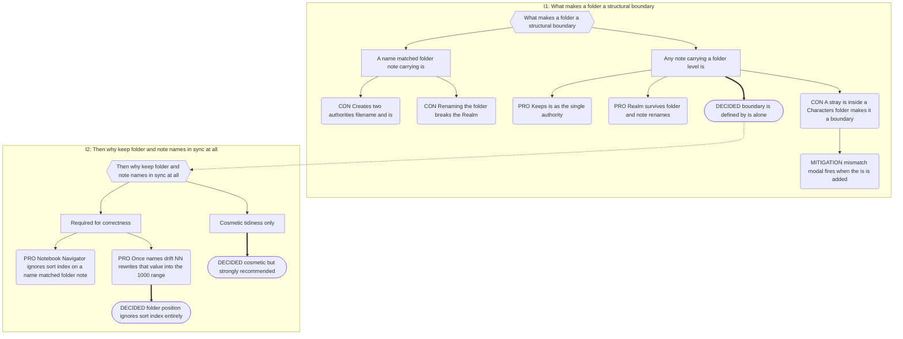

# Part 4: Structural Boundaries

## Part 4: Structural Boundaries

### 4.1 Definition

A folder is a **structural boundary** when it directly contains a note carrying a
**folder-level** Narrative `is` value. That note is the folder's Folder Note. Name
matching between folder and note is **not** required and never has been.

A Folder Note represents its folder to the folder's **parent**. It is never sorted among
its own children; it is yielded first (§7.3).

### 4.2 Boundary Resolution — Top-Down

**Level assignment is contextual, not local.** A declared level is validated against the
nearest _resolved_ ancestor boundary, so the Indexer resolves the tree **top-down from
each Realm root**. No component may determine boundary status by inspecting a folder in
isolation. Upward scope inheritance is a query against the already-resolved tree, never
an independent walk. Boundary/level resolution happens per-folder regardless of eventual
Realm-reachability; whether a folder's subtree ever reaches a Realm (and therefore what
`realmId` it gets, §5.5 Indexed Scope) is a separate, later determination, not a
precondition for resolving levels.

Per folder:

1. Collect all notes declaring a folder-level `is`.
2. **Discard order violations** — any candidate at or above the parent boundary's level.
   If this empties the set, the folder is not a boundary; the discarded candidates form
   an Island (§4.5).
3. **Nearest legal level wins.** Beneath a Realm, `Series` beats `Book`; beneath a
   Series, `Book` beats `Header`. Skipping is tolerated, never preferred: if the author
   bothered to say "Series", believe them.
4. **Still tied** — two or more candidates at the _same_ nearest legal level — apply the
   Universal Clash Resolution Protocol and fire the one-time **Two Kings** modal: there
   can be only one governing note per folder; the winner is named; the loser remains a
   valid Narrative note for traversal but does not govern the folder.

### 4.3 Name Synchronisation

A tidiness service, driven by `vault.on("rename")`. It never affects whether a boundary
exists.

| Trigger                                              | Behaviour                                                                                                                                              |
| ---------------------------------------------------- | ------------------------------------------------------------------------------------------------------------------------------------------------------ |
| Folder Note renamed, names previously matched        | Rename the folder to match.                                                                                                                            |
| Folder renamed                                       | Rename the Folder Note to match.                                                                                                                       |
| Note gains a folder-level `is`, name already matches | No action needed.                                                                                                                                      |
| Note gains a folder-level `is`, name ≠ folder name   | **Modal:** state the inconsistency; offer _rename folder to note_, _rename note to folder_, or _leave as is_.                                          |
| Either rename would collide                          | **Abort.** Notice: _"The 'X' [concept]'s folder could not be renamed to be in sync. Narradin will continue to work, but some results might look odd."_ |
| Folder Note is in the vault root                     | Never attempt to rename the vault directory. Silently skip.                                                                                            |

Events that re-evaluate boundary status: note create, `is` change, note rename, folder
rename. Deletion needs no name-sync handling.

**Why this matters beyond tidiness.** Notebook Navigator ignores the `sort_index` of a
_name-matched_ folder note. Once the names drift, NN begins including that note in manual
reorders and rewrites its `sort_index` unpredictably — typically renumbering it into the
~1000 range. Name sync is what keeps the two index properties cleanly separated.

**Consequence to accept.** Dropping a note with a folder-level `is` into
`Book 1/Characters/` makes `Characters` a boundary, truncating upward inheritance for
every Player inside. This is not silent — the mismatch modal fires on the `is` change and
states what happened. Choosing "leave as is" is an informed choice.

### 4.4 Legal Nesting

Nesting of any depth is permitted, Realm-inside-Realm included, provided the order rule
holds. Containment flows downward through it (§5.1). Narradin does not prevent, warn
about, or merge legal nesting.

### 4.5 Islands

An **Island** is a boundary declaring a level at or above its parent's — a Series folder
note inside a Book, a Realm inside a Book.

| Aspect                                      | Behaviour                                                                                                                                                                                                                                                                                                                                                                                                                                                                                                                                                                                                                                                                                 |
| ------------------------------------------- | ----------------------------------------------------------------------------------------------------------------------------------------------------------------------------------------------------------------------------------------------------------------------------------------------------------------------------------------------------------------------------------------------------------------------------------------------------------------------------------------------------------------------------------------------------------------------------------------------------------------------------------------------------------------------------------------- |
| Outer containment                           | **Excluded.** Not traversed, compiled, mentioned, reported, or written to by any ancestor Realm Scope.                                                                                                                                                                                                                                                                                                                                                                                                                                                                                                                                                                                    |
| Internal operation                          | **Normal** for Realm-rooted Islands, and for narrative-scope resolution _within_ a non-Realm-rooted Island's own subtree (Book/Series boundaries still resolve normally relative to each other inside it) — but a non-Realm-rooted Island as a whole still has no `realmId` and is therefore never compiled, never reported outside the single structure-issues line below.                                                                                                                                                                                                                                                                                                               |
| `realmId`, Island rooted in a Realm         | Inherited from being a Realm itself (§4.2). Contents remain visible to Narradin and retain blast-radius protection. **This Island is not an orphan.**                                                                                                                                                                                                                                                                                                                                                                                                                                                                                                                                     |
| `realmId`, Island **not** rooted in a Realm | **`null`.** Crossing an Island boundary is forbidden in both directions (§5.3), so a `realmId` can never be reached from outside and none exists inside. **This Island is a headless orphan** (Orphan Scope, §5.5): it still gets a Canonical Index row — Indexed Scope (§5.5) equals Narradin Scope, orphans included — but that row carries `realmId: null`. It has no Realm Scope, no Local Scope (§5.2's "no Realm reached" case applies), and falls outside Narrative Scope, so it remains invisible to every scope-bound operation (traversal, compile, mentions, reports, alias). The structure-issues report is a direct query for `realmId IS NULL` rows in the Canonical Index. |
| Reporting                                   | `_narradin/structure-issues.md`, naming the violation and both levels.                                                                                                                                                                                                                                                                                                                                                                                                                                                                                                                                                                                                                    |
| Island rooted in a Realm folder note        | A **first-class Realm** in its own right. It satisfies "no Realm, no play" on its own terms; the outer structure's opinion is irrelevant once severed.                                                                                                                                                                                                                                                                                                                                                                                                                                                                                                                                    |

**Rationale.** Narrative order is derived from physical traversal — that is what makes
dragging a Book folder reorder a manuscript in one gesture. Logically reattaching an
Island to a distant legal ancestor would require inventing a sort position it does not
physically have, destroying the "file tree _is_ the manuscript" model. Severance says,
honestly: _your notes are safe and still tracked, but this subtree won't appear in your
manuscript until the order is fixed._

### 4.6 Self-Containment

A Realm folder must be movable anywhere in the vault without breaking. Narradin therefore
never persists absolute paths as identity (§12.3) and never requires a file outside the
Realm folder. Templates may live inside or outside a Realm at the author's discretion.

---

## Decision Record

## B.1 Boundary Identity

**Chain:** I1 boundary identity → I2 why keep names in sync.

**Why sync stayed cosmetic.** The NN hazard is real but it attacks _ordering_, not
_identity_. Fixing it in the ordering rule (§7.3, folders positioned by `folder_index`
only) is strictly safer than making identity depend on a filename, because it removes
the failure mode instead of policing it.

---
