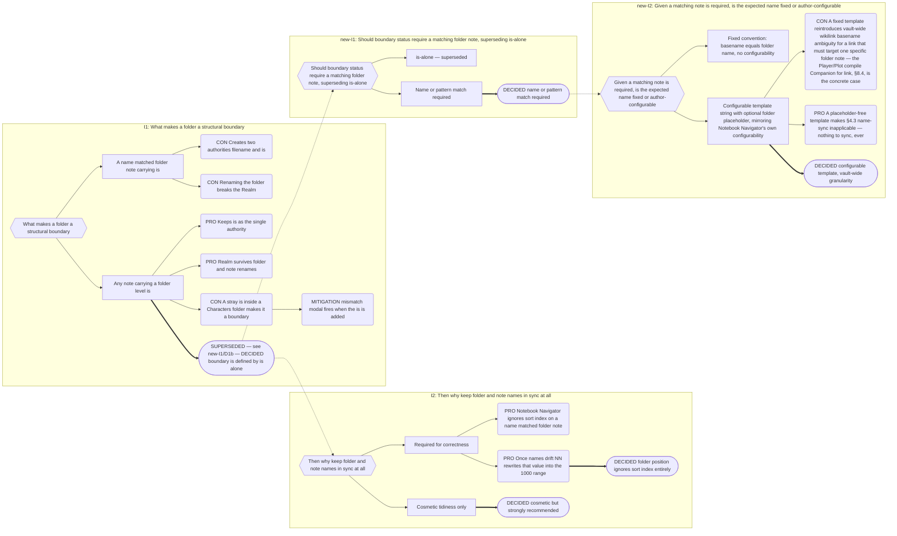

# Part 4: Structural Boundaries

## Part 4: Structural Boundaries

### 4.1 Definition

A folder is a **structural boundary** when it directly contains a note that (a) carries
a valid Narrative `is` value — any concept, not a fixed set (§2.1) — **and** (b) whose
basename matches the configured **folder-note filename template** (§2.3). That note is
the folder's Folder Note. Both conditions are required: an `is` value alone is no
longer sufficient (Decision Record B.1, reopened — the "name matching is not required"
position is superseded).

A **transparent intermediate folder** — one with no note satisfying both conditions
above — is simply not a candidate under this definition. No special-casing is needed:
either no note in it carries a valid Narrative `is`, or none matches the filename
template, so it never qualifies, and the resolution walk (§4.2) simply passes through
it.

A Folder Note represents its folder to the folder's **parent**. It is never sorted among
its own children; it is yielded first (§7.3).

### 4.2 Boundary Resolution — Top-Down

**Level assignment is positional, not ranked.** Because nothing severs structurally
anymore (Decision 4, §5.3), boundary resolution no longer validates a candidate against
the nearest resolved ancestor's level, or discards a candidate for being "at or above"
its parent. The Indexer still resolves the tree **top-down from each Realm root**,
because Local Scope and Realm Scope containment (§5.1–§5.3) are hierarchical facts that
must be computed in tree order — but no component determines boundary status by
inspecting a folder in isolation, and no component ranks one Narrative concept against
another to decide precedence. Upward scope inheritance is a query against the
already-resolved tree, never an independent walk.

Per folder:

1. Collect all notes that (a) carry a valid Narrative `is` value and (b) match the
   configured folder-note filename template (§2.3, §4.1). A transparent intermediate
   folder contributes zero candidates here — it simply recurses through to its children
   without altering boundary status anywhere in the chain.
2. **No structural order-violation discarding occurs.** A folder note's `is` value,
   whatever concept it names, governs its folder regardless of what governs the folder
   above or below it — there is no fixed sequence to violate. A separate,
   advisory-only comparison against the captured expected order (§2.3) feeds the
   `StatusOverlayProvider` mechanism (§12) — it never discards a candidate and never
   affects resolution (§4.5).
3. **Multiple candidates matching the filename template in the same folder** — near-
   vacuous now that boundary status requires a name match, not merely an `is` value: at
   most one note in a folder can resolve to the template's expected name under a
   case-sensitive comparison, so this case now arises only from case-insensitivity
   edge cases on certain filesystems. Where it does, the Universal Clash Resolution
   Protocol (§1.1) still applies and resolves deterministically: the ascending
   natural-sort step decides. There can be only one governing note per folder; the
   winner governs, the loser remains a valid Narrative note for traversal but does not
   govern the folder.

### 4.3 Name Synchronisation

Applies **only when the configured folder-note filename template (§2.3) contains a
`{{folder}}` placeholder** — today's default. Under a placeholder-free (fixed) template
(e.g. `index`), a Folder Note's name never depends on the folder's name at all, so this
entire section is **inapplicable**: there is nothing to sync, ever, under that regime.
What follows describes the `{{folder}}`-containing regime, unchanged from before.

A tidiness service, driven by `vault.on("rename")`. Under a `{{folder}}`-containing
template it is also **correctness-critical, not merely cosmetic**: since boundary
status now requires a name match (§4.1), a drifted name is not just an NN quirk — it
would cost the folder its boundary status entirely. See the note after Decision Record
B.1 for how this changes the historical "cosmetic sync" framing.

| Trigger                                                              | Behaviour                                                                                                                                              |
| -------------------------------------------------------------------- | ------------------------------------------------------------------------------------------------------------------------------------------------------ |
| Folder Note renamed, names previously matched                        | Rename the folder to match.                                                                                                                            |
| Folder renamed                                                       | Rename the Folder Note to match.                                                                                                                       |
| Note gains a valid Narrative `is`, name already matches              | No action needed.                                                                                                                                      |
| Note gains a valid Narrative `is`, name ≠ folder name (per template) | **Modal:** state the inconsistency; offer _rename folder to note_, _rename note to folder_, or _leave as is_.                                          |
| Either rename would collide                                          | **Abort.** Notice: _"The 'X' [concept]'s folder could not be renamed to be in sync. Narradin will continue to work, but some results might look odd."_ |
| Folder Note is in the vault root                                     | Never attempt to rename the vault directory. Silently skip.                                                                                            |

Events that re-evaluate boundary status: note create, `is` change, note rename, folder
rename. Deletion needs no name-sync handling.

**The idempotency invariant.** Before firing a corrective rename, this table's handler
checks whether the two names already match; if they do, it does nothing. A corrective
rename's own resulting event — folder renamed, or note renamed — passes back through this
same table and the same check, and finds "already matches," terminating without a second
action. This is what makes the table safe to drive from both directions without any
suppression mechanism: see Part 12 §12.1's "Idempotent Reactive Handlers," which uses
this exact table, worked both directions (note-renamed-first and folder-renamed-first),
as its canonical example rather than duplicating the full trace here.

**Why this matters beyond tidiness (and now beyond correctness too).** Notebook
Navigator ignores the `sort_index` of a _name-matched_ folder note. Once the names
drift, NN begins including that note in manual reorders and rewrites its `sort_index`
unpredictably — typically renumbering it into the ~1000 range. Name sync is what keeps
the two index properties cleanly separated — and, under a `{{folder}}`-containing
template, is also what keeps the folder a boundary at all.

**Consequence to accept.** Dropping a note with a valid Narrative `is` (matching the
filename template) into `Book 1/Characters/` makes `Characters` a boundary, truncating
upward inheritance for every Player inside. This is not silent — the mismatch modal
fires on the `is` change and states what happened. Choosing "leave as is" is an informed
choice.

### 4.4 Legal Nesting

Nesting of any depth is **unconditionally** permitted, Realm-inside-Realm included, full
stop — there is no order rule left to hold or violate (Decision 4, §5.3). Containment
flows downward through it (§5.1). Narradin does not prevent, warn about, or merge
nesting of any kind.

### 4.5 Order Advisories (formerly Islands)

**Islands, as a severing mechanism, are retired entirely.** No structural nesting ever
severs anything — Realm-in-Realm nesting included (Decision Record B.2, I5; see
Appendix A for the rejected alternative). This section's number and heading are
preserved for readers navigating by number, but the substance underneath has changed
completely: what survives is a purely advisory ordering comparison, with no severing
consequence whatsoever.

An author-captured **expected narrative level order** (§2.3) is compared, purely for
information, against the order boundaries are actually encountered on a downward walk.
A mismatch is surfaced through the `StatusOverlayProvider` mechanism (§12, Decision
Record B.25) — it never discards a candidate, never excludes a subtree from traversal,
compilation, mentions, or reports, and never gates any operation. There is no `realmId:
null` case arising from this anymore, no headless orphan sourced from a hierarchy
violation, and no separate outer-containment exclusion to document here — see §5.1/§5.3
for the (unconditional) containment rule and Orphan Scope (§5.5) for the one remaining,
Island-independent way a note can lack a Realm.

### 4.6 Self-Containment

A Realm folder must be movable anywhere in the vault without breaking. Narradin therefore
never persists absolute paths as identity (§12.3) and never requires a file outside the
Realm folder. Templates may live inside or outside a Realm at the author's discretion.
This holds under either filename-template regime: protected by §4.3's continued
name-sync under a `{{folder}}`-containing template, and trivially true under a fixed
template, since a Folder Note's name never depends on the folder's name at all.

---

## Decision Record

## B.1 Boundary Identity

**Chain:** I1 boundary identity → I2 why keep names in sync → new-I1 should boundary
status require a matching folder note, superseding `is`-alone → new-I2 given a matching
note is required, is the expected name fixed or author-configurable.

**Why sync stayed cosmetic — historically.** The NN hazard is real but it attacks
_ordering_, not _identity_, under the old is-alone boundary rule. Fixing it in the
ordering rule (§7.3, folders positioned by `folder_index` only) was strictly safer than
making identity depend on a filename, because it removed the failure mode instead of
policing it. **This framing no longer fully describes the current rule.** Now that
boundary status itself requires a name match (new-I1/D1b above), name drift under a
`{{folder}}`-containing template is load-bearing for _identity_ too, not just NN's
`sort_index` quirk — I2's "cosmetic but strongly recommended" conclusion describes only
the historical is-alone regime; §4.3 states the current, correctness-critical
consequence directly rather than reopening I2's diagram to say so.

---
