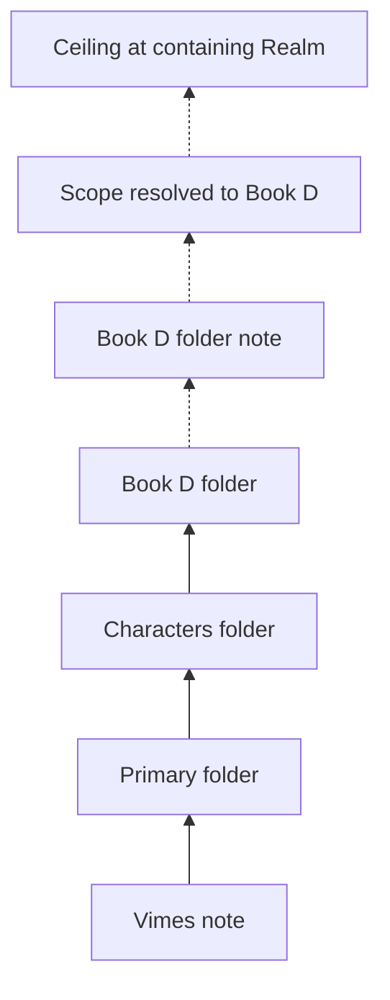
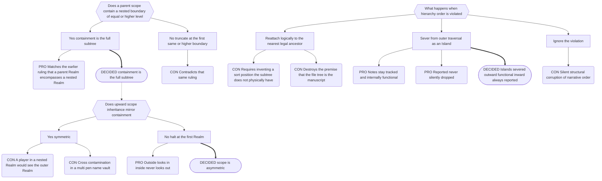

# Part 5: Scope

## Part 5: Scope

Scope is **asymmetric**. Two distinct operations, deliberately not mirror images.

### 5.1 Containment — outward-looking, downward

A Folder Note's scope is its **entire subtree**, including legally nested boundaries of
any level, Realms included. Nothing truncates a downward walk except an Island.

### 5.2 Inheritance — inward-looking, upward

Resolving the scope of a Player, Plot, or Companion walks **up** from its folder:

- stop at the first structural boundary — that boundary's scope is the note's scope;
- the walk **halts unconditionally at the first Realm**. It never sees a parent Realm and
  never sees a sibling;
- if no Realm is reached, the note has **no scope and is invisible to Narradin**. It is
  not global.

Organisational folders (`Characters/`, `Primary/`) carry no Folder Note and are
transparent to this walk.

**Players and Plot can never scope to a narrative leaf.** Their scope is always a
folder-level boundary. Companions can and do bind to leaves, because they bind through
`for`, not through position.

This makes the file explorer a functional tool: dragging a character note from
`Book 1/Characters/` to `Series/Characters/` promotes them from book-scoped to
series-scoped instantly.

### 5.3 The Membrane Rule

> The outside world looks in. The inside world does not look out. Nothing crosses into an
> Island, ever.

A _legally_ nested Realm is not a sandbox — its contents are readable and reportable from
the outer Realm. An _Island_ is fully sealed in both directions.

Writes need no separate rule: because alias propagation is bounded by the Source Note's
own scope (§10.6), an outer-Realm entity can never write into a nested Realm — its
ceiling is its own Realm.

### 5.4 Scope Is Mutable

A note's resolved scope changes when the note moves **or** when a boundary appears or
disappears above it. Both cases must be treated as scope changes; the second re-parents
many notes at once without any of them moving. This has direct consequences for pending
alias work (§10.7).

---

## Decision Record

## B.2 Scope, Islands, and the Membrane

**Why logical reattachment lost.** It sounds helpful and is quietly fatal. Narrative
order is _derived_ from physical traversal — that is what makes dragging a Book folder
reorder a manuscript. A reattached subtree has no physical position among its new
siblings, so any position assigned to it is invented, and the file tree stops predicting
the manuscript.

---
