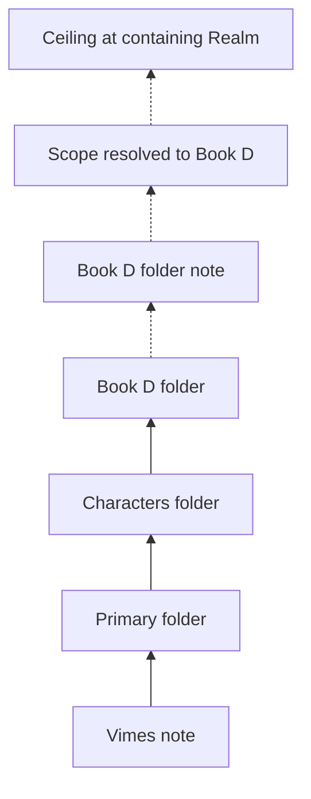
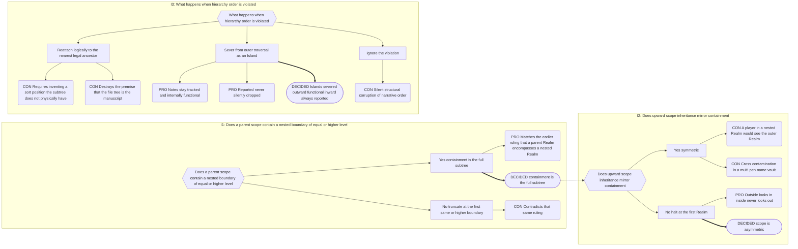

# Part 5: Scope

## Part 5: Scope

Scope is **asymmetric**. Two distinct operations, deliberately not mirror images.

### 5.1 Containment — outward-looking, downward

A Folder Note's **Local Scope** (§5.5) is its **entire subtree**, including legally
nested boundaries of any level, Realms included. Nothing truncates a downward walk
except an Island.

### 5.2 Inheritance — inward-looking, upward

Resolving the **Local Scope** (§5.5) of a Player, Plot, or Companion walks **up** from
its folder:

- stop at the nearest of the 5 fixed folder-anchor boundaries (§4.1/§4.2) — that
  boundary's scope is the note's scope. Any transparent intermediate folder along the
  way carries no `is`, so the walk passes straight through it without stopping — no
  special logic is needed, since it was never a candidate to begin with (§4.1);
- the walk **halts unconditionally at the first Realm**. It never sees a parent Realm and
  never sees a sibling;
- if no Realm is reached, the note has **no Local Scope and is invisible to Narradin**
  (Orphan Scope, §5.5). It is not global.

Organisational folders (`Characters/`, `Primary/`) carry no Folder Note and are
transparent to this walk.

**Players and Plot can never scope to a narrative leaf.** Their Local Scope is always a
folder-level boundary. Companions can and do bind to leaves, because they bind through
`for`, not through position.

This makes the file explorer a functional tool: dragging a character note from
`Book 1/Characters/` to `Series/Characters/` promotes them from book-scoped to
series-scoped instantly.

### 5.3 The Membrane Rule

> The outside world looks in. The inside world does not look out. Nothing crosses into an
> Island, ever.

A _legally_ nested Realm is not a sandbox — its contents are readable and reportable from
the outer Realm. An _Island_ is fully sealed in both directions — including outward
`realmId` lookup. An Island rooted in its own Realm folder note supplies that `realmId`
from within; any other Island can never acquire one and is therefore a headless orphan,
untracked by Narradin beyond the single structure-issues line naming it (§4.5). This
asymmetry — outside looks in, inside never looks out — is what makes **Realm Scope**
(§5.5) containment directional rather than a plain set union.

Writes need no separate rule: because alias propagation is bounded by the Source Note's
own Local Scope (§10.6), an outer-Realm entity can never write into a nested Realm — its
ceiling is its own Realm.

### 5.4 Scope Is Mutable

A note's resolved scope changes when the note moves **or** when a boundary appears or
disappears above it. Both cases must be treated as scope changes; the second re-parents
many notes at once without any of them moving. This has direct consequences for pending
alias work (§10.7).

### 5.5 Scope Taxonomy

Every other Part uses "scope" as an informal shorthand for one of the terms below. This
section is the single authoritative naming of each, so that a bare "scope" elsewhere in
this spec always resolves to exactly one of these.

**A. Classification scopes** (subsets of Narradin Scope by ontology category, Part 3)

| Scope               | Definition                                                                                                                                                                                                                                                                                                                 |
| ------------------- | -------------------------------------------------------------------------------------------------------------------------------------------------------------------------------------------------------------------------------------------------------------------------------------------------------------------------- |
| **Narradin Scope**  | Any note with a valid (settings-configured) `is` value.                                                                                                                                                                                                                                                                    |
| **Narrative Scope** | Narradin Scope notes with a valid Narrative-category `is` value (Part 3 #1) **that adhere to the fixed five-anchor hierarchy (§2.2/§4)**. A hierarchy break removes the note from Narrative Scope even though it keeps its Narrative ontology classification — this is what an Island (§4.5) is, expressed in scope terms. |
| **Player Scope**    | Narradin Scope notes with a valid Player-category `is` value (Part 3 #3). A classification set — distinct from "a given Player's resolved Local Scope" (§5.2), which is that one note's individual boundary.                                                                                                               |
| **Plot Scope**      | Narradin Scope notes with a valid Plot-category `is` value (Part 3 #4). Same classification-vs-individual-boundary distinction as Player Scope.                                                                                                                                                                            |
| **Companion Scope** | Narradin Scope notes with a valid Companion-category `is` value (Part 3 #2).                                                                                                                                                                                                                                               |
| **System Scope**    | Narradin Scope notes with a valid System-category `is` value (Part 3 #5), addressed only through the lozenge namespace (§9.2). Classification only — System concepts are not subject to boundary/inheritance resolution.                                                                                                   |

**B. Structural scopes** (containment/inheritance mechanics, §5.1–§5.3)

| Scope            | Definition                                                                                                                                                                                                                                                                                                                                                |
| ---------------- | --------------------------------------------------------------------------------------------------------------------------------------------------------------------------------------------------------------------------------------------------------------------------------------------------------------------------------------------------------- |
| **Realm Scope**  | The Narradin Scope subset whose paths converge, by containment (§5.1) or inheritance (§5.2), on a specific top-level (Realm-level) Narrative `is` value. A legally nested Realm's contents are included in its containing Realm's Realm Scope (§5.3) — this is the asymmetric Membrane Rule already stated in §5.3, just named here.                      |
| **Local Scope**  | The Narradin Scope subset whose paths converge on a specific note carrying a valid **folder-level** Narrative `is` value — i.e. exactly what §5.1 (Containment) and §5.2 (Inheritance) already compute. A Realm is itself a folder-level Narrative boundary, so when the boundary reached is a Realm, a note's Local Scope _is_ that Realm's Realm Scope. |
| **Orphan Scope** | Narradin Scope minus the union of every Realm Scope. Equivalently: notes for which §5.2's upward walk never reaches a Realm (headless, non-Realm-rooted Islands, §4.5). Defined by subtraction — this is _what_ an orphan is, not how it is detected or recorded.                                                                                         |

**C. Operational scopes** (used by the Indexer, Compiler, References, Reports)

| Scope                         | Definition                                                                                                                                                                                                                                                                                                                                                                                                                                                                                  |
| ----------------------------- | ------------------------------------------------------------------------------------------------------------------------------------------------------------------------------------------------------------------------------------------------------------------------------------------------------------------------------------------------------------------------------------------------------------------------------------------------------------------------------------------- |
| **Indexed Scope**             | Equal to Narradin Scope. Every note with a valid `is` value gets a Canonical Index row; Orphan Scope notes get one too, with `realmId: null` (§4.5).                                                                                                                                                                                                                                                                                                                                        |
| **Narrative Traversal Scope** | For a given anchor note: `(Local Scope ∩ Narrative Scope) − Orphan Scope`. The set of narrative entities belonging to the active Realm and falling within the anchor note's Local Scope. Example: anchoring on a Book folder note yields every nested Act/Chapter folder note and every Scene/Heading/custom-leaf note inside that Book.                                                                                                                                                    |
| **Compile Scope**             | For a given compile operation and the `is` value currently being processed from its `compile` array: the subset of the anchor note's Narrative Traversal Scope entities **and their Companions** whose `is` matches that value. Handles both Narrative-category compile targets (`[[A Scene]]`) and Companion-category compile targets (`[[Some Prose]]`) uniformly. Distinct from the ancestor/descendant **eligibility anchor**, which is simply the compiling note's Local Scope (§8.4). |
| **Reference-Valid Scope**     | The referencing note's own resolved Realm Scope (§5.2/§5.3). An Inline Property may name/target any entity within it; cross-Realm references are invalid. Narrower than this: the Alias Manager's rewrite blast radius, which is bounded by Local Scope, not Realm Scope (§10.6) — a deliberate Half-Fix, not a contradiction.                                                                                                                                                              |

_"Membraned Scope" was considered and rejected as a separate term — it is fully described
by Orphan Scope plus the existing asymmetric Containment/Inheritance rules (§5.1–§5.3) and
needs no new name._

---

## Decision Record

## B.2 Scope, Islands, and the Membrane

**Chain:** I1 nested containment → I2 upward inheritance → I3 hierarchy violations.

**Why logical reattachment lost.** It sounds helpful and is quietly fatal. Narrative
order is _derived_ from physical traversal — that is what makes dragging a Book folder
reorder a manuscript. A reattached subtree has no physical position among its new
siblings, so any position assigned to it is invented, and the file tree stops predicting
the manuscript.

---
