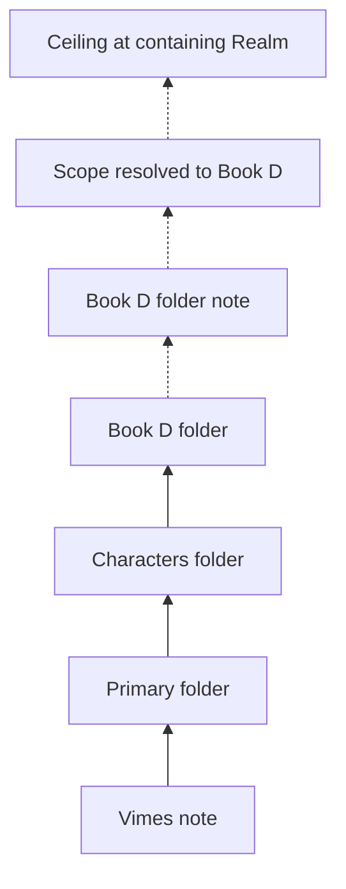

# Part 5: Scope

## Part 5: Scope

Scope is **asymmetric**. Two distinct operations, deliberately not mirror images.

### 5.1 Containment — outward-looking, downward

A Folder Note's **Local Scope** (§5.5) is its **entire subtree**, including nested
boundaries of any level, Realms included, at any depth. Nothing truncates a downward
walk — nesting of any kind, Realm-in-Realm included, is unconditionally legal (§4.4),
and nothing structural ever severs it (Decision Record B.2, I4/I5).

### 5.2 Inheritance — inward-looking, upward

Resolving the **Local Scope** (§5.5) of a Player, Plot, or Companion walks **up** from
its folder:

- stop at the nearest folder boundary (§4.1/§4.2) — any Narrative concept placed as a
  matching folder note, not a fixed anchor type — that boundary's scope is the note's
  scope. Any transparent intermediate folder along the way carries no matching folder
  note, so the walk passes straight through it without stopping — no special logic is
  needed, since it was never a candidate to begin with (§4.1);
- the walk **halts unconditionally at the first Realm**. It never sees a parent Realm and
  never sees a sibling — this rule is unchanged by Decision 4: nesting became
  unconditionally legal in every direction, but the upward walk still halts at the first
  Realm it meets, exactly as before;
- if no Realm is reached, the note has **no Local Scope and is invisible to Narradin**
  (Orphan Scope, §5.5). It is not global.

**This asymmetry is what produces the Membrane Rule.** Containment (§5.1) never
truncates downward; inheritance halts unconditionally at the first Realm upward. Put
together, an outer Realm's downward reach includes every Realm nested anywhere beneath
it, while nothing inside ever walks past its own containing Realm to look back out. The
Membrane Rule (§5.3) is simply this asymmetry, named.

Organisational folders (`Characters/`, `Primary/`) carry no Folder Note and are
transparent to this walk.

**Players and Plot can never scope to a narrative leaf.** Their Local Scope is always a
folder-level boundary. Companions can and do bind to leaves, because they bind through
`for`, not through position.

This makes the file explorer a functional tool: dragging a character note from
`Book 1/Characters/` to `Series/Characters/` promotes them from book-scoped to
series-scoped instantly.

### 5.3 The Membrane Rule

> The outside world looks in. The inside world does not look out.

**Unconditional, universal, no bifurcation.** Every nested Realm, at any depth, is
included in its outer Realm's Realm Scope — outer sees in, on _everything_, reporting
and Compile alike. There is no "legally nested" gate anymore (Decision 4): nesting of
any kind is unconditionally legal (§4.4), so there is no illegal case left to seal off
differently, and no Island exists to be sealed in both directions. Inner never sees
out — this half is unchanged and remains absolute. A bifurcated rule (reporting reaches
in, Compile stays Realm-bounded) was proposed and explicitly rejected (Decision Record
B.2, I6): self-containment was never actually a Realm-specific property, so
bifurcating it would manufacture an unjustified special case with no problem it uniquely
solves.

Self-containment is not a Realm-specific carve-out; it is the ordinary consequence of
every operation already being bounded by wherever it's anchored — its own Local Scope
(§5.2). An outer-Realm-anchored operation's Local Scope _is_ that outer Realm's full
subtree (§5.1), nested Realms included, so it legitimately reaches in; an
inner-Realm-anchored operation's Local Scope halts at its own Realm (§5.2), so it never
reaches out. Same mechanism, no bifurcation, for either direction — this is what makes
**Realm Scope** (§5.5) containment directional rather than a plain set union.

Writes need no separate rule: because alias propagation is bounded by the Source Note's
own Local Scope (§10.6), an outer-Realm entity can only write into a nested Realm when
that nested Realm genuinely falls within its own Local Scope's subtree — its ceiling is
its own Local Scope, exactly as everywhere else.

### 5.4 Scope Is Mutable

A note's resolved scope changes when the note moves **or** when a boundary appears or
disappears above it. Both cases must be treated as scope changes; the second re-parents
many notes at once without any of them moving. This has direct consequences for pending
alias work (§10.7).

**Worked example — moving between nested Realms.** Suppose a character note lives inside
`Earth-616/`, itself nested inside the outer `Marvel Multiverse/` Realm. Anchored at the
outer Realm, an operation run from `Marvel Multiverse/` sees into `Earth-616` (Membrane
Rule, §5.3) — the character is visible, reportable, compilable from that outer anchor.
Move the note to a sibling nested Realm, `Earth-1610/`: its Local Scope is now
`Earth-1610`, not `Earth-616` — instantly, per §5.2's ordinary upward walk, with no
special nested-Realm logic invoked. An operation anchored inside `Earth-616` that could
see the character a moment ago now cannot; an operation anchored in the outer `Marvel
Multiverse/` still can, because it still sees into every nested Realm in its own subtree.
Nothing new is needed here — this is exactly what §5.2's general rule already predicts,
illustrated concretely.

### 5.5 Scope Taxonomy

Every other Part uses "scope" as an informal shorthand for one of the terms below. This
section is the single authoritative naming of each, so that a bare "scope" elsewhere in
this spec always resolves to exactly one of these.

**A. Classification scopes** (subsets of Narradin Scope by ontology category, Part 3)

| Scope               | Definition                                                                                                                                                                                                                                                                                                                        |
| ------------------- | --------------------------------------------------------------------------------------------------------------------------------------------------------------------------------------------------------------------------------------------------------------------------------------------------------------------------------- |
| **Narradin Scope**  | Any note with a valid (settings-configured) `is` value.                                                                                                                                                                                                                                                                           |
| **Narrative Scope** | Narradin Scope notes with a valid Narrative-category `is` value (Part 3 #1). Since nothing severs structurally anymore (Decision 4), this simply equals every Narradin Scope note classified Narrative — there is no hierarchy-break exclusion left to state; Islands, which used to carve an exception here, are retired (§4.5). |
| **Player Scope**    | Narradin Scope notes with a valid Player-category `is` value (Part 3 #3). A classification set — distinct from "a given Player's resolved Local Scope" (§5.2), which is that one note's individual boundary.                                                                                                                      |
| **Plot Scope**      | Narradin Scope notes with a valid Plot-category `is` value (Part 3 #4). Same classification-vs-individual-boundary distinction as Player Scope.                                                                                                                                                                                   |
| **Companion Scope** | Narradin Scope notes with a valid Companion-category `is` value (Part 3 #2).                                                                                                                                                                                                                                                      |
| **System Scope**    | Narradin Scope notes with a valid System-category `is` value (Part 3 #5), addressed only through the lozenge namespace (§9.2). Classification only — System concepts are not subject to boundary/inheritance resolution.                                                                                                          |

**B. Structural scopes** (containment/inheritance mechanics, §5.1–§5.3)

| Scope            | Definition                                                                                                                                                                                                                                                                                                                                                             |
| ---------------- | ---------------------------------------------------------------------------------------------------------------------------------------------------------------------------------------------------------------------------------------------------------------------------------------------------------------------------------------------------------------------- |
| **Realm Scope**  | The Narradin Scope subset whose paths converge, by containment (§5.1) or inheritance (§5.2), on a specific Realm-level Narrative `is` value. Every nested Realm's contents, at any depth, are included in its containing Realm's Realm Scope (§5.3, unconditional) — this is the asymmetric Membrane Rule already stated in §5.3, just named here.                     |
| **Local Scope**  | The Narradin Scope subset whose paths converge on a specific note carrying a valid **folder-level** Narrative `is` value — i.e. exactly what §5.1 (Containment) and §5.2 (Inheritance) already compute. A Realm is itself a folder-level Narrative boundary, so when the boundary reached is a Realm, a note's Local Scope _is_ that Realm's Realm Scope.              |
| **Orphan Scope** | Narradin Scope minus the union of every Realm Scope. Equivalently: notes for which §5.2's upward walk never reaches a Realm. Independent of Islands, which are retired (§4.5) — this was always the simpler, more fundamental case, and survives their retirement unchanged. Defined by subtraction — this is _what_ an orphan is, not how it is detected or recorded. |

**C. Operational scopes** (used by the Indexer, Compiler, References, Reports)

| Scope                         | Definition                                                                                                                                                                                                                                                                                                                                                                                                                                                                                  |
| ----------------------------- | ------------------------------------------------------------------------------------------------------------------------------------------------------------------------------------------------------------------------------------------------------------------------------------------------------------------------------------------------------------------------------------------------------------------------------------------------------------------------------------------- |
| **Indexed Scope**             | Equal to Narradin Scope. Every note with a valid `is` value gets a Canonical Index row; Orphan Scope notes get one too (§12.3). There is no per-row `realmId` column anymore (Decision 5, Decision Records B.7/B.14); Realm membership for a row, if any, is computed on demand via the bounded ancestor walk, never stored.                                                                                                                                                                |
| **Narrative Traversal Scope** | For a given anchor note: `(Local Scope ∩ Narrative Scope) − Orphan Scope`. The set of narrative entities belonging to the active Realm and falling within the anchor note's Local Scope. Example: anchoring on a Book folder note yields every nested Act/Chapter folder note and every Scene/Heading/custom-leaf note inside that Book.                                                                                                                                                    |
| **Compile Scope**             | For a given compile operation and the `is` value currently being processed from its `compile` array: the subset of the anchor note's Narrative Traversal Scope entities **and their Companions** whose `is` matches that value. Handles both Narrative-category compile targets (`[[A Scene]]`) and Companion-category compile targets (`[[Some Prose]]`) uniformly. Distinct from the ancestor/descendant **eligibility anchor**, which is simply the compiling note's Local Scope (§8.4). |
| **Reference-Valid Scope**     | The referencing note's own resolved Realm Scope (§5.2/§5.3). An Inline Property may name/target any entity within it; cross-Realm references are invalid. Narrower than this: the Alias Manager's rewrite blast radius, which is bounded by Local Scope, not Realm Scope (§10.6) — a deliberate Half-Fix, not a contradiction.                                                                                                                                                              |

_"Membraned Scope" was considered and rejected as a separate term — it is fully described
by Orphan Scope plus the existing asymmetric Containment/Inheritance rules (§5.1–§5.3) and
needs no new name._

---

## Decision Record

## B.2 Scope, Islands, and the Membrane

**Chain:** I1 nested containment → I2 upward inheritance → I3 hierarchy violations →
I4 given generic levels, does anchor-order-violation still produce an Island → I5 does
Realm-in-Realm nesting still sever, given I4 removed severance for everything else → I6
does outer-sees-in apply only to reporting, or to Compile too.

```mermaid
flowchart LR
    subgraph S1["I1: Does a parent scope contain a nested boundary of equal or higher level"]
        I1{{Does a parent scope contain a nested boundary of equal or higher level}}
        P1[Yes containment is the full subtree]
        P2[No truncate at the first same or higher boundary]
        I1 --> P1
        I1 --> P2
        A1(PRO Matches the earlier ruling that a parent Realm encompasses a nested Realm)
        C1(CON Contradicts that same ruling)
        P1 --> A1
        P2 --> C1
        D1([DECIDED containment is the full subtree])
        P1 ==> D1
    end
    D1 -.-> I2
    subgraph S2["I2: Does upward scope inheritance mirror containment"]
        I2{{Does upward scope inheritance mirror containment}}
        P2a[Yes symmetric]
        P2b[No halt at the first Realm]
        I2 --> P2a
        I2 --> P2b
        C2a(CON A player in a nested Realm would see the outer Realm)
        C2b(CON Cross contamination in a multi pen name vault)
        P2a --> C2a
        P2a --> C2b
        A2a(PRO Outside looks in inside never looks out)
        P2b --> A2a
        D2([DECIDED scope is asymmetric])
        P2b ==> D2
    end
    subgraph S3["I3: What happens when hierarchy order is violated"]
        I3{{What happens when hierarchy order is violated}}
        P3a[Reattach logically to the nearest legal ancestor]
        P3b[Sever from outer traversal as an Island]
        P3c[Ignore the violation]
        I3 --> P3a
        I3 --> P3b
        I3 --> P3c
        C3a(CON Requires inventing a sort position the subtree does not physically have)
        C3b(CON Destroys the premise that the file tree is the manuscript)
        P3a --> C3a
        P3a --> C3b
        A3a(PRO Notes stay tracked and internally functional)
        A3b(PRO Reported never silently dropped)
        P3b --> A3a
        P3b --> A3b
        C3c(CON Silent structural corruption of narrative order)
        P3c --> C3c
        D3([SUPERSEDED — see I4/D4 — DECIDED Islands severed outward functional inward always reported])
        P3b ==> D3
    end
    D3 -.-> I4
    subgraph S4["I4: Given generic levels, does anchor-order-violation still produce an Island"]
        I4{{Given generic levels, does anchor-order-violation still produce an Island}}
        P4a[Keep enforcing order, Island per anchor mis-nesting — superseded]
        P4b[No structural enforcement at all, purely advisory]
        I4 --> P4a
        I4 --> P4b
        D4([DECIDED no structural enforcement, purely advisory])
        P4b ==> D4
    end
    D4 -.-> I5
    subgraph S5["I5: Does Realm-in-Realm nesting still sever, given I4 removed severance for everything else"]
        I5{{Does Realm-in-Realm nesting still sever, given I4 removed severance for everything else}}
        P5a[Realm-nesting is the one remaining severance trigger]
        P5b[Realm-nesting never severs either — unconditional Membrane visibility]
        I5 --> P5a
        I5 --> P5b
        C5a(CON Produces an inconsistent now I do now I don't UX — a Progressions report reaches a nested-Realm scene a Compile can't)
        P5a --> C5a
        A5a(PRO Restores and universalizes the original legally-nested-Realm outer-sees-in framing that blanket severance had accidentally collapsed)
        P5b --> A5a
        D5([DECIDED Realm-nesting never severs, unconditional Membrane visibility])
        P5b ==> D5
    end
    D5 -.-> I6
    subgraph S6["I6: Does outer-sees-in apply only to reporting, or to Compile too"]
        I6{{Does outer-sees-in apply only to reporting, or to Compile too}}
        P6a[Bifurcate — reporting reaches in, Compile stays Realm-bounded]
        P6b[Uniform — both reach in, self-containment comes from wherever an operation is anchored]
        I6 --> P6a
        I6 --> P6b
        C6a(CON Self-containment was never actually a Realm-specific property, so this manufactures an unjustified special case with no problem it uniquely solves)
        P6a --> C6a
        A6a(PRO Same mechanism, Local Scope anchoring, as every other boundary)
        P6b --> A6a
        D6([DECIDED uniform, no bifurcation])
        P6b ==> D6
    end
```

**Why logical reattachment lost.** It sounds helpful and is quietly fatal. Narrative
order is _derived_ from physical traversal — that is what makes dragging a Book folder
reorder a manuscript. A reattached subtree has no physical position among its new
siblings, so any position assigned to it is invented, and the file tree stops predicting
the manuscript.

**Why severance itself lost, the second time.** I3's severance answer solved a real
problem (silent structural corruption) but at the cost of a bifurcated UX: a report could
reach content a Compile could not, once nesting order became advisory rather than
enforced (I4). Reopening whether Realm-nesting alone should keep severing (I5) surfaced
the same inconsistency at a smaller scale — "now I do, now I don't" depending on which
operation asked. Removing severance entirely, and making self-containment purely a
function of where an operation is anchored (I6), removed the special case instead of
managing it.

---
