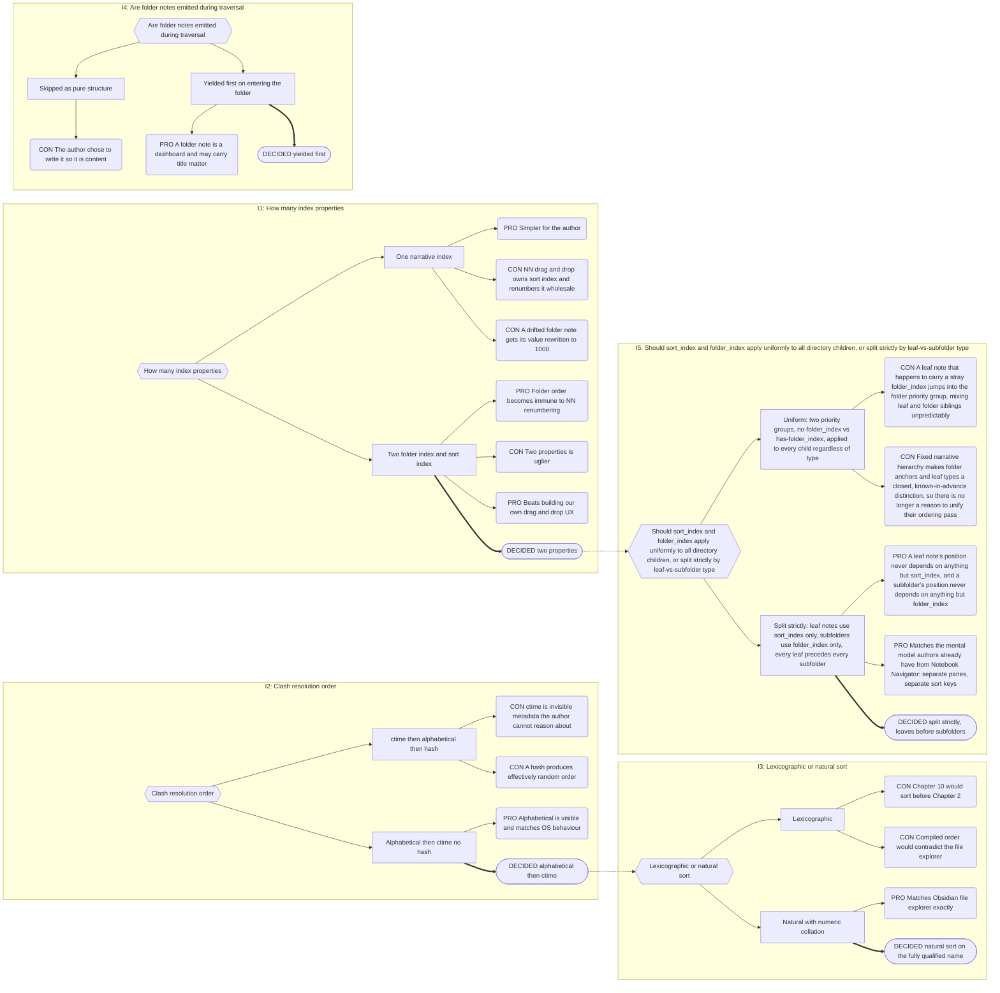

# Part 7: Hierarchy and Narrative Order

## Part 7: Hierarchy and Narrative Order

### 7.1 The Narrative Backbone

Along with `is`, the hierarchy is Narradin's narrative backbone.

- The narrative hierarchy is **fully generic and arbitrary-depth** (Decision Record
  B.17, reopened). There is no fixed chain of names — any Narrative concept may serve
  as a folder-level anchor via folder-note placement (§4.1); level-ness is positional,
  not a property of which concept it is.
- **Realm is the sole mandatory anchor.** Every other Narrative concept — whatever an
  author names it, at whatever depth — is entirely optional and entirely
  author-arranged. `Realm/Book A/` is valid with no intermediate level at all;
  `Realm/Scene 1.md` is valid with nothing between Realm and a leaf.
- Boundaries encountered on a downward walk are **not validated against any fixed
  order** — there is no sequence left to violate (Decision 4). A captured, purely
  advisory expected order (§2.3) drives an informational comparison via the
  `StatusOverlayProvider` (§12) — never a structural gate.
- Every Narrative concept placed as a matching folder note is a Folder Level; every
  Narrative concept **not** so placed — Heading, Scene, a custom concept, or even a
  concept that elsewhere in the vault does govern a folder — is a Leaf Level in that
  location. This is positional, per-instance, never a fixed property of the concept
  itself (§2.1).
- Anchor meanings vary wildly and Narradin does not care what an author uses any given
  folder-level concept to represent — the mechanism is fixed (folder-note placement),
  the intent behind any given concept is the author's.

**Chaos Override.** Any Narrative note that is **not** the governing Folder Note for its
folder is a leaf note, full stop — whatever concept it carries, name-matched to its
folder or not, alone in its own folder or not. A note's `is` value never by itself
creates a boundary; only matching the filename template while occupying that role does
(§4.1).

### 7.2 What Gets Traversed

- **Notes** — only those carrying a valid Narrative `is` (Absolute Opt-In).
- **Folders** — _all_ folders are descended into, marked or not. A transparent
  intermediate folder — one with no matching Folder Note (§4.1) — establishes no
  boundary and yields no content of its own; it is ordered among its siblings exactly
  like a folder that has no `folder_index` (§7.3), and its children are traversed by
  recursing into it with the same algorithm. Nesting of any depth, Realm-in-Realm
  included, is traversed straight through — nothing truncates it (§5.1, §5.3).
- **Excluded** — `_narradin` and Generated Companions. Nothing structural is excluded
  from traversal anymore; Islands, which used to be excluded here, are retired (§4.5).

### 7.3 Ordering Within a Directory

**Why two index properties.** Notebook Navigator presents folders and files in separate
panes; folders cannot be manually sorted, files can. NN's drag-and-drop writes
`sort_index` to files, interpolating between neighbours and renumbering wholesale
(typically restarting near 1000) when interpolation fails. `folder_index` is manual and
expected to be used sparingly — realistic for Books, Series, and Acts; nobody
hand-numbers beats.

**The classification oracle.** Whether a given note is the Folder Note (yielded first,
never sorted as a leaf or subfolder) or a leaf note is decided by §4.1/§4.2: does this
note match the configured folder-note filename template for its folder **and** carry a
valid Narrative `is`? This replaces the old "is the `is` value in the fixed leaf-type
set" test — the oracle is now about matching-and-placement, not about which concept a
note declares. Everything else below (folder-note-first, `sort_index` for leaves only,
`folder_index` for subfolders only, leaves-before-subfolders) is structurally
unchanged — none of it assumes Realms are a hard traversal stop, and none of it ever
did (§5.1).

**Algorithm, per directory — leaves before subfolders, strictly:**

1. **Yield the Folder Note first**, before anything else. It is not sorted among its
   children. Folder Notes are typically sparse dashboards, but they are the author's to
   fill and Narradin never skips them.
2. **Leaf notes, all of them, next.** Any Narrative note that is not its folder's
   governing Folder Note — per the classification oracle above — is ordered by
   `sort_index` only; missing defaults to `1`. Ties resolve by Clash Resolution — which,
   absent NN custom sort, means _all_ of them. **Leaf notes never carry or consult
   `folder_index`** — it plays no role in their position, ever.
3. **Subfolders, all of them, after every leaf note has been yielded.** Ordered by
   `folder_index` only, ascending; missing sorts last. Ties resolve by Clash Resolution.
   **Subfolders never carry or consult `sort_index` for positioning** — a subfolder's
   own Folder Note may carry a `sort_index` (NN writes one to every file except the
   folder note when custom sort is enabled), but it is never read for this purpose.
   This applies uniformly whether the subfolder carries a matching Folder Note, no
   matching note at all (a transparent intermediate folder), or one whose expected
   advisory order (§2.3, §4.5) doesn't match what was actually encountered — the
   ordering algorithm here does not special-case any of that; nothing is excluded from
   traversal anymore (Decision 4), so it simply assigns every subfolder a position
   among its siblings and recurses.
4. **Leaves are yielded entirely before any subfolder is recursed into.** This is a
   strict depth-first, leaves-before-children rule — every leaf note in a directory
   appears in the traversal output before the first note from any subfolder of that
   same directory, with no interleaving.
5. Recurse into each subfolder, in the order established by step 3, applying this same
   five-step algorithm to its contents.

**Folder positioning.** A folder is positioned solely by the `folder_index` on its Folder
Note. **A Folder Note's `sort_index` is ignored for positioning.**

> NN cannot sort folders, so a folder note's `sort_index` is never meaningful — but once
> its name drifts from the folder name, NN begins including it in manual reorders and
> rewrites that value, typically into the ~1000 range (§4.3). Honouring it would let a
> cosmetic mismatch silently relocate an entire Book to the end of its Series.

A folder with no `folder_index` sits at the default of `1` among other subfolders and
resolves against its subfolder siblings by Clash Resolution — the same default-and-tie
mechanism §1.1 already defines, applied here to `folder_index` rather than `sort_index`.

**Why the default index is 1, not 0.** Notebook Navigator treats `0` as equivalent to
null. Defaulting to `1` keeps Narradin aligned with NN — for `sort_index` on leaf notes
and `folder_index` on subfolders alike, each scoped strictly to its own item type per
steps 2–3 above. Note also that enabling custom sort on a folder in NN auto-populates
`sort_index` on every file except the folder note.

**Consequence, by design:** un-indexed leaf notes float to the top of the leaf group in
their directory, visibly, and un-indexed subfolders float to the top of the subfolder
group. A dedication with no index naturally precedes its siblings; an acknowledgements
note gets `sort_index: 999` and sinks toward the end of the leaf group. Chaos is
surfaced, not hidden.

```typescript
// Requirement expressed as code. Not an implementation.
function sortDirectory(items: NarradinItem[]): NarradinItem[] {
    const leaves = items
        .filter(i => i.kind === 'leaf')
        .sort((x, y) => (x.sort_index ?? 1) - (y.sort_index ?? 1) || resolveClash(x, y));
    const subfolders = items
        .filter(i => i.kind === 'subfolder')
        .sort((x, y) => (x.folder_index ?? 1) - (y.folder_index ?? 1) || resolveClash(x, y));
    return [...leaves, ...subfolders];  // folder note already yielded ahead of both
}
```

### 7.4 Acceptance Fixtures

Locked ground truth for the traversal engine. Re-derived from scratch against the
leaves-before-subfolders algorithm in §7.3 — do not compare against any earlier fixture
set that interleaved leaf notes and folders at the same level.

**Fixture 1 — leaves before subfolders, both indexed, and a leaf's stray `folder_index` ignored**

```
Realm (folder)
  Realm.md               is [[A Realm]]   folder_index 1
  Series (folder)
    Series.md            is [[A Series]]  folder_index 1
    Scene C.md            is [[A Scene]]   sort_index 23
    Scene D.md            is [[A Scene]]   folder_index 2
    Book A (folder)
      Book A.md          is [[A Book]]    folder_index 3
      Scene A.md         is [[A Scene]]   sort_index 1   ctime 234
      Scene B.md         is [[A Scene]]   sort_index 1   ctime 123
    Book B (folder)
      Book B.md          is [[A Book]]    folder_index 2
      Scene E.md         is [[A Scene]]   sort_index 1
      Scene F.md         is [[A Scene]]   sort_index 2
```

At the Series level, `Scene C` and `Scene D` are leaf notes — both yielded before either
`Book A` or `Book B`, ordered by `sort_index` alone. `Scene D` carries a `folder_index`
of `2` and no `sort_index` — a leaf note never consults `folder_index` (§7.3 step 2), so
it defaults to `sort_index: 1` regardless, placing it **ahead of** `Scene C` (23), not
between `Book B` and `Book A` as the stray value might suggest. `Book A` and `Book B`
are subfolders — ordered by `folder_index` alone, with `Book B` (2) before `Book A` (3).

Expected: `Realm.md`, `Series.md`, `Scene D`, `Scene C`, `Book B.md`, `Scene E`,
`Scene F`, `Book A.md`, `Scene A`, `Scene B`.

**Fixture 2 — a transparent intermediate folder and a skipped level**

```
Realm (folder)
  Realm.md               is [[A Realm]]   folder_index 1
  Book A (folder)
    Book A.md            is [[A Book]]    folder_index 1
    WIP (folder, no is, no folder note — transparent)
      Chapter 1 (folder)
        Chapter 1.md      is [[A Chapter]]  folder_index 1
        Scene G.md        is [[A Scene]]    sort_index 1
      Scene H.md          is [[A Scene]]    sort_index 1
```

`Realm/Book A/` has no Series between them — Series is skipped, which is legal (only
Realm is unskippable, §7.1). `WIP` carries no `is` and no folder note, so it is a
transparent intermediate folder: it establishes no boundary of its own and is ordered
among `Book A`'s subfolders exactly like any other subfolder (here, the only one, so it
sorts by the `folder_index` default of `1`), then recursed into with this same
algorithm. Inside `WIP`, `Scene H` is a leaf note yielded before the `Chapter 1`
subfolder is recursed into, by the same leaves-before-subfolders rule — `WIP` is not
itself a boundary, but the ordering algorithm treats its contents like any directory's.

Expected: `Realm.md`, `Book A.md`, `Scene H`, `Chapter 1.md`, `Scene G`.

> **Note.** These fixtures supersede an earlier set that mixed leaf notes and folders
> into two priority groups (Group A/no-`folder_index`, Group B/has-`folder_index`)
> applied uniformly to all directory children. That model is retired (Decision Record
> B.3, Issue 5): leaves and subfolders no longer share one ordering pass at all — leaves
> use `sort_index` exclusively, subfolders use `folder_index` exclusively, and every
> leaf note precedes every subfolder, full stop. `ctime` remains decorative in Fixture
> 1: `Scene A.md` and `Scene B.md` still resolve at Clash Resolution step 1 (natural
> sort on the fully qualified name), never reaching step 2.

### 7.5 Content Sequence

The **Content Sequence** of a Narrative Traversal Scope (§5.5) is the narrative sequence
(§7.3) with each note followed immediately by its Companions in configured companion
type order. Generated Companions are excluded; Islands, which used to be excluded here
too, are retired (§4.5) — nothing is structurally excluded from the Content Sequence
anymore beyond that one case.

**Traversal never truncates at a nested Realm boundary.** This is a real behavior
consequence of Decision 4 (§5.1, §5.3), not a special case stated here for the first
time: several consumers — the Compiler (Part 8), every view (Part 16), and POV
positional resolution (§16.4) — depend on the Content Sequence walking straight through
a nested Realm exactly as it would through any other folder-level boundary.

Defined once, consumed by the Compiler (Part 8), every view (Part 16), positional value
resolution (§16.4), and health reporting. There is no second traversal anywhere.

**Ordering is orthogonal to filtering.** Each entry carries enough for a consumer to
decide without re-deriving anything:

```typescript
// Requirement expressed as a shape. Not an implementation.
interface ContentSequenceEntry {
    id: number;                 // Indexer ++id
    path: string;
    category: 'narrative' | 'companion';
    is: string;                 // resolved concept
    role: 'narrative-folder' | 'narrative-leaf' | 'companion';
    companionType?: string;     // e.g. 'prose', 'research'
    hostId?: number;
    sequenceIndex: number;      // this entry's index in the Content Sequence
    companionRank: number;      // 0 for the host note; 1..n for its companions in configured type order
}
```

**These two fields, not the Inline Property `Position`.** `sequenceIndex` and
`companionRank` are host-level facts about _this entry_ — the note or Companion itself —
not the narrower per-property `(line, offset, blockId)` tuple defined in §9.7. A
consumer composing a full cross-note sort key (Progressions, mention ordering) joins an
Inline Property's `(line, offset)` with its host's `(sequenceIndex, companionRank)` here,
via `fileId`/`id` — the two never travelled together in one struct (Appendix B §B.6).

A consumer skipping `research` companions filters on `companionType`; order is untouched.

---

## Decision Record

## B.3 Narrative Ordering

**Chain:** I1 index property count → I2 clash resolution order → I3 lexicographic vs
natural sort → I4 folder note emission → I5 do the two index properties apply uniformly
or split strictly by leaf-vs-subfolder type.



**The consequence nobody predicted.** NN only writes `sort_index` where custom sort has
been enabled. Everywhere else every item defaults to `1` and ties — so **clash
resolution is the default ordering mechanism, not an exotic tiebreak.** This is why the
natural-versus-lexicographic choice mattered far more than it appeared to when it was
raised.

---
