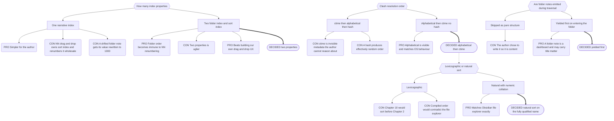

# Part 7: Hierarchy and Narrative Order

## Part 7: Hierarchy and Narrative Order

### 7.1 The Steel Thread

Along with `is`, the hierarchy is Narradin's steel thread.

- The author defines an ordered list of Narrative levels.
- Folder Levels are a contiguous prefix from the top.
- Boundaries encountered on a downward walk must **descend in configured order**.
  Violations create Islands (§4.5).
- **Only Realm is unskippable.** `Realm/Book A/` is valid with no Series.
  `Realm/Series/Header/Scene` is valid with no Book. Order is constrained; completeness
  is not.
- Level meanings vary wildly and Narradin does not care: a Header may be a section,
  prologue, dedication, act, or chapter; a leaf may be a chapter, scene, or beat.

**Chaos Override.** Any note carrying a leaf-level `is` is a leaf note, full stop —
name-matched to its folder or not, alone in its own folder or not. Leaf `is` values never
create boundaries.

### 7.2 What Gets Traversed

- **Notes** — only those carrying a valid Narrative `is` (Absolute Opt-In).
- **Folders** — _all_ folders are descended into, marked or not. An unmarked folder is a
  transparent container: it participates in sibling ordering (always Group A, since it
  can carry no index), establishes no boundary, and yields no content.
- **Excluded** — Islands (from outer traversal only), `_narradin`, and Generated
  Companions.

### 7.3 Ordering Within a Directory

**Why two index properties.** Notebook Navigator presents folders and files in separate
panes; folders cannot be manually sorted, files can. NN's drag-and-drop writes
`sort_index` to files, interpolating between neighbours and renumbering wholesale
(typically restarting near 1000) when interpolation fails. `folder_index` is manual and
expected to be used sparingly — realistic for Books, Series, and some Headers; nobody
hand-numbers beats.

**Algorithm, per directory:**

1. **Yield the Folder Note first**, before anything else. It is not sorted among its
   children. Folder Notes are typically sparse dashboards, but they are the author's to
   fill and Narradin never skips them.
2. **Group A — no `folder_index`.** Sorted by `sort_index`; missing defaults to `1`. Ties
   resolve by Clash Resolution — which, absent NN custom sort, means _all_ of them.
   Emitted **before** Group B.
3. **Group B — has `folder_index`.** Sorted ascending. Ties → Clash Resolution.
4. Yield leaf notes as encountered; recurse into folders as encountered.

**Folder positioning.** A folder is positioned solely by the `folder_index` on its Folder
Note. **A Folder Note's `sort_index` is ignored for positioning.**

> NN cannot sort folders, so a folder note's `sort_index` is never meaningful — but once
> its name drifts from the folder name, NN begins including it in manual reorders and
> rewrites that value, typically into the ~1000 range (§4.3). Honouring it would let a
> cosmetic mismatch silently relocate an entire Book to the end of its Series.

A folder with no `folder_index` sits in Group A at the default of `1` and resolves against
its siblings by Clash Resolution.

**Why the default index is 1, not 0.** Notebook Navigator treats `0` as equivalent to
null. Defaulting to `1` keeps Narradin aligned with NN. Note also that enabling custom
sort on a folder in NN auto-populates `sort_index` on every file except the folder note.

**Consequence, by design:** un-indexed notes float to the top of their directory, visibly.
A dedication with no index naturally precedes Book folders; an acknowledgements note gets
`folder_index: 999` and sinks. Chaos is surfaced, not hidden.

```typescript
// Requirement expressed as code. Not an implementation.
function sortDirectory(items: NarradinItem[]): NarradinItem[] {
    const a = items
        .filter(i => i.folder_index == null)
        .sort((x, y) => (x.sort_index ?? 1) - (y.sort_index ?? 1) || resolveClash(x, y));
    const b = items
        .filter(i => i.folder_index != null)
        .sort((x, y) => x.folder_index - y.folder_index || resolveClash(x, y));
    return [...a, ...b];  // folder note already yielded ahead of both
}
```

### 7.4 Acceptance Fixtures

Locked ground truth for the traversal engine.

**Fixture 1**

```
Realm (folder)
  Realm.md               is [[A Realm]]   folder_index 1
  Series (folder)
    Series.md            is [[A Series]]  folder_index 1
    Scene C.md           is [[A Scene]]   sort_index 23
    Scene D.md           is [[A Scene]]   folder_index 2
    Book A (folder)
      Book A.md          is [[A Book]]    folder_index 3
      Scene A.md         is [[A Scene]]   sort_index 1   ctime 234
      Scene B.md         is [[A Scene]]   sort_index 1   ctime 123
```

Expected: `Realm.md`, `Series.md`, `Scene C`, `Scene D`, `Book A.md`, `Scene A`,
`Scene B`.

**Fixture 2** — as above, plus:

```
    Book B (folder)
      Book B.md          is [[A Book]]    folder_index 2
      Scene E.md         is [[A Scene]]   sort_index 1
      Scene F.md         is [[A Scene]]   sort_index 2
```

At Series level: Group A = `Scene C`. Group B = `Book B` (2), `Scene D` (2), `Book A` (3).
`Book B` and `Scene D` tie at 2; fully-qualified natural sort gives `Book B` first.

Expected: `Realm.md`, `Series.md`, `Scene C`, `Book B.md`, `Scene E`, `Scene F`,
`Scene D`, `Book A.md`, `Scene A`, `Scene B`.

> **Note.** When these fixtures were first walked by hand, folder notes were skipped and
> Clash Resolution led with `ctime`, giving `Scene B, Scene A`. Both rules have since
> changed. The values above reflect current rules and supersede the originals. Note also
> that `ctime` is now decorative here: `Scene A.md` and `Scene B.md` resolve at step 1.

### 7.5 Content Sequence

The **Content Sequence** of a scope is the narrative sequence (§7.3) with each note
followed immediately by its Companions in configured companion type order. Islands and
Generated Companions are excluded.

Defined once, consumed by the Compiler (Part 8), every view (Part 16), positional value
resolution (§16.4), and health reporting. There is no second traversal anywhere.

**Ordering is orthogonal to filtering.** Each entry carries enough for a consumer to
decide without re-deriving anything:

```typescript
// Requirement expressed as a shape. Not an implementation.
interface ContentSequenceEntry {
    id: number;                 // Indexer ++id
    path: string;
    category: 'narrative' | 'companion';
    is: string;                 // resolved concept
    role: 'narrative-folder' | 'narrative-leaf' | 'companion';
    companionType?: string;     // e.g. 'prose', 'research'
    hostId?: number;
    position: Position;         // sequenceIndex + companionRank populated
}
```

A consumer skipping `research` companions filters on `companionType`; order is untouched.

---

## Decision Record

## B.3 Narrative Ordering



**The consequence nobody predicted.** NN only writes `sort_index` where custom sort has
been enabled. Everywhere else every item defaults to `1` and ties — so **clash
resolution is the default ordering mechanism, not an exotic tiebreak.** This is why the
natural-versus-lexicographic choice mattered far more than it appeared to when it was
raised.

---
