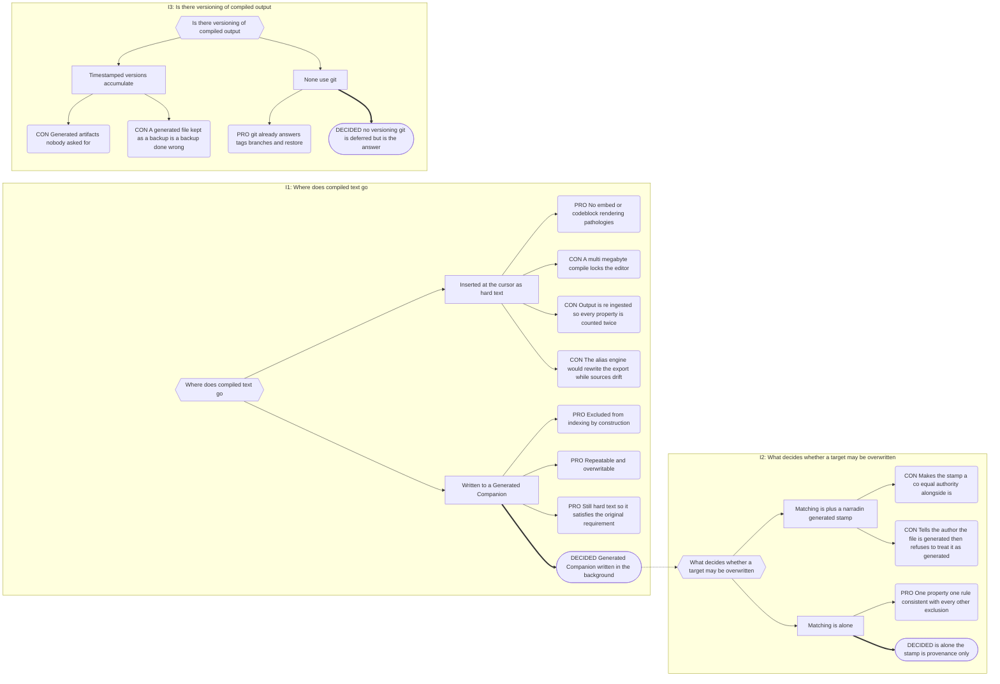

# Part 8: The Compiler

## Part 8: The Compiler

**Goal:** walk the Content Sequence within a scope and emit designated content as hard
text.

### 8.1 Core Behaviour

- **Trigger** — a command from a note carrying a `compile` property. That note's location
  determines the compiling note's **Local Scope**, which anchors both the **Compile
  Scope** (§5.5) and the eligibility test in §8.4: run it from a Book folder note,
  compile that Book; from a Series folder note, compile the Series.
- **Interaction** — a modal confirming compile types, resolved **Compile Scope**, and
  estimated word count. **No editor involvement.**
- **Output** — a **Generated Companion** containing hard text. Never an embed, never a
  codeblock, never an insertion at the cursor. Written in the background; a notice with a
  click-to-open action fires on completion.
- **`compile` property** — an array of concept links naming which `is` types to emit.
  - `["[[Some Prose]]"]` — the manuscript.
  - `["[[A Scene]]", "[[A Heading]]"]` — an outline from the dashboards.
  - `["[[Character]]"]` — a cast list (§8.4).
- **Per-host order** — the host note first if matched, then its Companions in
  `compile`-array order. Content Sequence order governs across hosts.
- **Non-markdown Companions** — emitted as transclusions; there is no alternative.
  Transclusions already present in source markdown pass through verbatim: they are
  content, not compile directives.
- **Islands** — excluded from any outer compile. Compiling _from inside_ an Island works
  normally; no banner, since the health report covers it.

**Content transform** — deferred to build. Expected: frontmatter stripped, Entity
Property syntax resolved (`{+…=v}` → `v`; `{~…}`, `{-…}` → nothing), heading remapping,
inter-note separators, and a toggleable CMOS pass for prose compiles (ellipses,
em-dashes, quote style). `[OPEN Q-2]`

### 8.2 Rendering Fidelity

Hard text rather than embeds or codeblocks is deliberate. Embeds carry their own display
pathologies — nested frames, broken heading levels, transclusion depth limits — and a
codeblock is not a manuscript. The output must be something an author can select, copy,
and hand to an editor without Obsidian in the room.

### 8.3 Output Target

Compile writes to `HostName__<type>.md`. One target per host per generated type. No
alternative filename, no versioning, no retention policy — version history is git's job
(Part 14), and a generated file kept as a manual backup is a backup done wrong.

**If the target declares a generated `is` — overwrite, silently.** Its contents are
irrelevant. A Generated Companion is a derivative of authored files, not an authored file;
it carries no independent value and warrants no ceremony. An author who typed feedback
into a file that still declares itself generated has been told what that file is by the
file itself.

**If the target is a Companion of a different type** — no collision arises. Changing its
`is` already renamed it to that type's suffix (§6.6), freeing the name. This is the
supported route for repurposing generated output.

**If the target is anything else** — a non-Companion `is`, or no `is` at all — **abort
with a notice** naming the file and suggesting rename or reclassification. This is the
ordinary collision rule applied throughout (§4.3, §6.2), not a special guard: Narradin
does not destroy a file that never declared itself generated.

> Stripping `is` from a generated file is therefore the one way to strand a compile. The
> file becomes invisible to Narradin while still holding the path. The notice says so;
> renaming resolves it.

Every compile is written to `_narradin/log.md` with target, Compile Scope, and types.

### 8.4 Player and Plot Compilation

Players and Plot notes have a Local Scope but no position in the narrative spine, so they
are never emitted inline. A Player/Plot compile is **attached by the author**: the
`compile` property is placed on a Companion of a folder-level Narrative note, and that
note's Local Scope anchors the operation, producing this compile's **Compile Scope**
(§5.5: Narrative Traversal Scope entities and their Companions filtered to the `compile`
array's current `is` value).

**Membership is two-axis.** Scope alone is insufficient — it describes where an entity
_may range_, not where it _appears_.

1. **Eligibility — Local Scope.** The entity's Local Scope must be an ancestor of, equal
   to, or a descendant of **the compiling note's Local Scope**. A sibling Book's bit
   players are excluded.
2. **Inclusion — evidence.** At least one resolved reference _within_ the compiling
   note's **Narrative Traversal Scope**, drawn from the Mention Index (§12.5).

| Case, compiling at Book 2                        | Eligible     | Included            |
| ------------------------------------------------ | ------------ | ------------------- |
| Realm-scoped protagonist appearing in Book 2     | ✓ ancestor   | ✓                   |
| Realm-scoped character never appearing in Book 2 | ✓ ancestor   | appendix only       |
| Book 2 bit player                                | ✓ descendant | ✓                   |
| Book 3 bit player                                | ✗            | —                   |
| Entity mentioned only inside an Island           | —            | ✗ never             |
| Entity mentioned only in `{-…}` removed content  | —            | ✗ not an appearance |

**Ordering** — grouped by the entity's Local Scope level, Realm down to the lowest folder
level; within each group, ordered by first appearance in the Narrative Traversal Scope,
with a link to the first-appearance prose. `[OPEN Q-3]`

**Appendix** — eligible-but-absent entities are listed in a trailing _"no appearances
found in scope"_ section, default on. It is the single most useful signal in a cast list:
_you created her and never used her._

### 8.5 Codeblock Evaluation During Compile

`narradin` codeblocks (§13.2) evaluate during compilation. A cast list on a Book
companion simply appears in the compiled manuscript.

Two requirements follow:

- **Cycle detection** — a block whose Local Scope contains its own host must be detected
  and reported, not recursed.
- **Markdown projection** — every view renders to plain markdown as well as DOM. Compile
  output is hard text and cannot carry inline SVG; icons degrade to their registered
  labels.

---

## Decision Record

## B.8 Compiler Output

**Chain:** I1 compiled output destination → I2 overwrite authority → I3 output
versioning.

---
