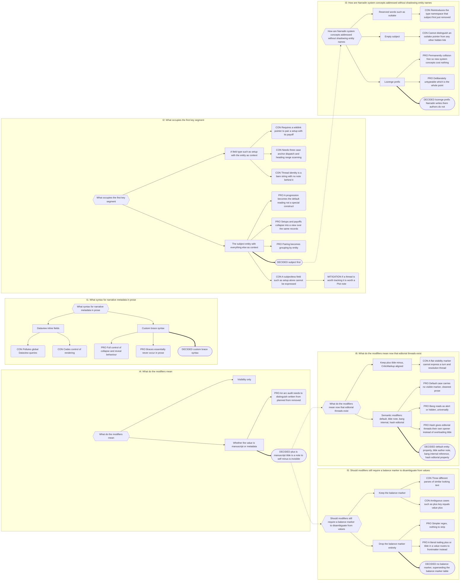
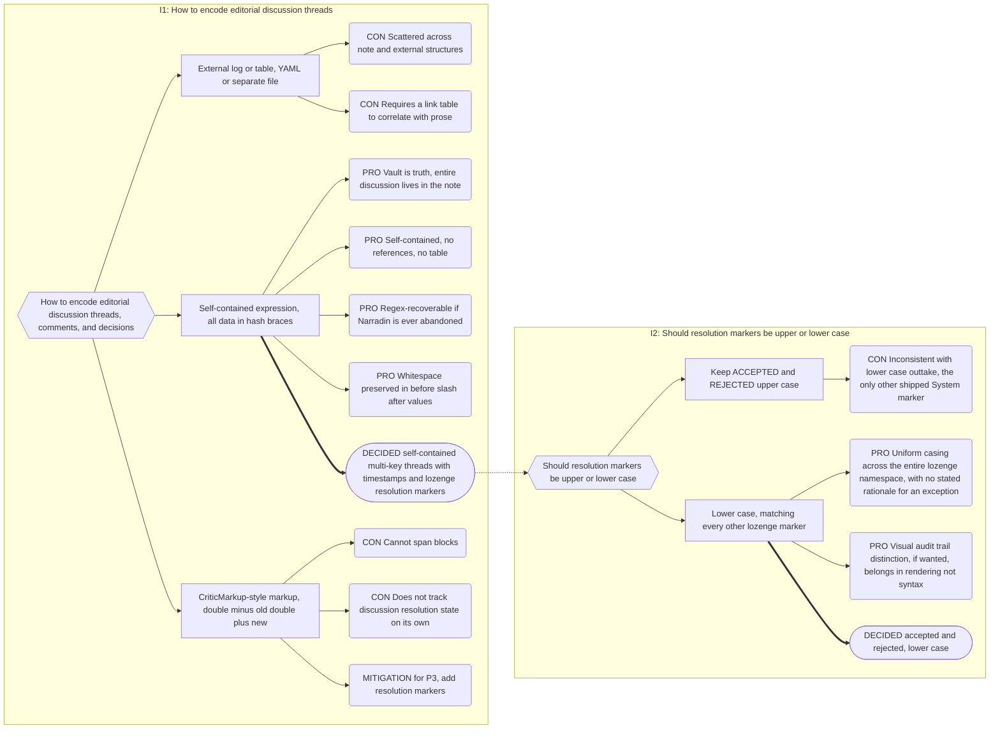
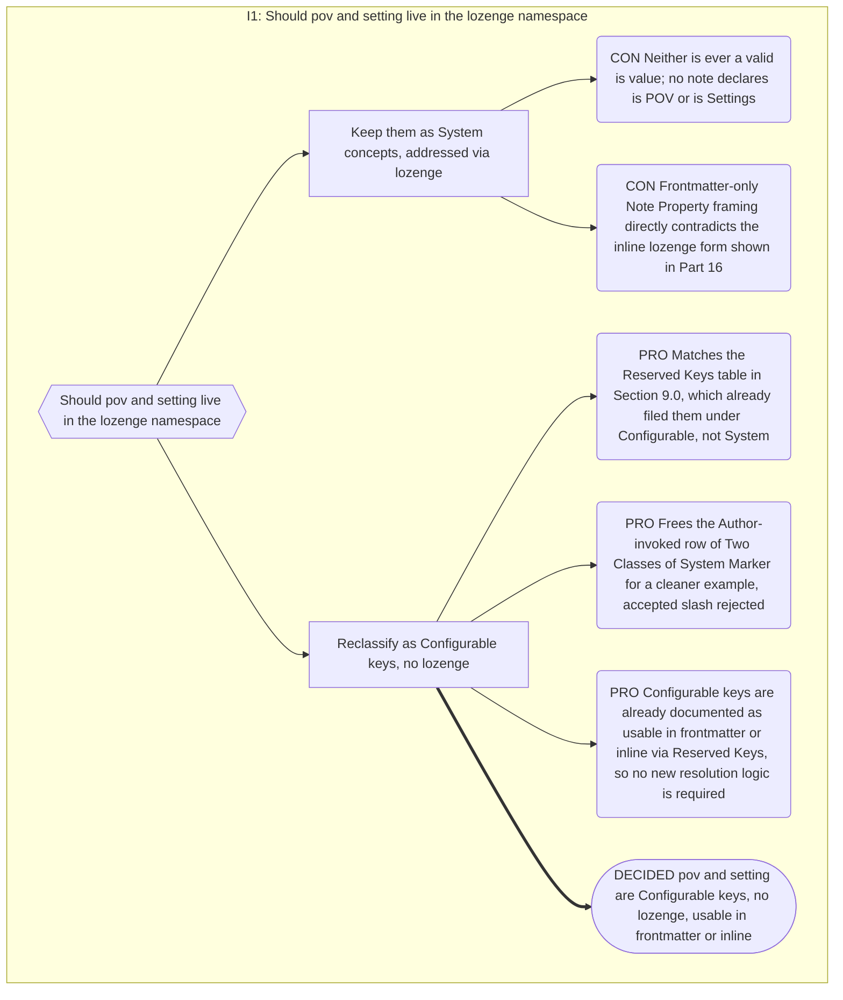

# Part 9: Inline Properties

## Part 9: Inline Properties

**Goal:** one shared grammar, one index, one position model, across four inline-brace
constructs. Progressions, Setups & Payoffs, cast lists, POV tracking, and outtake markers
are all _views_ over the same records — not parallel subsystems.

Four types exist, distinguished by opener:

| Modifier | Name                   | Visibility                                             | Use Case                                      |
| -------- | ---------------------- | ------------------------------------------------------ | --------------------------------------------- |
| _(none)_ | **Entity Property**    | Visible, dimmed & smaller                              | Narrative metadata (cast, arcs, progressions) |
| `~`      | **Author Note**        | Hidden (interpunct in preview)                         | Private note-to-self, not in final text       |
| `!`      | **Internal Reference** | Hidden, source-mode only                               | Outtake pointers, internal bookkeeping        |
| `#`      | **Editorial Property** | Visible (dimmed if unresolved) or hidden by resolution | Edits, comments, discussion threads           |

### 9.0 Note Properties vs Inline Properties

Two kinds of metadata, distinguished by **subject**, not by syntax.

|             | **Note Property**                        | **Inline Property**                               |
| ----------- | ---------------------------------------- | ------------------------------------------------- |
| Subject     | the note it sits in                      | an entity (or discussion) named in the key        |
| Location    | frontmatter only                         | frontmatter **or** body                           |
| Cardinality | one per key per note                     | many per key per note                             |
| Owner       | Narradin (reserved keys) or author       | the author                                        |
| Examples    | `is`, `for`, `sort_index`, `narradin__*` | `{Frodo+midpoint=…}`, `Frodo: realizes the truth` |

`is: [[A Scene]]` describes _this note_. `Frodo: realizes the truth` describes _Frodo_
and merely happens to live here.

**Why Note Properties are frontmatter-only.** This is an architectural constraint, not a
terminology preference. `metadataCache.on('resolved')` delivers every frontmatter block
in the vault, from Obsidian's own index, at boot. Body properties are Narradin's own
parse — debounced, driven by `vault.on('modify')`, resolved at Content Projection (§12.4). If `is` could
live in the body, Canonical Index (§12.3) would depend on Content Projection to build the tree (circular), boot
would require reading every file before any hierarchy existed, and Notebook Navigator
could not see it — the very reason `is` is worth having.

**But chaos is surfaced, not prevented.** An author writing `{~is=[[A Scene]]}` is not
blocked. Health reports: _"`is` found as a body Inline Property in 3 notes. Narradin
reads `is` only from frontmatter."_ Half-Fix, visible, accountable.

### Three Kinds of File Property Key

Every frontmatter key a note carries falls into exactly one of three kinds. This
taxonomy names a distinction that already governs behavior throughout this Part and
§2.3 — it introduces no new grammar or resolution logic, only the vocabulary for
categories that already exist.

- **Configurable keys** — plain (unprefixed) keys whose _name_ is user-definable, kept
  as an exchange layer with the author and other plugins (Notebook Navigator among
  them). `is`, `sort_index`, and `folder_index` are semantically mandatory — every note
  must resolve one under _some_ name — but the name itself is freely reconfigurable
  (§2.3/§2.4) to avoid vault-wide key clashes. The set also includes `icon`, and
  deliberately leaves room for future additions such as `color`, `background`, other
  Notebook Navigator-supported keys, and Narradin-recorded status keys.
- **Interpreted keys** — the default case: any key that is neither Configurable nor
  `◊`-prefixed is treated as an Entity Property subject, resolved against Player and
  Plot entities per §9.2's Subject Resolution order. Interpreted keys support multi-key
  (`|`-separated), multi-context (`+`-separated), and multi-value (`|` on the RHS)
  forms. In frontmatter, YAML's `:` plays the role the inline grammar's `=` plays in
  the body — a detail of Obsidian's YAML parser, not of Narradin's grammar.
- **System keys** — `◊`-prefixed, Narradin-authored and machine-owned, hidden by
  default (source mode always reveals them). See §9.2's "The Lozenge Namespace" and
  "Two Classes of System Marker" for the mechanism; this taxonomy only names the
  category.

**Reserved Keys** — never interpreted as an Entity Property subject, in either origin,
grouped by the taxonomy above:

| Category                     | Keys                                                                |
| ---------------------------- | ------------------------------------------------------------------- |
| Configurable / structural    | `is`, `for`, `compile`, `folder_index`, `sort_index`, `narradin__*` |
| Configurable / narrative     | `pov`, `setting`                                                    |
| Configurable / alias         | `do_not_rename`                                                     |
| Configurable / Obsidian core | `aliases`, `tags`, `cssclasses`, `icon`                             |
| Configurable / ecosystem     | `excalidraw*` (prefix match)                                        |

**`do_not_rename`.** A timestamp-valued Configurable key (Decision 7, Part 10). Author-set,
optionally auto-populated via a command (or by the Compiler, on every Generated
Companion, Part 8). **Target-side**: it excludes the note carrying it from receiving
Alias Manager rewrites; it does **not** prevent the underlying entity itself from being
renamed elsewhere. Gates Alias Manager target discovery only (§10.6) — it has no effect
on anything else. A timestamp, not a boolean, so the author has a handle on when the
freeze happened, not just that one exists.

**Tags vs. properties for author-owned booleans (Decision 8, guidance only).** Pure
author-owned boolean Configurable keys are good candidates for Obsidian tags instead of
frontmatter properties — presence is the boolean sign, with no properties-panel clutter
— but only under a reserved namespace prefix (e.g. `#narradin/...`, mirroring
`narradin__*`) to avoid colliding with an author's own unrelated tags, and only for
facts the _author_ owns. Machine-owned/lozenge state (`◊status`, anything
`narradin__*`) must never become a tag: tags lack the lozenge namespace's deliberate
typing friction, so machine state would become trivially, accidentally disturbable.
`do_not_rename` itself ended up **not** using this pattern — it needs a timestamp value,
which tags can't carry gracefully — so there is no concrete current application; this
guidance is recorded here for future use only.

### 9.1 Grammar

```
{ modifier  key ( | key )*  =  value }
key       := subject ( + context )*
```

**Base pattern.**

```regex
/(?<!\{)\{(?<mod>[~!#]?)(?<lhs>[^{}=\n]+)=(?<rhs>[^{}=\n]*)\}(?!\})/gm
```

- `(?<!\{)` and `(?!\})` → avoid Mustache-style `{{…}}` templating.
- **Single `=` separator.** Neither LHS nor RHS may contain `=` — a second `=` anywhere
  inside the braces is what makes an expression malformed (§9.8), not a phantom field.
- No nesting (braces are excluded from both capture groups, so nesting is impossible by
  construction), single line always (`\n` is excluded too — a hidden property spanning a
  paragraph break would silently merge two blocks).
- **LHS format:** `Subject+Context1+Context2…|Subject+Context|…` (split on `|` for keys,
  then `+` for contexts).
- **RHS format:** `Value|Value|…` (split on `|` for values). `|` is legal inside a value
  at the regex level; only `=` is not.

**Post-processing, in order:**

1. If `mod` is empty, treat as an Entity Property.
2. Split `lhs` on `|` → keys.
3. For each key, split on `+` → `[subject, ...contexts]`.
4. Trim subject and each context (leading/trailing whitespace removed, internal runs
   collapsed).
5. Skip empty keys silently (a trailing `|` is a typing artefact, not an error).
6. **RHS: preserve as-written.** Split on `|` → values. Spaces immediately after `=` are
   retained (value content) — a user can write `{Frodo = setup = value}` for legibility;
   spaces around `=` and `+` are trimmed on the LHS, but spaces inside a value survive
   untouched.
7. Reject the whole property as malformed (§9.8) if any surviving key has an empty
   subject.

**Design consequences, deliberate:**

- **No balance marker.** The previous grammar required an explicit modifier plus a
  trailing character to balance it (`{+key=value+}`); that is gone (Appendix B §B.6).
  A literal trailing `+`, `~`, `!`, or `#` in a value is just value content now — there
  is nothing to strip.
- Duplicate key+context pairs **within one property** collapse to a single record.
  Differing contexts stay separate — that is precisely how one line of prose targets two
  payoffs: `{Frodo+payoff+ring|Frodo+payoff+oath=…}`.

**Parsing exclusions.** The parser ignores `{...}` inside: inline math `$…$` and block
math `$$…$$`; fenced code blocks and inline code spans; and Obsidian comments `%%…%%` and
HTML comments.

> ⚠️ **There is no CriticMarkup exclusion.** The previous grammar carved out `{++`,
> `{--`, `{~~`, `{==`, `{>>` before modifier detection ran. That exclusion is dropped
> entirely (Appendix B §B.6) — Editorial Properties are Narradin's own answer to
> track-changes, and CriticMarkup patterns are not otherwise special-cased. One
> consequence is accepted as-is, not a launch blocker: CriticMarkup's `{~~text~~}` and a
> Narradin Author Note (`~`) both open on `~`, and the two can visually collide in
> source. Authors who use both conventions in the same vault should expect it.

### 9.2 Entity Properties

**Syntax.**

```
{[modifier] Subject+Context1+Context2…=Value}
```

Examples:

```
{Frodo+setup=hobbits flee the shire}                // visible, dimmed
{~Gandalf+internal-note=TODO revisit wizard timing} // hidden note-to-self (interpunct in preview)
{!Saruman+outtake=cut this betrayal arc}            // hidden internal (nothing visible, glides over in preview)
```

**Modifiers.** This table governs the three constructs that share this grammar shape —
Entity Property (default), Author Note (`~`), and Internal Reference (`!`). Editorial
Property (`#`) has a different internal structure; see §9.5.

| Modifier | Behavior        | Preview                 | Reading Mode  | Source Mode               |
| -------- | --------------- | ----------------------- | ------------- | ------------------------- |
| _(none)_ | Default: kept   | value, dimmed & smaller | value, normal | full syntax               |
| `~`      | Note to self    | interpunct `·`          | nothing       | full syntax               |
| `!`      | Hidden/internal | nothing, glides over    | nothing       | full syntax, atomic range |

Source mode always shows full syntax for all three — **source mode is the debugger.**
`{!…}` is editable only there, by design, and must be implemented as a CodeMirror
**atomic range** so arrow-key traversal skips it rather than appearing to teleport.

Dimming applies to Live Preview only. Reading mode and compile output are clean
manuscript. Only the **value** is visible in reading mode (or interpunct for `~`, or
nothing for `!`).

### Subject Resolution

Ordered, first match wins:

0. **Reserved Key** — segment 0, after modifier stripping, matches a configured
   Reserved Key name (§9.0) exactly (post Key Normalisation). The property is a
   positional override of that Configurable key (e.g. `pov`, `setting`) rather
   than an Entity Property; it is handled by that key's own resolution logic
   (§16.4 for `pov`/`setting`) and is never sent through the remaining steps
   below, never reported as unresolved, and never collision-checked against
   entity names — the same reclaim-via-settings escape hatch documented for
   `is`, `for`, `tags`, etc. applies if an author's entity is genuinely named
   after a Reserved Key.
1. **Player or Plot entity** — segment 0, normalised per Key Normalisation below, matched
   against basenames, aliases, and stale `narradin__fka` values within the property
   host's **Reference-Valid Scope** (§5.5) — its own resolved Realm Scope. Matching
   through the alias layer means a report does not blank out between a rename and its
   propagation.
2. **System concept** — segment 0 begins with `◊` (U+25CA LOZENGE) and the remainder
   resolves to a configured System concept. The property is a **system marker**.
3. **Unresolved** — indexed as unresolved, rendered in place normally, reported to health
   with fuzzy near-miss candidates computed at report time.

**Unresolved is never dropped.** Silence is how a typo hides for six months while an arc
quietly loses three beats.

**See §16.4** for the positional-override resolution logic that Step 0 hands off to for
`pov`/`setting`; §16.4 cross-references back here for why the inline form (`{~pov=…}`)
never falls through to Unresolved.

**Reference-Valid Scope.** An Inline Property may name or target any entity within the
host note's own **Reference-Valid Scope** (§5.5) — its resolved Realm Scope (§5.2/§5.3).
Cross-Realm references are invalid: subject resolution never reaches outside the host's
Realm, matching the Membrane Rule's "inside never looks out." This is deliberately
**wider** than the Alias Manager's rewrite blast radius, which is bounded by Local Scope,
not Realm Scope (§10.6) — an Inline Property may validly target an entity the Alias
Manager would never rewrite on that note's behalf. Not a contradiction: reference
validity and rewrite reach are different operations with different, independently
justified boundaries — a deliberate Half-Fix on the rewrite side, not on this one.

#### The Lozenge Namespace

The lozenge exists to **reserve a namespace**, not to decorate one. It is deliberately
awkward to type — no keyboard carries it, and Narradin offers no suggester, command, or
palette entry for it. **Narradin writes lozenges; authors do not.**

The consequence is that the System namespace is permanently collision-free. New System
concepts may be added at any time without reserving words in the entity namespace,
introducing collision surface, or offering a setting to reclaim a shadowed name. Making
the lozenge convenient would forfeit exactly this.

Resolution order is retained for determinism, but the shadowing case it guards against —
an entity literally named `◊outtake` — cannot arise accidentally. An author who creates
one has done so deliberately and forfeits lozenge-dependent behaviour for that name.

Per Embrace the Chaos, a hand-typed lozenge is honoured: if the remainder resolves to a
System concept it behaves as a system marker; otherwise it is an ordinary unresolved
subject. The lozenge survives Key Normalisation untouched — it is not a combining mark,
an apostrophe, or a dash.

#### Two Classes of System Marker

Both are machine-written. They differ in what triggers the write.

| Class                        | Examples                 | Triggered by                              | Author's role                                                                                          |
| ---------------------------- | ------------------------ | ----------------------------------------- | ------------------------------------------------------------------------------------------------------ |
| **Machine-only bookkeeping** | `◊outtake`               | a command, automatically (Cut to Outtake) | None — Narradin computes the value; hand-editing corrupts a relationship Narradin owns                 |
| **Author decision**          | `◊accepted`, `◊rejected` | an explicit Accept/Reject choice          | The author picks which marker gets written; the marker itself is still never hand-typed or hand-edited |

Both are machine-written; the lozenge namespace is always Narradin's to write, never the
author's to type, for every marker without exception. The two classes differ only in
**what triggers the write**: `◊outtake` is written automatically as a side effect of a
structural command, with no author decision point of its own beyond invoking that
command; `◊accepted`/`◊rejected` are written at the exact moment the author makes an
explicit Accept or Reject choice — the decision is authorial, the marker syntax is not.
Both remain usable in **either** frontmatter or inline contexts, same as every other
System key.

**A third class: owner-scoped append/remove.** `◊status` (Decision Record B.25, Part 12)
is a lozenge-prefixed, **list-valued** System Key, distinct from both classes above: no
single subsystem owns the whole value, and no single write replaces it. Any number of
owning subsystems may append their own token to the end; each subsystem may only remove
tokens **it** owns, cherry-picked from wherever they sit in the array, never another
subsystem's. The **last entry governs display** — recency, not severity, a deliberate
choice to avoid building a subjective ranking system (Count and Report, Never Judge,
Part 1). Exclusively machine-written, like every lozenge marker; maintained truthfully
regardless of whether it is currently rendered. See Part 12's `StatusOverlayProvider`
subsection for the full mechanism.

### Key Normalisation

Applied to both sides of every entity match. Produces a matching key only — **never used
for presentation.**

1. Unicode NFKD
2. Strip combining marks (`\p{M}`)
3. Unicode full case-fold (`ß → ss`, `İ → i̇`)
4. Delete apostrophe variants: `'` `'` `ʼ` `` ` ``
5. Map dash/hyphen variants, `\`, and `/` to a single space
6. Collapse whitespace runs; trim

`Kulālaya/Maunavān` and `kulalaya\maunavan` both yield `kulalaya maunavan`.

- Both raw and normalised forms are stored; **raw is authoritative for display.**
- Post-normalisation collisions fall through to Naming Collisions and broadcast.
- **No edit-distance matching in v1.** Normalisation resolves representation differences,
  not misspellings. Fuzzy matching would silently bind a property to the wrong entity;
  near-misses are _suggested_ in health reports, never applied.
- **Presentation priority:** note basename → alias → surrounding prose → the literal key
  as typed.

### 9.3 Author Notes

A `~`-prefixed Inline Property: a private note-to-self, never rendered in Reading mode or
compile output.

```
{~Gandalf+internal-note=TODO revisit wizard timing}
```

Behavior follows the modifier table in §9.2: a dimmed interpunct `·` in Live Preview,
nothing in Reading mode, full syntax in source mode. Subject resolution and key
normalisation are identical to Entity Properties.

**CriticMarkup collision, accepted.** CriticMarkup's own `{~~text~~}` opens on the same
character as an Author Note's `~` modifier. Since §9.1 drops the CriticMarkup exclusion
entirely, the two are not disambiguated by the parser. Left as-is; not a launch blocker.

### 9.4 Internal References

A `!`-prefixed Inline Property: hidden bookkeeping — outtake pointers, internal
cross-references — invisible everywhere except source mode.

```
{!Saruman+outtake=cut this betrayal arc}
```

Behavior follows the modifier table in §9.2: nothing renders in Live Preview or Reading
mode; the cursor glides over it. Source mode is the only place it is editable, and it
must be implemented as a CodeMirror **atomic range** so arrow-key traversal skips it
rather than appearing to teleport.

**Mentions from Internal References are excluded from appearance evidence** — cast lists,
first-appearance ordering, presence counts — because removed or hidden content is not an
appearance. They are retained in Progressions, where the gap is exactly what the author
needs to see (§12.5).

### 9.5 Editorial Properties

A `#`-prefixed Inline Property: a self-contained, threaded edit/comment/discussion,
distinct in structure from the other three.

**Syntax.**

```
{#Speaker+ISO-Timestamp+Context1+Context2…|Speaker+ISO-Timestamp+Context…|…[|◊accepted+ISO-Timestamp|◊rejected+ISO-Timestamp] = BeforeValue|AfterValue}
```

Each turn in the thread is a multi-key entry. The final optional key may be `◊accepted`
or `◊rejected` to mark resolution.

**Examples.**

Unresolved edit:

```
{#Alice+2026-08-07T16:13:35Z+This is passive+and slow = walked slowly|ran quickly}
```

Resolved (accepted):

```
{#Alice+2026-08-07T16:13:35Z+This is passive|Bob+2026-08-07T16:14:00Z+Good catch|◊accepted+2026-08-07T16:14:30Z = walked slowly|ran quickly}
```

Multi-turn discussion with rejection:

```
{#Alice+2026-08-07T16:13:35Z+Too passive here|Bob+2026-08-07T16:13:50Z+I see it now|Alice+2026-08-07T16:14:05Z+Let's speed it up|◊rejected+2026-08-07T16:14:10Z = walked slowly|ran quickly}
```

**Structure.**

- **Turns:** Each `|`-separated key is one turn in a discussion thread.
  - Subject = speaker name (or `◊accepted`/`◊rejected` for resolution).
  - First context = ISO 8601 timestamp.
  - Remaining contexts = comment text (rendered as lines, `+` joins them).
- **Values:** `|`-separated array.
  - `[0]` = before text (original).
  - `[1]` = after text (proposed/accepted/rejected).
  - Future extensions possible for additional values.

**Rendering.**

_Unresolved:_

- Modal with full thread (all speakers, timestamps, comments).
- After text shown in prose, dimmed and boxed to indicate pending edit.
- Accept/Reject buttons, plus a Delete action.
- **Delete on an unresolved edit is not itself a resolution.** It prompts the
  user to choose ◊accepted or ◊rejected first. Choosing Cancel at that
  prompt aborts the deletion entirely; the edit remains unresolved and
  untouched.
- Choosing a resolution at that prompt both resolves and deletes in one
  step: the `{#...}` expression is removed from the source entirely,
  leaving behind exactly the text that resolution would have rendered
  (the after-value for ◊accepted, the before-value for ◊rejected) — with
  no marker, no icon, no expandable thread. This differs from a plain
  Accept/Reject (below), which keeps the collapsed thread and icon in
  source for audit history.

_After Accept:_

- Value replaced with after text, normal rendering.
- Thread collapsed but expandable.
- Dimmed checkmark (`✓`) icon.
- Full thread history preserved in source.

_After Reject:_

- Value unchanged (before text shown, normal rendering).
- Thread collapsed but expandable.
- Dimmed X (`✗`) icon.
- Full thread history preserved in source.

**Resolution markers.**

- `◊accepted+Timestamp` → edit accepted, after value applied.
- `◊rejected+Timestamp` → edit rejected, before value retained.
- Both are system markers (lozenge), timestamped, audit-trail preserving.

### 9.6 Context Vocabulary

Contexts are free text. An optional **per-Realm vocabulary** may register known contexts:

```yaml
- context: setup      # normalised
  label: Setup        # display
  icon: sprout        # Icon Registry key
  role: opens
- context: payoff
  label: Payoff
  icon: wheat
  role: closes
```

- `role: opens | closes | none`. Default `none`.
- Shipped defaults — **opens:** `setup`, `intrigue`, `suspense`, `hook`.
  **closes:** `payoff`, `reveal`, `twist`.
- Authors extend freely: `promise`/`fulfilment`, `wound`/`healing`, `question`/`answer`
  all work with no code.
- Unregistered contexts render plainly and are reported as near-misses — `midpoint` vs
  `mid-point` fragments an arc silently otherwise.

Validation would fight Embrace the Chaos; silence would fragment arcs. The vocabulary is
the middle path: legal either way, reported when suspicious.

### 9.7 Position

Every Inline Property carries a Position — the three fields the parser can observe
directly, at the moment it reads a specific note's body:

| Component | Meaning                                                                              |
| --------- | ------------------------------------------------------------------------------------ |
| `line`    | **1-based, matching source mode.** Frontmatter's opening `---` is line 1             |
| `offset`  | column, for multiple properties on one line                                          |
| `blockId` | present if the author wrote one on the containing block; Narradin never authors them |

**`sequenceIndex` and `companionRank` are host-level, not per-property** (Appendix B
§B.6). They are facts about the _host note or companion_ a property lives in, already
known from the Content Sequence walk (§7.5, `ContentSequenceEntry`) by the time a parser
reaches that note's body — pushing them into every inline-property record would duplicate
data that is already available one level up. A full cross-note sort key (for views such
as Progressions, and for mention ordering) is composed **at query time** by joining a
property's `(line, offset)` with its host's `(sequenceIndex, companionRank)` via `fileId`
— the two no longer travel together in one struct.

**Block IDs** are captured when the author has written one on a block containing a
property. Narradin never authors them. They feed the anchor cascade (§16.6).

### 9.8 Malformed Expressions

An Inline Property is malformed if:

- LHS or RHS contains the separator character on the wrong side (e.g., RHS contains an
  extra `=`).
- After splitting and trimming, a key has an empty subject.
- Any other structural parse failure.

**Detection is two-pass, because the strict pattern can't see its own near-misses.** The
§9.1 base pattern excludes `{`, `}`, `=`, and `\n` from both `lhs` and `rhs`, so text with
a second `=` inside the braces (e.g. `{Frodo+setup = This has = two equals}`) does not
match it at all — there is no capture to inspect, let alone flag. Catching that case
requires a **second, looser scan** that runs only over spans the strict pattern left
unclaimed, never in place of it:

```regex
/* Pass 1 — unchanged from §9.1. Every match here is a well-formed property. */
/(?<!\{)\{(?<mod>[~!#]?)(?<lhs>[^{}=\n]+)=(?<rhs>[^{}=\n]*)\}(?!\})/gm

/* Pass 2 — candidate scan. Any single-line, non-nested {...} not already
   claimed by Pass 1, still respecting the Mustache guard. */
/(?<!\{)\{(?<mod>[~!#]?)(?<body>[^{}\n]*)\}(?!\})/gm
```

A Pass 2 candidate is malformed — not ignored — when its `body` contains at least one
`=` (it was clearly attempting a `key=value` shape) or, after applying §9.1's
post-processing, a surviving key has an empty subject. A Pass 2 candidate with no `=` at
all is not an Inline Property and is left as plain text — braces alone don't imply intent.

Malformed expressions are **not silently dropped**. Instead:

1. Render with the theme's `text-error` class (red/error styling).
2. Optional hover tooltip: "Malformed inline property: [reason]".
3. The author can fix it, or delete it.

Example:

```
{Frodo+setup = This has = two equals}  // ERROR: "Value contains = character"
```

Following Count and Report, Never Judge: a typo should show red squiggles in preview, not
make the property vanish. Silence is how a typo hides for six months.

### 9.9 Records and Providers

**`PropertyProvider`** owns Inline Property records from both origins. Purely syntactic —
it performs no entity resolution, so its records stay valid when entities are renamed,
created, or deleted. It owns two record shapes: `EntityPropertyRecord`, shared by Entity
Properties, Author Notes, and Internal References (they differ only by `modifier`), and
`EditorialPropertyRecord`, for `#` threads.

```typescript
interface Position {
    line: number;       // 1-based, frontmatter '---' is line 1
    offset: number;     // column, for multiple properties on one line
    blockId?: string;   // present if the author wrote one; Narradin never authors them
}

interface EntityPropertyRecord {
    fileId: number;
    position: Position;
    origin: 'frontmatter' | 'body';
    modifier: '' | '~' | '!';   // '' = default (visible, kept)
    keys: Array<{ subject: string; contexts: string[] }>;  // raw and normalised
    value: string;
}

interface EditorialTurn {
    speaker: string;      // raw, as typed — "Alice", "◊accepted", "◊rejected"
    timestamp: string;    // ISO 8601, as typed, not validated for correctness
    comments: string[];   // remaining contexts, one per line
}

interface EditorialPropertyRecord {
    fileId: number;
    position: Position;
    turns: EditorialTurn[];
    resolution: 'pending' | 'accepted' | 'rejected';
    resolvedAt?: string;         // timestamp from the ◊accepted/◊rejected turn, if present
    values: string[];            // [0] = before, [1] = after; may extend beyond 2 in future
}
```

`fileId` on both records already implies the host note; `sequenceIndex` and
`companionRank` for that host are resolved by whatever component walks the Content
Sequence (Indexer/Canonical Index, §7.5), not stored redundantly on every property record.
Whatever component composes a full cross-note sort order (Part 16 views) must join on
`fileId` to pull those two fields in from the host record.

Keyed by Position, so ten identical `{Frodo+tension=…}` in one scene are ten records.

**Frontmatter specifics.** YAML forbids duplicate keys, so one entry per key per note. A
string array expands to one record per element, preserving array order, all sharing the
note's frontmatter Position. Non-string values are taken verbatim.

**Empty value** — `{Frodo+arrives=}` is legal. It may be a deliberate presence marker or
a placeholder; views render a _Missing Value_ badge.

**There is no `ProgressionProvider` and no `SetupPayoffProvider`.** Every view in Part 16
is a query over `PropertyProvider` joined to `MentionProvider` (§12.5).

---

## Decision Record

## B.6 Inline Property Grammar

**Chain:** I1 prose syntax → I2 first key segment → I3 system-concept addressing → I4
modifier meaning (superseded, see I5/I6 below).



**D4 is superseded by D6.** The modifier set grew from three CriticMarkup-aligned
symbols (`+`/`~`/`-`) to four semantic ones (default/`~`/`!`/`#`), and editorial threads
gained a dedicated opener rather than overloading `~`. D5 removes the balance marker that
D4's original grammar required. Per §B.12, D4's node and text are left untouched above —
the trail is the value, not the current state.

**The single highest-leverage decision in the project.** Making segment 0 the subject
deleted an entire deferred subsystem, two planned providers, and roughly two hundred
lines of pairing logic from the prototype. It is worth understanding _why_: the old
grammar had no note behind a thread, so every relationship needed an explicit pointer.
Give the thread a note and the relationships become queries.

---

## B.13 Editorial Property Grammar

Editorial Properties (`{#...}`) are a distinct subsystem, not a grammar tweak on the
other three modifiers — hence their own numbered decision record rather than a fifth
fork of B.6.

**Chain:** I1 how to encode editorial discussion threads → I2 resolution-marker casing.



**Reasoning:** The vault is the source of truth. By embedding the entire discussion (all
speakers, timestamps, comments, before/after values, resolution status) in a single
braced expression, Narradin ensures the note is intelligible in any context (raw
Markdown, external editor, after Narradin is abandoned). The trade-off is density in
source, but Narradin's UI handles all the rendering work.

---

## B.19 Reclassifying `pov` and `setting` Out of the Lozenge Namespace

This decision reopens B.6 §I3/D3 above — the lozenge-prefix decision for system-concept
addressing — narrowing its scope: `pov` and `setting` were never valid `is` values and
should never have been addressed through the lozenge namespace at all.



**Why Configurable beat System.** Neither `pov` nor `setting` was ever a genuine ontology
member — no note anywhere declares `is: [[POV]]` or `is: [[Settings]]`, unlike `Outtake`,
which the outtake collection note actually declares (§16.5). Filing them under System
forced a frontmatter-only Note Property framing (§9.0) that the spec's own Part 16
inline-override examples directly contradicted — a contradiction with no resolution
mechanism, not a stylistic inconsistency. Configurable removes the contradiction for
free: Reserved Keys already document usability in frontmatter or inline (§9.0), so no new
resolution logic was needed beyond Subject Resolution's new Step 0 (§9.2) — the
Reserved-Key pre-check that already applies uniformly to `is`, `for`, `tags`, and every
other Configurable key. The lozenge namespace, meanwhile, keeps its original purpose
intact: reserving a collision-free space for concepts Narradin alone writes, with
`◊outtake` and the newly-lowercased `◊accepted`/`◊rejected` as its only remaining members.

---
