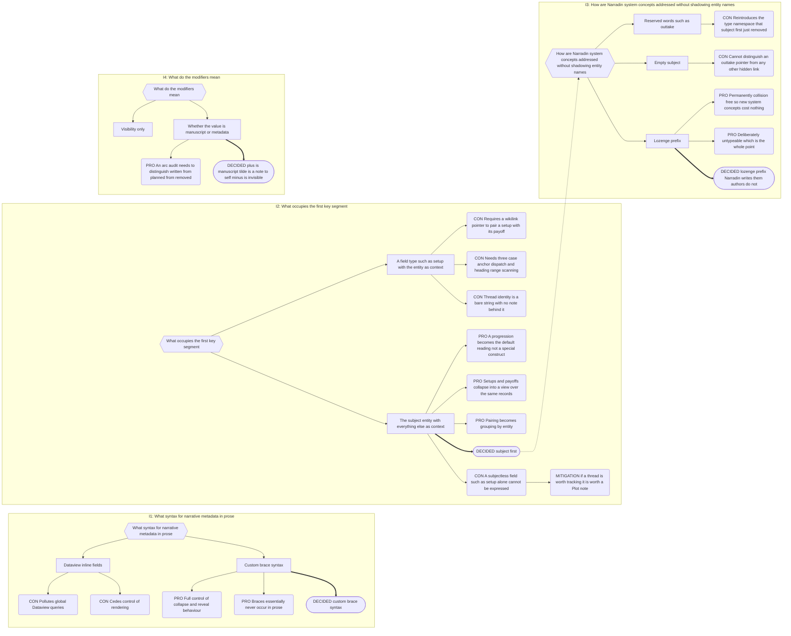

# Part 9: Entity Properties

## Part 9: Entity Properties

**Goal:** one grammar, one index, one position model. Progressions, Setups & Payoffs,
cast lists, POV tracking, and outtake markers are all _views_ over the same records —
not parallel subsystems.

### 9.1 Note Properties vs Entity Properties

Two kinds of metadata, distinguished by **subject**, not by syntax.

|             | **Note Property**                               | **Entity Property**                                |
| ----------- | ----------------------------------------------- | -------------------------------------------------- |
| Subject     | the note it sits in                             | an entity named in the key                         |
| Location    | frontmatter only                                | frontmatter **or** body                            |
| Cardinality | one per key per note                            | many per key per note                              |
| Owner       | Narradin (reserved keys) or author              | the author                                         |
| Examples    | `is`, `for`, `pov`, `sort_index`, `narradin__*` | `{+Frodo+midpoint=…}`, `Frodo: realizes the truth` |

`is: [[A Scene]]` describes _this note_. `Frodo: realizes the truth` describes _Frodo_
and merely happens to live here.

**Why Note Properties are frontmatter-only.** This is an architectural constraint, not a
terminology preference. `metadataCache.on('resolved')` delivers every frontmatter block
in the vault, from Obsidian's own index, at boot. Body properties are Narradin's own
parse — debounced, driven by `vault.on('modify')`, resolved at Layer 4. If `is` could
live in the body, Layer 3 would depend on Layer 4 to build the tree (circular), boot
would require reading every file before any hierarchy existed, and Notebook Navigator
could not see it — the very reason `is` is worth having.

**But chaos is surfaced, not prevented.** An author writing `{~is=[[A Scene]]~}` is not
blocked. Health reports: _"`is` found as a body Entity Property in 3 notes. Narradin
reads `is` only from frontmatter."_ Half-Fix, visible, accountable.

**Reserved Keys** — never interpreted as an Entity Property subject, in either origin:

| Source              | Keys                                                                |
| ------------------- | ------------------------------------------------------------------- |
| Narradin structural | `is`, `for`, `compile`, `folder_index`, `sort_index`, `narradin__*` |
| Narradin narrative  | `pov`, `settings`                                                   |
| Obsidian core       | `aliases`, `tags`, `cssclasses`, `icon`                             |
| Ecosystem           | `excalidraw*` (prefix match)                                        |

### 9.2 Grammar

```
{ modifier  key ( | key )*  =  value  balance }
key       := subject ( + context )*
```

**Canonical pattern.** CriticMarkup exclusion (§9.6) runs **before** this, so `{++…++}`
never reaches it.

```regex
/(?<!\{)\{(?<mod>[-+~]?)(?<lhs>[^{}|=\n]+(?:\|[^{}|=\n]+)*)=(?<rhs>[^{}\n]*)\}(?!\})/gm
```

Post-processing, in order:

1. Empty `mod` → treat as `+`.
2. If `mod` was **explicitly written** and `rhs` ends with that character, strip one.
3. Split `lhs` on `|` → keys. Split each key on `+` → segments. Segment 0 is the
   subject; the rest are contexts. Trim all.
4. Skip empty keys silently (a trailing `|` is a typing artefact, not an error).
5. Reject the whole property if any surviving key has an empty subject.

**Design consequences, deliberate:**

- `{`, `}`, and newline are the only characters that terminate a value. `|` and `=` are
  legal inside it, so wikilinks with display text and prose containing `=` both work.
- **Single line always.** A property may not span a paragraph break — a hidden property
  containing a block boundary would silently merge two blocks.
- Nesting is impossible by construction.
- `(?<!\{)` and `(?!\})` keep Mustache-style `{{…}}` templating clear.
- Duplicate key+context pairs **within one property** collapse to a single record.
  Differing contexts stay separate — that is precisely how one line of prose targets two
  payoffs: `{+Frodo+payoff+ring|Frodo+payoff+oath=…}`.

**The balance marker.** Balance exists only when there is something to balance, so
identical-looking text parses differently by opener:

| Source           | Modifier     | Value    |
| ---------------- | ------------ | -------- |
| `{key=value+}`   | implicit `+` | `value+` |
| `{+key=value+}`  | explicit `+` | `value`  |
| `{+key=value++}` | explicit `+` | `value+` |

Deterministic, and accepted as something authors learn by rote. Health flags any
explicit-modifier property whose value ends in the modifier character — the case looks
ambiguous even where it isn't.

### 9.3 Modifiers

| Form           | Live Preview                           | Cursor enters | Reading       | Compile      |
| -------------- | -------------------------------------- | ------------- | ------------- | ------------ |
| `{+…}` / `{…}` | value, **dimmed and slightly smaller** | full syntax   | value, normal | value, plain |
| `{~…}`         | dimmed interpunct `·`                  | full syntax   | nothing       | nothing      |
| `{-…}`         | nothing; **cursor glides over**        | nothing       | nothing       | nothing      |

`+` says _the value is manuscript text carrying metadata_. `~` says _this is a note to
self_. `-` says _invisible_.

Source mode always shows full syntax for all three — **source mode is the debugger.**
`{-…}` is editable only there, by design, and must be implemented as a CodeMirror
**atomic range** so arrow-key traversal skips it rather than appearing to teleport.

`{~…}`'s interpunct is intentionally a glyph, not an icon: an icon per occurrence
speckles a dense scene. Registered icons belong in reports, where there is room.

Dimming applies to Live Preview only. Reading mode and compile output are clean
manuscript.

### 9.4 Subject Resolution

Ordered, first match wins:

1. **Player or Plot entity** — segment 0, normalised per §9.5, matched against
   basenames, aliases, and stale `narradin__fka` values in scope. Matching through the
   alias layer means a report does not blank out between a rename and its propagation.
2. **System concept** — segment 0 begins with `◊` (U+25CA LOZENGE) and the remainder
   resolves to a configured System concept. The property is a **system marker**.
3. **Unresolved** — indexed as unresolved, rendered in place normally, reported to health
   with fuzzy near-miss candidates computed at report time.

**Unresolved is never dropped.** Silence is how a typo hides for six months while an arc
quietly loses three beats.

#### The Lozenge Namespace

The lozenge exists to **reserve a namespace**, not to decorate one. It is deliberately
awkward to type — no keyboard carries it, and Narradin offers no suggester, command, or
palette entry for it. **Narradin writes lozenges; authors do not.**

The consequence is that the System namespace is permanently collision-free. New System
concepts may be added at any time without reserving words in the entity namespace,
introducing collision surface, or offering a setting to reclaim a shadowed name. Making
the lozenge convenient would forfeit exactly this.

Resolution order is retained for determinism, but the shadowing case it guards against —
an entity literally named `◊outtake` — cannot arise accidentally. An author who creates
one has done so deliberately and forfeits lozenge-dependent behaviour for that name.

Per Embrace the Chaos, a hand-typed lozenge is honoured: if the remainder resolves to a
System concept it behaves as a system marker; otherwise it is an ordinary unresolved
subject. The lozenge survives §9.5 normalisation untouched — it is not a combining mark,
an apostrophe, or a dash.

#### Two Classes of System Marker

Both are machine-written. They differ in what happens afterwards.

| Class              | Examples            | Authored by                    | Edited by author                    |
| ------------------ | ------------------- | ------------------------------ | ----------------------------------- |
| **Machine-only**   | `◊outtake`          | a command, as bookkeeping      | No — Narradin owns the relationship |
| **Author-invoked** | `◊pov`, `◊settings` | a command, as an authoring act | Yes — authorial content             |

Machine-only markers are pointers Narradin maintains; hand-editing one corrupts a
relationship Narradin owns. Author-invoked markers are the author's content in a syntax
Narradin supplies — the command exists only because `◊` cannot be typed.

### 9.5 Key Normalisation

Applied to both sides of every entity match. Produces a matching key only — **never used
for presentation.**

1. Unicode NFKD
2. Strip combining marks (`\p{M}`)
3. Unicode full case-fold (`ß → ss`, `İ → i̇`)
4. Delete apostrophe variants: `'` `'` `ʼ` `` ` ``
5. Map dash/hyphen variants, `\`, and `/` to a single space
6. Collapse whitespace runs; trim

`Kulālaya/Maunavān` and `kulalaya\maunavan` both yield `kulalaya maunavan`.

- Both raw and normalised forms are stored; **raw is authoritative for display.**
- Post-normalisation collisions fall through to Naming Collisions and broadcast.
- **No edit-distance matching in v1.** Normalisation resolves representation differences,
  not misspellings. Fuzzy matching would silently bind a property to the wrong entity;
  near-misses are _suggested_ in health reports, never applied.
- **Presentation priority:** note basename → alias → surrounding prose → the literal key
  as typed.

### 9.6 Parsing Exclusions

The parser ignores `{...}` inside: inline math `$…$` and block math `$$…$$`; fenced code
blocks and inline code spans; Obsidian comments `%%…%%` and HTML comments; and
CriticMarkup (`{++`, `{--`, `{~~`, `{==`, `{>>`).

> ⚠️ **CriticMarkup exclusion is ordering-critical, not merely defensive.** It must run
> _before_ modifier detection, or any CriticMarkup edit containing `=` becomes a phantom
> field. Doubling is what separates the two grammars: **a Narradin modifier is never
> doubled at the open.**

**CriticMarkup — deferred.** Narradin will not implement track-changes. Commentator has
been in beta for three years and requires BRAT; if it ships officially, users get
track-changes for free. Narradin's only obligation is to ignore it cleanly.

### 9.7 Context Vocabulary

Contexts are free text. An optional **per-Realm vocabulary** may register known contexts:

```yaml
- context: setup      # normalised
  label: Setup        # display
  icon: sprout        # Icon Registry key
  role: opens
- context: payoff
  label: Payoff
  icon: wheat
  role: closes
```

- `role: opens | closes | none`. Default `none`.
- Shipped defaults — **opens:** `setup`, `intrigue`, `suspense`, `hook`.
  **closes:** `payoff`, `reveal`, `twist`.
- Authors extend freely: `promise`/`fulfilment`, `wound`/`healing`, `question`/`answer`
  all work with no code.
- Unregistered contexts render plainly and are reported as near-misses — `midpoint` vs
  `mid-point` fragments an arc silently otherwise.

Validation would fight Embrace the Chaos; silence would fragment arcs. The vocabulary is
the middle path: legal either way, reported when suspicious.

### 9.8 Position

Every Entity Property, mention, and Content Sequence entry carries a Position: a
four-part tuple compared lexicographically.

| Component       | Meaning                                                                  |
| --------------- | ------------------------------------------------------------------------ |
| `sequenceIndex` | index of the host Narrative note in the Indexer's narrative sequence     |
| `companionRank` | 0 for the host note; 1..n for its companions in configured type order    |
| `line`          | **1-based, matching source mode.** Frontmatter's opening `---` is line 1 |
| `offset`        | column, for multiple properties on one line                              |

Frontmatter therefore precedes body content naturally, with no sentinel value.

**Block IDs** are captured when the author has written one on a block containing a
property. Narradin never authors them. They feed the anchor cascade (§16.6).

### 9.9 Records and Providers

**`PropertyProvider`** owns Entity Property records from both origins. Purely syntactic —
it performs no entity resolution, so its records stay valid when entities are renamed,
created, or deleted.

```typescript
interface EntityPropertyRecord {
    fileId: number;
    position: Position;
    origin: 'frontmatter' | 'body';
    modifier: '+' | '~' | '-';
    keys: Array<{ subject: string; contexts: string[] }>;  // raw and normalised
    value: string;
    blockId?: string;
}
```

Keyed by Position, so ten identical `{+Frodo+tension=…}` in one scene are ten records.

**Frontmatter specifics.** YAML forbids duplicate keys, so one entry per key per note. A
string array expands to one record per element, preserving array order, all sharing the
note's frontmatter Position. Non-string values are taken verbatim.

**Empty value** — `{+Frodo+arrives=}` is legal. It may be a deliberate presence marker or
a placeholder; views render a _Missing Value_ badge.

**There is no `ProgressionProvider` and no `SetupPayoffProvider`.** Every view in Part 16
is a query over `PropertyProvider` joined to `MentionProvider` (§12.5).

---

## Decision Record

## B.6 Entity Property Grammar

**Chain:** I1 prose syntax → I2 first key segment → I3 system-concept addressing → I4
modifier meaning.



**The single highest-leverage decision in the project.** Making segment 0 the subject
deleted an entire deferred subsystem, two planned providers, and roughly two hundred
lines of pairing logic from the prototype. It is worth understanding _why_: the old
grammar had no note behind a thread, so every relationship needed an explicit pointer.
Give the thread a note and the relationships become queries.

---
