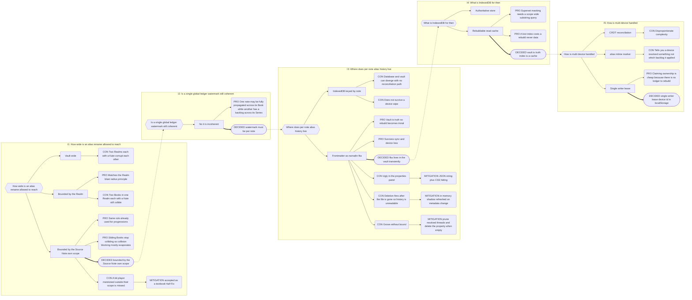
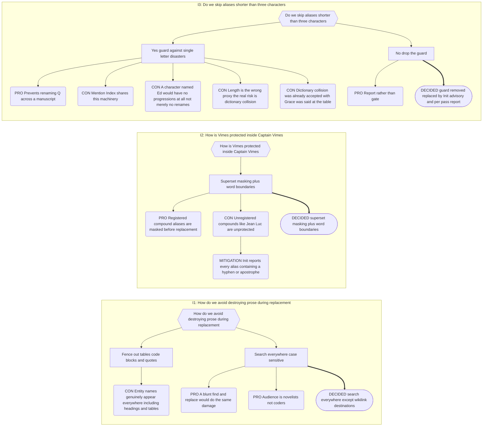

# Part 10: The Alias Manager

## Part 10: The Alias Manager

**Goal:** Obsidian's native rename updates wikilink _destinations_ only — not display
text, not plain-text mentions. This engine closes that gap for tracked entities, and never
leaves the vault worse than a partial manual find-and-replace.

### 10.1 Note Sets

**Source Notes** — notes whose basename and aliases are tracked and propagated. Configured
by `is` value, selectable only from already-defined `is` values, defaulting to all Player
and Plot concepts.

**Targets** — _not separately configured._ A target is **any note with a valid Narradin
`is` value**, within the Source Note's scope, excluding Generated Companions, Islands, and
`_narradin`.

Source membership changes on: note creation, note deletion, an `is` change adding or
removing membership, and settings changes. When a note _leaves_ the Source set, any pending
work is flushed first (§10.7).

### 10.2 `narradin__fka` — A Pending-Work Marker

**The ledger lives in the vault, transiently.** It is not a durable history.

> **Absent** — the note is clean; its current `aliases` and basename are truth.
> **Present** — unpropagated history exists.

Serialised as a **JSON string** in a single frontmatter property (§12.6). Structure: an
array of threads; each thread an array of values, oldest-first. **Position is identity** —
no `aliasId` is required, because nothing outlives propagation.

**Thread length carries meaning:**

| Length | Meaning                                                                |
| ------ | ---------------------------------------------------------------------- |
| ≥ 2    | Rename chain. The last value is current; every earlier value is stale. |
| 1      | **Retirement.** The value is dead with no successor.                   |

This encoding works because a pure _add_ generates no propagation work and therefore never
enters `fka` at all.

**Lifecycle**

| Event                        | Effect                                                                   |
| ---------------------------- | ------------------------------------------------------------------------ |
| Modal rename, or file rename | Create or extend a thread; append the new value.                         |
| Modal delete                 | Create a single-value thread.                                            |
| Successful pass              | **Remove** every resolved thread. Empty array → **delete the property.** |
| Failed pass                  | `fka` untouched; retry later.                                            |

Threads are _removed_, not pruned to one — pruning would make a resolved rename masquerade
as a retirement.

**No watermark.** Staleness is positional. Both `propagatedAt` and the former global
`ledgerWatermark` are removed; the latter became incoherent the moment propagation was
scope-bounded (§10.6).

**Backlog.** Every value except the last, each paired **directly** with the last.
`[A,B,C]` yields `[A→C]` and `[B→C]`. Stale values never chain through intermediates —
which is precisely what makes arbitrary delay between passes safe.

**Which notes carry it.** Only Source Notes, only while work is pending. In steady state,
`narradin__fka` exists on no note in the vault.

**Notes are keyed by the Indexer's `++id`.** No separate UUID.

**Newly promoted Source Notes.** Any pre-existing `fka` is discarded; current basename and
aliases become the anchor with no history.

**Deletion.** `vault.on('delete')` fires after the file is gone, but the metadata provider
already caches all frontmatter, so the last known `fka` is available and is written to the
log. Nothing further happens — pending renames on a deleted note are abandoned and the
prose keeps the old name. Deleting a character must never scrub their name from the
manuscript.

### 10.3 The Implicit Basename Alias

A Source Note's basename is tracked but **never written into the `aliases` frontmatter
property**. Renaming the note appends to that thread, which is exactly a rename in the
backlog — so a file rename propagates through prose and link display text just like an
alias rename. If you want your aliases fixed in display text, you want your name fixed too.
Not optional.

### 10.4 Sources of Change

**Modal (Layer 5).** Lists every current alias, each in a text field prefilled with its own
value. Clear the field → **delete**. Change the value → **rename**. Leave it → no-op. The
basename is never shown; to change it, rename the file natively.

**Native file rename.** Appends to the implicit basename thread.

**Manual frontmatter edit.** Narradin does **not** own `aliases` and never overwrites hand
edits. On a metadata change it diffs the incoming array against current state:

| Condition                             | Result                                                       |
| ------------------------------------- | ------------------------------------------------------------ |
| in incoming, **missing from** current | **Add** — new thread, no propagation work, so no `fka` entry |
| in incoming, **matches** current      | **No-op**                                                    |
| in current, **missing from** incoming | **Delete** — single-value thread in `fka`                    |

Positional correspondence is meaningless. A manual edit can therefore never register as a
_rename_ — only the modal and native file renames can link an old string to a new one
within a thread.

### 10.5 Alias Deletion Semantics

Retiring an alias does **not** scrub it from prose. It rewrites only wikilink display text:
`[[Note|DeadAlias]]` → `[[Note]]`. Plain prose occurrences are left untouched. Removing an
alias never meant "delete this name from my manuscript."

### 10.6 The Application Engine

A background worker. Executes each Source Note's backlog across its targets.

**Blast radius** — the **Source Note's own narrative scope**, resolved by the Indexer. A
Series-level character rewrites across that Series; a Chapter-scoped bit player rewrites
that Chapter. Mentions outside scope are missed: a deliberate Half-Fix. Never wider than
the containing Realm; Islands are never entered.

**Target discovery** — via the Mention Index (§12.5), not a scope-wide scan. The index is
maintained against all claimed strings, _including stale `fka` values_, so the pass can
locate what it needs to fix.

**Collision window** — a string is unavailable if, within an **overlapping scope**, it is
either a current alias/basename of another Source Note **or appears anywhere in another
Source Note's `fka` threads.** The second clause is unconditional and load-bearing: a
recently retired string may still sit unpropagated in prose.

Because scopes must overlap for a block to apply, same-named characters in sibling Books
never collide — which reconciles the block with the Naming Collisions principle instead of
contradicting it.

**Chaining cannot legally occur.** For `A: Vimes → Jimmy` and `B: Jimmy → Bob` to coexist,
A must have taken "Jimmy" while B's was unpropagated — which the collision check forbids.

**Pass semantics** — all-or-nothing per note write: every replacement for a note is
computed, then written in a single `modify`. A write failure aborts the pass, leaves `fka`
intact, logs, and is retryable.

**Atomicity, not immediacy.** A pass need not run promptly. Delay is safe because the
backlog pairs stale values directly to current.

**Simultaneous replacement.** For each target, collect every applicable `(stale, current)`
pair from every in-scope Source Note, compute all match spans against the **original**
text, resolve overlaps by longest-match-wins, and rewrite in one pass. Output is never
re-scanned. Defence in depth against a failure of the collision check.

**Replacement rules**

- **Case-sensitive, always.** _"Grace was said at the table"_ may become _"Wilma was said
  at the table."_ That is what proofreading is for; renaming after proofreading is its own
  reward.
- **Search everywhere.** Tables, quotes, code blocks, headings — nothing is fenced out,
  because entity names genuinely live everywhere.
- **One sacred fence:** the _destination_ half of a wikilink, `[[Destination|`. Never
  touched. The _display_ half is fair game, as is all plain text.
- **Entity Property keys are rewritten.** `+` and `=` are non-word characters, so word
  boundaries handle `{+Frodo+midpoint=…}` → `{+Bilbo+midpoint=…}` correctly. Without this,
  a rename would silently detach every progression.
- Renames may break surrounding syntax (`John Hancock` → `J |-|` inside a table). Accepted.

**Smart Replace — substring protection**

1. **Superset masking.** Query all active strings in scope that contain the target as a
   substring — `Captain Vimes` when replacing `Vimes`. Record every span. Any occurrence of
   the target inside a recorded span is **skipped**. `Commander Vimes` — not itself an
   alias — is not protected and _is_ replaced.
2. **Word boundaries.** Word character = `\p{L}` ∪ `\p{N}` ∪ `\p{M}` ∪ `_`. `Vimes's` →
   `Jimmy's`; `MacVimes` and `Vimesy` are skipped; `Séverine` matches whole.
3. **Apostrophe folding, search only.** `'` `'` `ʼ` are equivalent when locating; the
   source text's character is preserved on write.
4. Hyphenated and apostrophised compounds (`Jean-Luc`, `Q'orath`) are protected **only** by
   superset masking — i.e. only if registered.

> **No minimum-length guard.** An earlier draft skipped aliases under three characters.
> Because the Mention Index shares this machinery, that guard meant a character named `Ed`
> had **no progressions at all** — not merely no renames. It is removed. Poor Gertrude and
> the bat cave remain possible; they are now at least logged.

Not handled by design: sentence-initial capitalisation; plurals and inflections
(`Vimeses`). Scripts without word separation (CJK) disable boundary protection; superset
masking is the only guard.

**Reporting replaces gating.** Two reports, no blocks:

- **Init advisory** — names every alias that is short (≤2 characters), a common English
  word, hyphenated, apostrophised, or in a script without word separation. Informational.
- **Per-pass replacement report** — alias, replacement, occurrence count, affected notes.
  Written to `_narradin/conflicts.md` on every pass.

**Ambiguity.** Where a plain-text match cannot be safely attributed, the text is left
untouched and the case is written to the conflict log with context.

### 10.7 Scope Migration — Flush and Re-Validate

Collision clearance is evaluated at entry against scopes _as they then are_. Scope is
mutable (§5.4), so clearance is **not durable.** Two hazards follow from a scope change
with pending `fka`:

1. **Ownership collision.** A's pending `Vimes → Jimmy` lands in a scope B already owns.
2. **Retroactive over-reach.** Even with no collision, A's backlog now targets prose A
   never governed.

**Primary mechanism — flush against the old scope.** A resolved-scope change on a Source
Note with non-empty `fka` is an **immediate trigger**, bypassing the debounce floor exactly
as a collision does. The pass runs against the **pre-change scope**, preserving intent.

Requirements this imposes:

- `EntityRenamed` and `ScopeUpdated` payloads carry the **pre-change resolved scope**.
- The trigger fires on the Indexer's resolved-scope delta, **not on rename alone** — adding
  or deleting a folder note re-parents many notes without any of them moving.

**Backstop — re-validate at pass time.** Immediately before executing, the pass re-runs the
collision check against _current_ scopes. Any pair that now collides is skipped, left in
`fka`, and written to the conflict report.

**Residue, stated honestly.** If a flush fails, the Source Note's stale strings persist in
its old scope while it lives in the new one. Not automatically recoverable. The conflict
report names it.

### 10.8 Initialise / Rebuild Index

Bootstraps or repairs the cache from vault state. Safe to re-run; cheap, because the vault
is truth.

1. Clear the cached index.
2. Enumerate Source Notes; read basename, `aliases`, and any `fka`.
3. Register all claimed strings.
4. On duplicate strings across notes **within overlapping scope**, apply
   oldest-`ctime`-wins (documented deviation, §1.1); name both notes in the conflict log.
5. Emit the Init advisory (§10.6).
6. Write a summary to the conflict log.

### 10.9 Multi-Device

The cached index is device-local and does not sync; `narradin__fka` does. With history
append-only and merging by union, a repeated pass finds no stale strings and no-ops — so
double application is harmless. **Idempotency downgrades the multi-device problem from
corruption to nuisance, but does not eliminate it:** a sync conflict that _drops_ a
historical value permanently orphans prose carrying it.

Reconciling two live ledgers is a CRDT problem and is explicitly out of scope. Narradin uses
a **single-writer lease**:

- Device id generated on install into **`localStorage`, never `data.json`** — the latter
  syncs and would clone the id across devices.
- `aliasEngine.ownerDeviceId` lives in synced settings. The engine runs only on the owner.
  **Off by default.**
- Non-owner devices show a warning banner naming the owner, with **Claim ownership** behind
  a confirmation. Claiming is cheap: there is no ledger to rebuild, only a cache.
- Documented procedure: run a manual pass before switching machines.

---

## Decision Record

## B.4 Where the Alias Ledger Lives

This is the longest dependency chain in the design. Each decision forced the next.

**Chain:** I1 blast radius → I2 watermark scope → I3 ledger location → I4 index role →
I5 multi-device.

**Note the direction of causation.** Narrowing the blast radius for _correctness_
reasons is what made vault-resident history necessary, which is what made the index
disposable, which is what made the multi-device lease affordable. Widen the blast radius
again and the last three decisions lose their justification.

---

## B.5 Alias Replacement Safety

**Chain:** I1 replacement scope → I2 compound-alias masking → I3 short-alias guard.

**This one was a live bug, not a preference.** The guard was written as shared with the
Mention Index (§12.5), which silently converted a rename-safety measure into total
invisibility for short-named characters. Worth remembering as a pattern: **a rule shared
between a writer and a reader will behave differently in each.**

---
