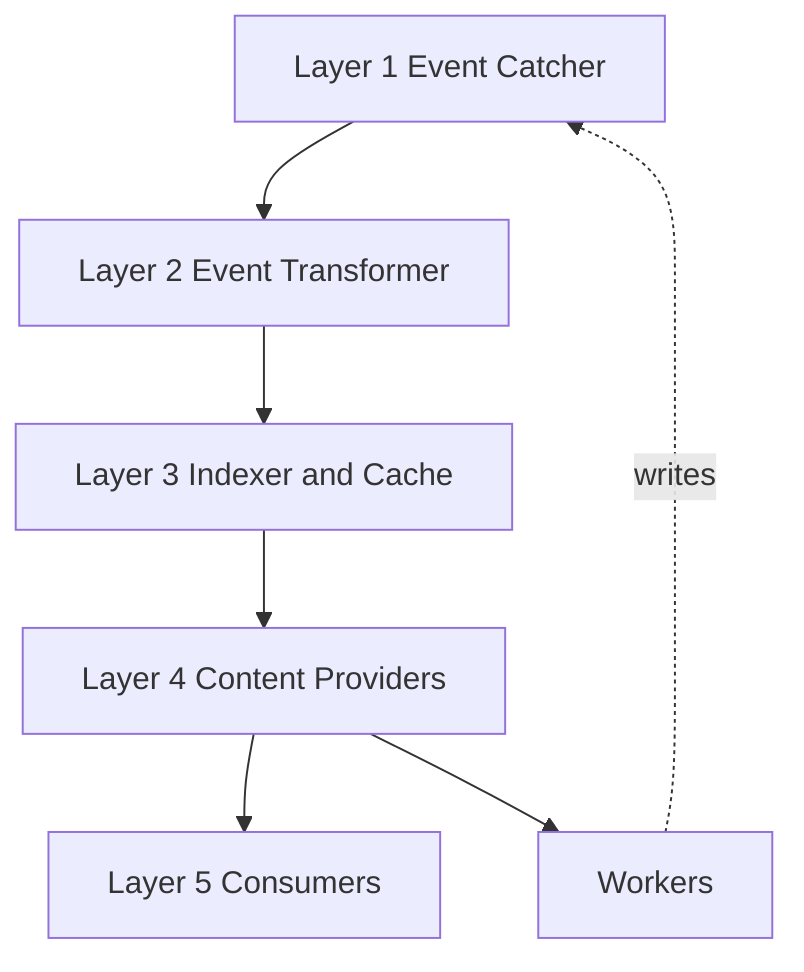

# Part 12: Architecture

## Part 12: Architecture

**Goal:** a modular, event-driven pipeline where adding a feature means adding a Provider,
never touching the ingest path or the UI layer.

### 12.1 Layer 1 — Event Catcher

- Hooks `vault.on('modify' | 'rename' | 'delete')` and
  `metadataCache.on('changed' | 'resolved')`.
- `metadataCache.on('changed')` guarantees frontmatter and links are current; it does
  **not** guarantee body text is ready for regex parsing. Entity Property parsing is
  therefore driven from `vault.on('modify')`.
- All raw events pass through a debounce/throttle queue so event storms never lock the main
  thread.
- **Boot-time delta sync:** on the initial `resolved`, reconcile vault state against the
  cache to catch external edits. Chunked, yielding to the main thread.
- **Storm circuit breaker:** above a threshold of events per interval, abandon incremental
  processing and schedule a single batched subtree reindex.

**Self-write suppression — a pending-write set.** Before any Narradin write, register
`{ op, path, newPath?, expectedHash?, expiry }`. Inbound events matching an entry are
dropped. Entries expire on a ~5 s timer so a failed write cannot wedge the gate.

- Renames register the `old → new` pair. This is the **only** case where suppression is a
  correctness requirement rather than an optimisation, because folder ↔ folder-note sync is
  the only path that forms an infinite loop.
- Works for non-markdown files, which cannot carry a frontmatter sentinel.
- Nothing is persisted — boot delta-sync reconciles after a crash, and ingest is idempotent.
- **Deliberate exception:** the alias application pass is **not** suppressed. It rewrites
  prose, mutating entity names inside `{...}` properties, which must be reindexed. Suppress
  _structural_ self-writes (renames, `is`/`icon`/index/`narradin__*` injection); let
  _content_ self-writes flow through the debouncer.

_A `narradin_id` content sentinel was considered for this role and rejected: renames carry
no content to stamp, non-markdown files have no frontmatter, and `vault.modify` races
`metadataCache`. `narradin__*` is retained for durable state — `fka`, `generated` — not for
loop suppression._

### 12.2 Layer 2 — Event Transformer

Translates file events into semantic Narradin events, hiding the fact that an `is` change is
indistinguishable from a create or delete. Maintains a registry of paths currently valid to
Narradin.

| Condition                           | Emitted                                                             |
| ----------------------------------- | ------------------------------------------------------------------- |
| gains a valid `is`, not in registry | `EntityCreated`                                                     |
| loses its `is`, was in registry     | `EntityDeleted` — even though the file still exists                 |
| in registry, renamed                | `EntityRenamed` — payload carries the **pre-change resolved scope** |
| in registry, content changed        | `EntityUpdated`                                                     |

### 12.3 Layer 3 — Indexer & Cache

Synchronous master state over a Dexie/IndexedDB cache. **Read-only with respect to the
vault** — a write here would re-enter Layer 1 and loop.

- **Identity.** A surrogate auto-incrementing `++id` per tracked file. Providers store `id`
  only, never paths.
- **Path map.** Sole owner of `id ↔ path`, exposed synchronously.
- **Note Properties.** Read directly from `metadataCache` — structural metadata must be
  available before Layer 4 exists (§9.1).
- **Boundary resolution.** Resolves the hierarchy **top-down from each Realm root** (§4.2),
  including Island detection.
- **Content Sequence.** Owns the traversal result (§7.5) and patches it on structural
  change. No Provider or Consumer ever walks the tree.
- **Scope map.** For every Player, Plot, and Companion, caches the resolving Narrative
  entity. Emits scope deltas, which drive alias flushes (§10.7).
- **Database.** One per vault: `narradin-{app.appId}-v{schemaVersion}`. Every row carries an
  indexed `realmId`; blast-radius enforcement is a mandatory predicate on every action
  query. Realms are **not** physically separated — nested Realms put a row in two at once,
  Realm moves would force migrations, and cross-Realm operations would fan out.
- **Disposable.** The database is a cache. Rebuildable, never authoritative.
- **Synchronous API** (shape, not contract): `getPath(id)`, `getId(path)`,
  `getContentSequence(scopeId?)`, `getScopeOwner(entityId)`,
  `getEntitiesInScope(narrativeId, category?)`, `getPreChangeScope(id)`.
- **Emits** `HierarchyUpdated`, `ScopeUpdated`.

### 12.4 Layer 4 — Content Providers

`MetadataProvider`, `HierarchyProvider`, `PropertyProvider`, `MentionProvider`,
`PlayerProvider`, `PlotProvider`, `CompanionProvider`, `AliasProvider`.

- **Own their in-memory caches.** Consumers must never cache, or multiple simultaneous views
  desynchronise.
- **Store `id`s only.** Rehydrate to paths and scope through the Indexer.
- **Fetch what the event didn't carry.**
- **Emit domain-shaped events**, firing only when data those consumers care about changed.

### 12.5 Layer 4 — Mention Index Provider

`MentionProvider` is explicitly **derived** — a projection over `PropertyProvider`, link
data, and plain-text scanning. Every mention is tagged by evidence kind:

| Kind                                        | Source                                               |
| ------------------------------------------- | ---------------------------------------------------- |
| `entity-property-subject`                   | segment 0 of an Entity Property                      |
| `entity-property-context`                   | a later segment that resolves to an entity           |
| `entity-property-value`                     | an entity name inside a value                        |
| `note-property-value`                       | `pov`, `settings`, or another reserved link property |
| `wikilink-destination` / `wikilink-display` | body links                                           |
| `plain-text`                                | normalised basename/alias occurrence (toggleable)    |

`entity-property-context` is what lets `{+Frodo+Samwise+argument=…}` count as _evidence
Samwise appears_ while the progression still belongs to Frodo.

**Mentions from `-` properties are excluded from appearance evidence** — cast lists,
first-appearance ordering, presence counts — because removed content is not an appearance.
They are retained in Progressions, where the gap is exactly what the author needs to see.

**Indexes stale strings too** — every value in every `fka` thread — so the alias pass can
locate the text it must fix.

**Matching reuses the Application Engine's machinery**: normalisation (§9.5), superset
masking, word boundaries. One code path finds a name and rewrites it, so discovery and
replacement can never disagree.

**Respects Islands absolutely.** A mention inside an Island is never visible outside it.

### 12.6 The `narradin__*` Namespace

Reserved absolutely. Object-valued properties are stored as **JSON strings** in a single
property — compact, cache-readable, visually inert.

Narradin additionally ships CSS hiding `[data-property-key^="narradin__"]` in the properties
panel. This leans on Obsidian's internal styling and is acknowledged as brittle; JSON-string
serialisation is what the presentation gracefully degrades _to_ if the selector breaks.

Raw YAML remains visible in source mode and in the all-properties view, and `narradin__*`
keys are **not** suppressed from property autocomplete. Power users may have good reasons to
touch them, at their own risk.

Current members: `narradin__fka`, `narradin__generated`, `narradin__ack`.

### 12.7 Layer 5 — Consumers and Workers

- **Consumers (UI):** CodeMirror view plugins, sidebars, codeblock views, the alias modal.
  They subscribe to Providers and render. They never parse files or query the database.
- **Workers:** the Alias Application Engine and the Compiler. A Worker reads a plan from a
  Provider, resolves paths through the Indexer, and performs batched writes.

### 12.8 Pacing

| Signal                                        | Target                                                                                                              |
| --------------------------------------------- | ------------------------------------------------------------------------------------------------------------------- |
| Entity Property parse after last keystroke    | 300–500 ms                                                                                                          |
| Metadata / structural change                  | ~150 ms                                                                                                             |
| Hierarchy rebuild (coalesced, subtree-scoped) | ~250 ms                                                                                                             |
| Boot delta-sync                               | chunked, yielding to main thread                                                                                    |
| Alias application pass                        | 15-minute floor; window-blur trigger; **immediate** on collision, on scope change with pending `fka`, or on command |

---

## Decision Record

## B.7 Architecture

```mermaid
flowchart TD
    I1{{How are Narradin own writes kept out of its own pipeline}}
    P1[A narradin id frontmatter sentinel]
    P2[An in memory pending write set]
    I1 --> P1
    I1 --> P2
    C1(CON Renames carry no content to stamp)
    C2(CON Renames are the only loop forming case so it misses the one that matters)
    C3(CON Non markdown files have no frontmatter)
    C4(CON vault modify races metadataCache so the read may be stale)
    C5(CON Mutates a synced property on every touch)
    P1 --> C1
    P1 --> C2
    P1 --> C3
    P1 --> C4
    P1 --> C5
    A1(PRO Registers the old to new pair so the rename loop is covered)
    A2(PRO Works for binaries)
    A3(PRO Ingest is idempotent so a miss costs CPU not correctness)
    P2 --> A1
    P2 --> A2
    P2 --> A3
    D1([DECIDED pending write set with a short expiry])
    P2 ==> D1
    E1(EXCEPTION the alias pass is not suppressed because it mutates entity names in properties)
    D1 --> E1
    I2{{Can Note Properties be read from the note body}}
    P3[Yes for consistency with Embrace the Chaos]
    P4[No frontmatter only]
    I2 --> P3
    I2 --> P4
    C6(CON Layer 3 would depend on Layer 4 to build the tree which is circular)
    C7(CON Boot would need every file read before any hierarchy existed)
    C8(CON Notebook Navigator could not see it)
    P3 --> C6
    P3 --> C7
    P3 --> C8
    A4(PRO metadataCache delivers all frontmatter at boot from Obsidian own index)
    P4 --> A4
    D2([DECIDED Note Properties are frontmatter only])
    P4 ==> D2
    M1(MITIGATION a body is is not blocked it is reported by health)
    D2 --> M1
    I3{{Do progressions and setups need their own providers}}
    P5[Yes one provider each]
    P6[No both are views over property plus mention]
    I3 --> P5
    I3 --> P6
    C9(CON Parallel stacks over identical substrate)
    P5 --> C9
    A5(PRO Cast lists health and outtakes reuse the same index)
    P6 --> A5
    D3([DECIDED no ProgressionProvider and no SetupPayoffProvider])
    P6 ==> D3
    I4{{Are Realms physically separated in storage}}
    P7[One database per Realm]
    P8[One database per vault with a realmId column]
    I4 --> P7
    I4 --> P8
    C10(CON A nested Realm puts a row in two Realms at once)
    C11(CON Moving a Realm would force a database migration)
    C12(CON Cross Realm operations become N database fan outs)
    P7 --> C10
    P7 --> C11
    P7 --> C12
    A6(PRO Blast radius becomes one indexed predicate testable in one place)
    P8 --> A6
    D4([DECIDED one database per vault])
    P8 ==> D4
```

---
