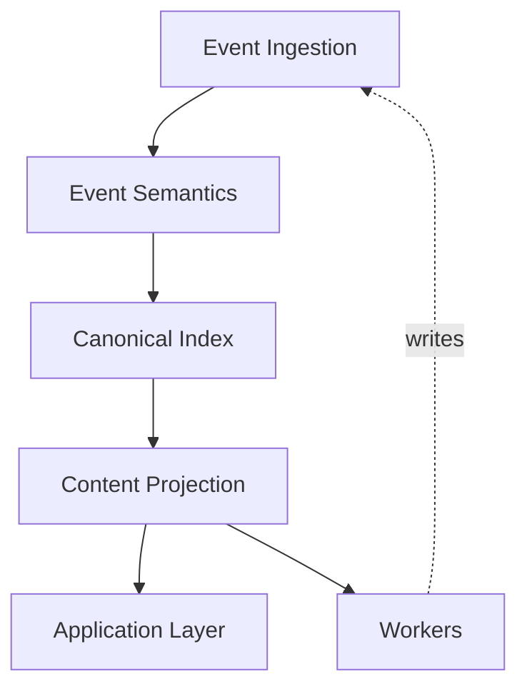
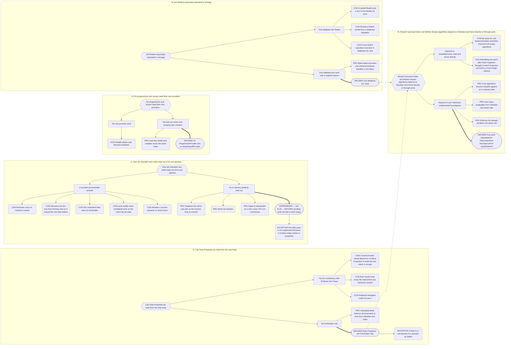
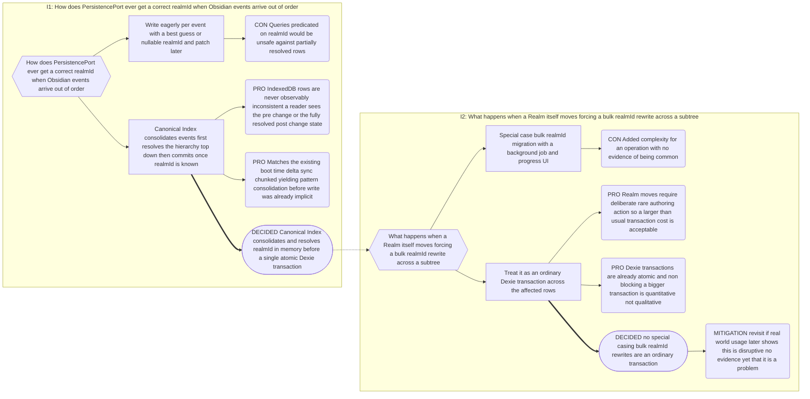
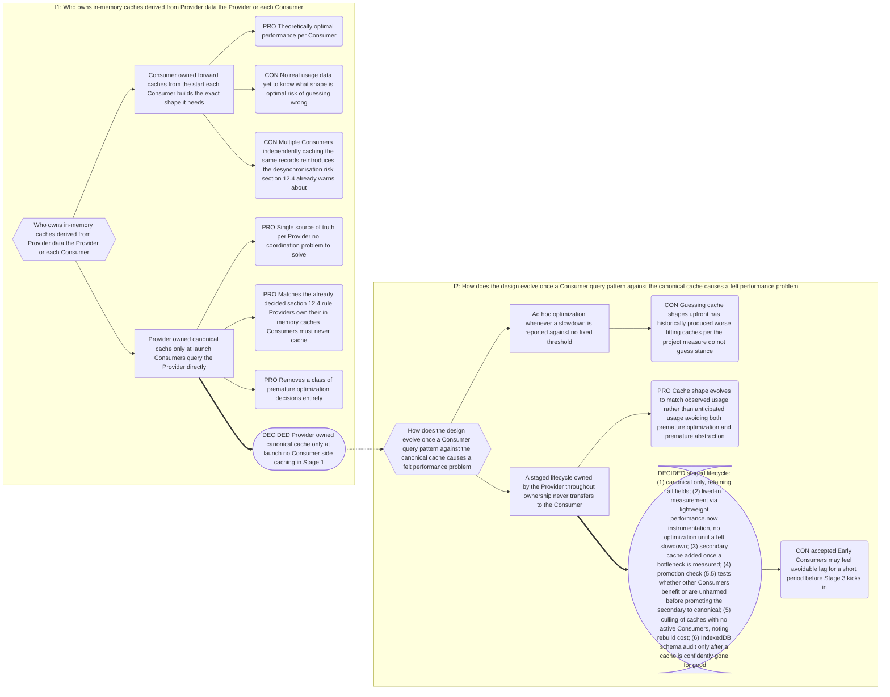
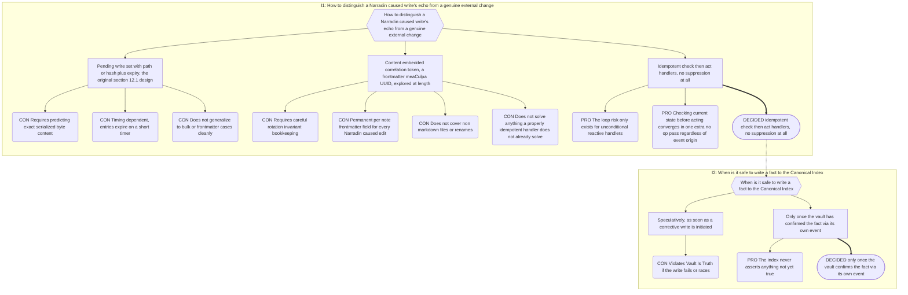

# Part 12: Architecture

## Part 12: Architecture

**Goal:** a modular, event-driven pipeline where adding a feature means adding a Provider,
never touching the ingest path or the UI layer.

### 12.1 Event Ingestion

- Hooks `vault.on('modify' | 'rename' | 'delete')` and
  `metadataCache.on('changed' | 'resolved')`.
- `metadataCache.on('changed')` guarantees frontmatter and links are current; it does
  **not** guarantee body text is ready for regex parsing. Entity Property parsing is
  therefore driven from `vault.on('modify')`, and the parser reads the raw body through
  `FileContentPort` (§12.9) rather than calling `vault.read`/`vault.cachedRead` directly.
- All raw events pass through a debounce/throttle queue so event storms never lock the main
  thread.
- **Boot-time delta sync:** on the initial `resolved`, reconcile vault state against the
  cache to catch external edits. Chunked, yielding to the main thread.
- **Storm circuit breaker:** above a threshold of events per interval, abandon incremental
  processing and schedule a single batched subtree reindex.

**Idempotent Reactive Handlers.** No self-write suppression mechanism exists anywhere in
Narradin — not a pending-write set, not a content-embedded correlation token, nothing.
Retired entirely (Decision Record B.18), replaced by one rule:

> **Every reactive structural handler checks current actual state before acting. It
> never reacts unconditionally to "an event happened."**

A handler built this way cannot loop, regardless of which side triggered it, because its
own corrective action produces an event that is evaluated by the identical check and
converges by finding "already correct." Idempotent Ingest (§1) already guarantees
reprocessing any file yields an identical index; this rule is what extends that guarantee
to renames and folder/folder-note sync, closing the one case the design previously
carved out as an exception. There is no infinite-loop risk to guard against in the first
place once a handler is check-then-act rather than unconditional — the loop only occurs
if a handler fires blindly on every matching event without first asking "is this already
true?"

**The Vault Is Truth — sequencing rule.** A second, orthogonal principle governs _when_
a write to the Canonical Index is permitted, distinct from the idempotency rule above:

> **An index write is permitted only once the fact it describes is already true and
> confirmed by the vault — via that action's own resulting event — never speculatively
> ahead of a not-yet-confirmed write.**

Initiating a corrective write is not the same as that write having happened. The
Canonical Index may never assert a fact merely because Narradin has _started_ a write
whose outcome isn't yet confirmed; it may assert the fact only once the vault's own event
for that write arrives. This is The Vault Is Truth (§1) applied specifically to the
timing of index commits, not just their content.

**Canonical worked example: folder ↔ folder-note name sync (§4.3), both directions.**

- **Note renamed first.** The Folder Note is renamed by the author. The name-sync
  handler (§4.3) fires, checks whether the folder's name already matches the note's new
  name — it does not — and issues a corrective folder rename. That rename produces its
  own `vault.on('rename')` event. The handler fires again, checks whether the names now
  match — they do — and stops. One corrective action, one no-op confirmation pass. No
  suppression was needed at any point: the second pass didn't need to be silenced, it
  needed to see the truth and agree with it.
- **Folder renamed first.** The folder itself is renamed. Two things follow from this,
  on different timelines:
  - **Category A — already true, safe to write immediately.** Every note nested inside
    the renamed folder has a new path prefix the instant the rename event fires — the
    vault has already confirmed this fact. The Canonical Index bulk-updates the path
    prefix for every such entry immediately; there is nothing speculative about it.
  - **Category B — not yet true, must wait for its own confirmation.** Separately, the
    name-sync handler checks whether this folder's own Folder Note's name still matches
    the folder's new name. If it does not, the handler issues a corrective rename
    request for that one note — but the Canonical Index does **not** yet update that
    note's basename. It waits. Only when that corrective rename's own `vault.on('rename')`
    event arrives does the index commit the new basename for that one entry. Meanwhile,
    the bulk path-prefix update for every _other_, unrelated nested entry (Category A)
    proceeds concurrently and is unaffected — the two are separate index-write timings,
    not one atomic pass, because they rest on different confirmation states.
  - The corrective rename's own resulting event then passes through the same
    check-then-act handler, finds the names already match, and stops — exactly the
    same convergence as the note-renamed-first direction, just triggered from the other
    side.

Both directions converge after exactly one corrective action plus one no-op confirmation
pass, and at no point does the Canonical Index assert a fact the vault has not yet
confirmed for itself.

_A content-embedded correlation token (`◊meaCulpa`, a frontmatter UUID stamped on every
Narradin-caused write and compared against the index on the next inbound event) was
explored at length and rejected: it requires a permanent per-note frontmatter field,
careful rotation-invariant bookkeeping, does not cover non-markdown files or renames, and
solves nothing a properly idempotent check-then-act handler doesn't already solve on its
own — see Decision Record B.18._

_A `narradin_id` content sentinel was separately considered and rejected: renames carry
no content to stamp, non-markdown files have no frontmatter, and `vault.modify` races
`metadataCache`. `narradin__*` is retained for durable state — `fka`, `generated` — not
for loop suppression of any kind._

### 12.2 Event Semantics

Translates file events into semantic Narradin events, hiding the fact that an `is` change is
indistinguishable from a create or delete. Maintains a registry of paths currently valid to
Narradin.

| Condition                           | Emitted                                                                   |
| ----------------------------------- | ------------------------------------------------------------------------- |
| gains a valid `is`, not in registry | `EntityCreated`                                                           |
| loses its `is`, was in registry     | `EntityDeleted` — even though the file still exists                       |
| in registry, renamed                | `EntityRenamed` — payload carries the **pre-change resolved Local Scope** |
| in registry, content changed        | `EntityUpdated`                                                           |

### 12.3 Canonical Index

Synchronous master state over a Dexie/IndexedDB cache. **Read-only with respect to the
vault** — a write here would re-enter Event Ingestion and loop.

- **Identity.** A surrogate auto-incrementing `++id` per tracked file. Providers store `id`
  only, never paths.
- **Path map.** Sole owner of `id ↔ path`, exposed synchronously.
- **Note Properties.** Read through `MetadataPort` (§12.9) — structural metadata must be
  available before Content Projection exists (§9.0). The port's adapter wraps `metadataCache`; the
  frontmatter-only decision itself is unchanged (Appendix B §B.7 D2).
- **Boundary resolution.** Resolves the fixed 5-anchor hierarchy (Realm/Series/Book/
  Act/Chapter, §2.2) **top-down from each Realm root** (§4.2), including Island
  detection.
- **Content Sequence.** Owns the traversal result (§7.5) and patches it on structural
  change. No Provider or Consumer ever walks the tree.
- **Local Scope map.** For every Player, Plot, and Companion, caches the resolving
  Narrative entity (§5.5). Emits scope deltas, which drive alias flushes (§10.7).
- **Indexed Scope.** Every Narradin Scope note gets a Canonical Index row (§5.5); Orphan
  Scope notes get one too, with `realmId: null` (§4.5).
- **Database.** One per vault: `narradin-{app.appId}-v{schemaVersion}`. Every row carries an
  indexed `realmId`; blast-radius enforcement is a mandatory predicate on every action
  query. A headless-orphan Island (§4.5) never acquires a `realmId` and therefore never
  becomes a row at all — it is absent from the index by construction, not filtered out of
  it. Realms are **not** physically separated — nested Realms put a row in two at once,
  Realm moves would force migrations, and cross-Realm operations would fan out. This schema
  is the adapter behind `PersistencePort` (§12.9); the boundary-resolution, traversal, and
  scope-map algorithms above depend on that interface, not on Dexie directly — the
  database choice itself is unchanged (Appendix B §B.7 D4).
- **Disposable.** The database is a cache. Rebuildable, never authoritative.
- **Synchronous API** (shape, not contract): `getPath(id)`, `getId(path)`,
  `getContentSequence(scopeId?)`, `getScopeOwner(entityId)`,
  `getEntitiesInScope(narrativeId, category?)`, `getPreChangeScope(id)`. Method names are
  unchanged code-facing identifiers (out of scope for this docs pass); in prose, each
  resolves or returns a **Local Scope** (§5.5) — `getScopeOwner` returns the Narrative
  entity a note's Local Scope resolves to, `getEntitiesInScope` returns the entities whose
  Local Scope matches, and `getPreChangeScope` returns the pre-change resolved Local Scope
  described in §12.2.
- **Emits** `HierarchyUpdated`, `ScopeUpdated`.

### 12.4 Content Projection

`MetadataProvider`, `HierarchyProvider`, `PropertyProvider`, `MentionProvider`,
`PlayerProvider`, `PlotProvider`, `CompanionProvider`, `AliasProvider`.

- **Own their in-memory caches.** Consumers must never cache, or multiple simultaneous views
  desynchronise.
- **Store `id`s only.** Rehydrate to paths and Local Scope through the Indexer.
- **Fetch what the event didn't carry.**
- **Emit domain-shaped events**, firing only when data those consumers care about changed.

A Provider may read from **multiple** lower-level sources (e.g. `PropertyProvider` reads
both frontmatter via `MetadataPort` and body text via `FileContentPort`) and combine them
into **one canonical in-memory record shape**, even though the underlying data or
IndexedDB storage may be split by origin. Consumers only ever see the combined shape.
For example, `PropertyProvider.getPropertiesForFile(fileId)` returns
`EntityPropertyRecord[]` regardless of whether a given record originated from frontmatter
or the note body — origin is a field on the record (§9.9's `origin: 'frontmatter' |
'body'`), not a caller-visible split.

### 12.5 Content Projection — Mention Index Provider

`MentionProvider` is explicitly **derived** — a projection over `PropertyProvider`, link
data, and plain-text scanning. Every mention is tagged by evidence kind:

| Kind                                        | Source                                               |
| ------------------------------------------- | ---------------------------------------------------- |
| `entity-property-subject`                   | segment 0 of an Entity Property                      |
| `entity-property-context`                   | a later segment that resolves to an entity           |
| `entity-property-value`                     | an entity name inside a value                        |
| `note-property-value`                       | `pov`, `settings`, or another reserved link property |
| `wikilink-destination` / `wikilink-display` | body links                                           |
| `plain-text`                                | normalised basename/alias occurrence (toggleable)    |

`entity-property-context` is what lets `{Frodo+Samwise+argument=…}` count as _evidence
Samwise appears_ while the progression still belongs to Frodo.

**Mentions from `!` properties are excluded from appearance evidence** — cast lists,
first-appearance ordering, presence counts — because removed content is not an appearance.
They are retained in Progressions, where the gap is exactly what the author needs to see.

**Indexes stale strings too** — every value in every `fka` thread — so the alias pass can
locate the text it must fix.

**Matching reuses the Application Engine's machinery**: normalisation (§9.2), superset
masking, word boundaries. One code path finds a name and rewrites it, so discovery and
replacement can never disagree.

**Respects Islands absolutely.** A mention inside an Island is never visible outside it.

### 12.6 The `narradin__*` Namespace

Reserved absolutely. Object-valued properties are stored as **JSON strings** in a single
property — compact, cache-readable, visually inert.

Narradin additionally ships CSS hiding `[data-property-key^="narradin__"]` in the properties
panel. This leans on Obsidian's internal styling and is acknowledged as brittle; JSON-string
serialisation is what the presentation gracefully degrades _to_ if the selector breaks.

Raw YAML remains visible in source mode and in the all-properties view, and `narradin__*`
keys are **not** suppressed from property autocomplete. Power users may have good reasons to
touch them, at their own risk.

Current members: `narradin__fka`, `narradin__generated`, `narradin__ack`.

### 12.7 Application Layer — Consumers and Workers

- **Consumers (UI):** CodeMirror view plugins, sidebars, codeblock views, the alias modal.
  They subscribe to Providers and render. They never parse files or query the database.
- **Workers:** the Alias Application Engine and the Compiler. A Worker reads a plan from a
  Provider, resolves paths through the Indexer, and performs batched writes. The plan
  computation (what to rewrite, where to compile to) is pure core logic that takes/returns
  data; only the write execution goes through `VaultWritePort` (§12.9) — the adapter-side
  orchestration that calls the port to carry out the plan.

### 12.8 Pacing

| Signal                                        | Target                                                                                                                    |
| --------------------------------------------- | ------------------------------------------------------------------------------------------------------------------------- |
| Entity Property parse after last keystroke    | 300–500 ms                                                                                                                |
| Metadata / structural change                  | ~150 ms                                                                                                                   |
| Hierarchy rebuild (coalesced, subtree-scoped) | ~250 ms                                                                                                                   |
| Boot delta-sync                               | chunked, yielding to main thread                                                                                          |
| Alias application pass                        | 15-minute floor; window-blur trigger; **immediate** on collision, on Local Scope change with pending `fka`, or on command |

### 12.9 Ports and the Core Boundary

`src/core/**` never imports `obsidian` or `dexie` at runtime. Five ports (`src/ports/`)
form the seam between the domain algorithms above and the technologies that back them:

| Port              | Wraps                                                          | Depended on by                                                                                     |
| ----------------- | -------------------------------------------------------------- | -------------------------------------------------------------------------------------------------- |
| `MetadataPort`    | `metadataCache`                                                | Canonical Index boundary resolution (§4.2) and Note Property reads (§12.3)                         |
| `FileContentPort` | `vault.read` / `vault.cachedRead`                              | Event Ingestion / Event Semantics Entity Property parsing (§12.1)                                  |
| `PersistencePort` | the Dexie/IndexedDB schema (§12.3 "Database")                  | Canonical Index's boundary-resolution, Content Sequence traversal (§7.5), and scope-map algorithms |
| `VaultWritePort`  | `vault.modify` / `rename` / `delete`                           | Workers' write-execution step (§12.7), not their plan computation                                  |
| `LoggerPort`      | `Vault.adapter` (`DataAdapter`) writes under `_narradin/logs/` | Developer-diagnostics logging, opt-in, silent by default (Decision Record B.16)                    |

**`LoggerPort`.** `log(level: LogLevel, message: string, meta?: Record<string,
unknown>): void` — the only method. `LogLevel` is `trace | debug | info | warn |
error`. Unlike the other four ports, nothing depends on it yet by necessity: it
exists so a wiring point is available as soon as call-sites are added
organically, per Decision Record B.16. Its adapter (`ObsidianLoggerAdapter`,
`src/adapters/`) owns the enabled/level checks (no I/O below the configured
threshold or while logging is disabled), formatting, single-backup rotation at
a 5 MB cap, and the vault file write — all against `Vault.adapter`, never
`Vault.create`/`Vault.modify`, so the plain-text log file never triggers a
`vault.on('modify')` event or gets treated as an indexed note. **Redaction is
the caller's responsibility, not the port's or the adapter's**: any
`message`/`meta` content built from vault content (note titles, aliases,
property values, body excerpts) must already be wrapped in guillemets
(`«...»`) by the calling code before it reaches `log()` — neither the
interface nor the adapter inspects arguments for vault content, since only the
caller knows which arguments are vault-derived.

None of this reverses an existing decision. `MetadataPort`'s adapter still reads
frontmatter via `metadataCache` (Appendix B §B.7 D2), and `PersistencePort`'s adapter is
still the one-database-per-vault Dexie schema (Appendix B §B.7 D4). The port only adds a
seam so the domain algorithms that consume those choices — boundary resolution,
traversal, scope resolution, plan computation — can be unit-tested against an in-memory
fake and stay decoupled from Obsidian/storage technology, per the core-purity rule (see
`src/core/README.md`, `src/ports/README.md`).

**Non-blocking adapters.** Ports carry no performance contract themselves — that's the
adapter's job. `MetadataPort` reads are expected to stay synchronous and cheap because
`metadataCache` is in-memory; this is by design, not a jank risk, and nothing here asks
`MetadataPort` to become async. `FileContentPort` reads are inherently async
(`vault.read` / `vault.cachedRead` already return Promises). `PersistencePort` and
`VaultWritePort` adapters must not block the calling path — batch writes, use IndexedDB
transactions appropriately, and never synchronously wait on I/O inside a call that Canonical
Index or a Worker expects to return quickly. The debounce/throttle/coalescing behaviour that
keeps the §12.8 pacing targets achievable lives in Event Ingestion's event queue and
Canonical Index's coalesced rebuild logic (§12.1, §12.3) — it is orchestration-layer responsibility, not
something a port interface can or should enforce.

**Providers are port-and-adapter in one, for their Consumers.** To their Consumers
(Application Layer), a Provider's canonical cache + query methods + change events
function as a **port** — a stable contract Consumers depend on without knowing how it is
fulfilled. To the layers below (Canonical Index, Ports), the same Provider acts as an
**adapter** — it knows how to orchestrate `MetadataPort`, `FileContentPort`, and the
Canonical Index's synchronous API to build its canonical view. This is a deliberate,
scoped collapse of the port/adapter separation that `src/core`/`src/ports` otherwise
enforces strictly. It is acceptable here because: (a) the scope is narrow — one domain
concern per Provider; (b) Providers sit close to the final Consumer, where the cost of an
unswappable implementation is low; (c) Providers live outside `src/core`/`src/ports`
already, so they were never bound by the core-purity rule (§12.9, `src/core/README.md`).
Consequence: a Provider's internal cache shape is not swappable the way `MetadataPort`'s
Obsidian-vs-fake adapter is. This is intentional, not an oversight — see Decision Record
B.15.

---

## Decision Record

## B.7 Architecture

**Chain:** I1 write-loop suppression, I2 frontmatter-only properties, I3 provider
consolidation, and I4 per-vault storage all feed I5, the ports-vs-direct-dependency
question.

_D5 does not supersede D2 or D4 — the dotted arrows mark that this issue reconsiders their
consequences, not their outcomes. Note Properties are still read from `metadataCache`
(D2) and the cache is still one Dexie database per vault (D4); `MetadataPort` and
`PersistencePort` are adapters over those same unchanged choices. The only new thing is
the seam between them and the core algorithms that consume them (§12.9)._

---

## B.14 RealmId Synchronization

**Chain:** extends B.7's I4/D4 (one database per vault with a `realmId` column) — this
record does not reopen _whether_ Realms are physically separated, only _when_ a
`realmId` write is safe to commit.

_D1 and D2 do not supersede B.7's D4 — the dotted arrow marks that D1's consolidate-then-
commit mechanism forced I2 (the Realm-move case) to be reasoned through explicitly, not
that the one-database-per-vault, `realmId`-column schema (D4) changed. `PersistencePort`
still never receives a write until `realmId` is known; Realm moves are still an ordinary,
if larger, transaction against that same schema._

---

## B.15 In-Memory Cache Ownership and Lifecycle

**Chain:** cross-references B.7 (Architecture, §12.4/§12.9's Provider caching rule) and
B.14 (RealmId Synchronization) — all three concern the Canonical Index / Provider
boundary.

_Consequence, stated honestly: a Provider's cache shape is therefore **not** a stable
public contract the way `MetadataPort`/`PersistencePort` are — it is expected to change
(via promotion) as real usage is observed. Consumers must query through typed getter
methods only, never touch a Provider's internal cache structure directly, so shape
changes never break Consumer code. This does not reverse B.7's D5 (ports) or §12.4's
Provider-owns-its-cache rule — D1 above only extends the latter with a lifecycle; see also
B.14, whose D1 (consolidate-then-commit) is a Canonical Index-side instance of the same
"don't optimize/special-case until it hurts" philosophy._

---

## B.18 Self-Write Suppression Retirement

**Chain:** I1 how to distinguish a Narradin-caused write's echo from a genuine external
change → I2 when is it safe to write a fact to the Canonical Index. Reopens B.7's I1/D1
(§12.1 above) — that Decision node is relabelled SUPERSEDED there per §B.12, rather than
edited in place here.

**Why the "renames are the one exception" premise didn't hold.** The original §12.1
design (B.7's D1) framed renames as the sole correctness-critical case for suppression,
because folder ↔ folder-note sync looked like the one path that could form an infinite
loop. Working through concrete traces in both directions (§12.1's worked example) shows
the loop only occurs if the reactive handler is _unconditional_ — fires without checking
current state first. A check-then-act handler converges in one corrective action plus
one no-op confirmation pass, with no suppression needed at all, in either direction. The
loop premise itself doesn't hold once handlers are written correctly, so there was never
a correctness-critical case left to carve out an exception for.

**Two distinct principles, not one merged rule.** D1 above governs _whether a handler
can loop_ (idempotent check-then-act, any handler, any trigger direction). D2 governs
_when an index write is permitted_ (only once the vault has confirmed the fact via its
own event) — a sequencing constraint that would matter even if no suppression question
existed at all. Conflating them risks smuggling speculative index writes back in under
cover of "the handler is idempotent so this is fine" — idempotency and sequencing are
independently necessary and neither implies the other.

---
