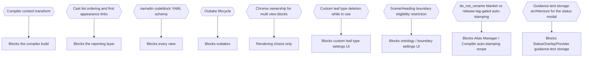

# Part 15: Open Questions

## Part 15: Open Questions

| Ref   | Question                                                                                                                                                                                                  | Blocks                          |
| ----- | --------------------------------------------------------------------------------------------------------------------------------------------------------------------------------------------------------- | ------------------------------- |
| Q-2   | Compiler content transform: frontmatter, heading remapping, separators, CMOS toggles.                                                                                                                     | Compiler build                  |
| Q-3   | Cast-list ordering detail and first-appearance linking.                                                                                                                                                   | Reporting layer                 |
| Q-5   | `narradin` codeblock YAML schema.                                                                                                                                                                         | Every view                      |
| Q-16c | Outtake lifecycle.                                                                                                                                                                                        | Outtakes                        |
| Q-16d | Chrome ownership when one codeblock invokes several views.                                                                                                                                                | Rendering                       |
| Q-17  | Custom leaf type deletion while notes still reference it — block deletion, require a bulk rename-to-another-type first, or something else?                                                                | Custom leaf type settings UI    |
| Q-18  | Should Scene/Heading eligibility to act as a folder-level boundary (via folder-note placement, §2.1/§4.1) ever be restricted, given they can now be placed at any level like any other Narrative concept? | Ontology / boundary settings UI |
| Q-19  | `do_not_rename` auto-stamping: does every Compiler output get it automatically, or only output tied to a Version Control release tag (§17)?                                                               | Alias Manager / Compiler        |
| Q-20  | Guidance-text storage architecture for the status-overlay modal (§12.10) — its own registry, or a plain internal map?                                                                                     | `StatusOverlayProvider`         |

All nine are scoped inside features not yet designed. None reaches back into ingest,
indexing, traversal, scope resolution, the alias engine, or the property grammar.

**Implementation-time check, not a spec-content question.** Whether Notebook
Navigator's own folder-note-pattern setting is actually vault-wide (§2.3 assumes it is,
to match the new folder-note filename template's granularity) is worth confirming
against real NN behavior/documentation during implementation — tracked here as a note,
not as a numbered open question, since it does not change any spec content, only
whether §2.3's recommendation holds up. Note Toolbar's reactive-refresh behavior on live
in-note edits (§12.10) is the same kind of implementation-verification item, not a
spec-content question — tracked the same way, not as a numbered row here.

---

## Decision Record

## B.11 Open Issues

Unresolved. Each is scoped inside a feature not yet designed.

`Q-5` is the pressing one: no view in Part 16 is reachable without it.

---
