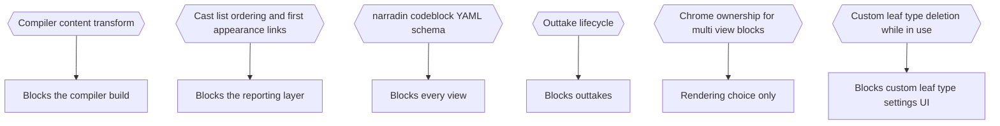

# Part 15: Open Questions

## Part 15: Open Questions

| Ref   | Question                                                                                                                                   | Blocks                       |
| ----- | ------------------------------------------------------------------------------------------------------------------------------------------ | ---------------------------- |
| Q-2   | Compiler content transform: frontmatter, heading remapping, separators, CMOS toggles.                                                      | Compiler build               |
| Q-3   | Cast-list ordering detail and first-appearance linking.                                                                                    | Reporting layer              |
| Q-5   | `narradin` codeblock YAML schema.                                                                                                          | Every view                   |
| Q-16c | Outtake lifecycle.                                                                                                                         | Outtakes                     |
| Q-16d | Chrome ownership when one codeblock invokes several views.                                                                                 | Rendering                    |
| Q-17  | Custom leaf type deletion while notes still reference it — block deletion, require a bulk rename-to-another-type first, or something else? | Custom leaf type settings UI |

All six are scoped inside features not yet designed. None reaches back into ingest,
indexing, traversal, scope resolution, the alias engine, or the property grammar.

---

## Decision Record

## B.11 Open Issues

Unresolved. Each is scoped inside a feature not yet designed.

`Q-5` is the pressing one: no view in Part 16 is reachable without it.

---
