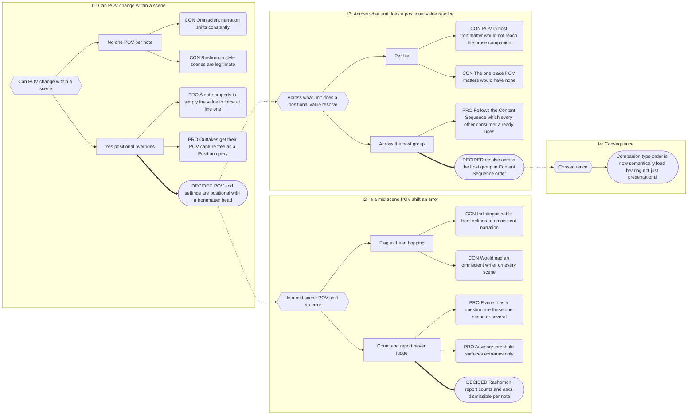

# Part 16: Views

## Part 16: Views

Every view is a query over `PropertyProvider` joined to `MentionProvider`, ordered by
Position, bounded by scope. None is a subsystem.

### 16.1 Progressions

The unfiltered chronological view of one entity's Entity Properties.

1. **Subject** — explicit `target` in the codeblock; else the hosting note's entity; else,
   if the host is a Companion, its `for` host. None → error state.
2. **Report scope** — the hosting note's scope (§5.2).
3. **Two-axis membership** (§8.4): the subject must be scope-eligible — its scope an
   ancestor of, equal to, or a descendant of the report scope — and rows are drawn **only
   from within the report scope**. A block on a Book folder note targeting a Series-scoped
   character shows that Book's rows, not the Series'.
4. Query `MentionProvider` for `entity-property-subject` mentions of the subject in scope.
   Hydrate with records.
5. Sort by Position.

**Columns:** Breadcrumb · Progression · Context. The breadcrumb is a chain of hierarchy
icons (Book › Chapter › Scene), each linking to its level — a bare scene link loses
structural bearing in a long list.

**Rows show all three modifiers**, distinguished by a registered icon and filterable in the
codeblock. This is the point of the view: default is written, `~` is planned but exists only as
a note, `!` marks internal/removed content. A report showing only the default modifier would tell an author their arc
is complete when half of it is still notes.

**Naming Collisions** — where two entities share a name, a row appearing in both reports
carries a warning-coloured duplicate badge.

### 16.2 Setups & Payoffs

The same records, paired by role. A thread is a **subject entity** — there is no wikilink
pointer, no anchor dispatch, no context-string thread identity. Those existed only because
there was no entity to hang the thread on.

**Matching.** Two records pair when:

1. **Same subject entity.**
2. One carries an `opens` context, the other a `closes` context. A record carrying both is
   legitimately dual-role — a chapter-ending reveal that closes one thread and opens the
   next. It participates as both.
3. **Discriminators agree.** Discriminators are all non-role contexts; role contexts are
   never discriminators.

| Setup discriminators | Payoff discriminators | Result                             |
| -------------------- | --------------------- | ---------------------------------- |
| ∅                    | ∅                     | ✓ strength 0                       |
| ∅                    | `{envelope}`          | ✓ strength 0 — empty is a wildcard |
| `{envelope}`         | ∅                     | ✓ strength 0 — empty is a wildcard |
| `{envelope}`         | `{envelope}`          | ✓ strength 1                       |
| `{envelope, ring}`   | `{envelope}`          | ✓ strength 1                       |
| `{envelope, ring}`   | `{envelope, ring}`    | ✓ strength 2                       |
| `{envelope}`         | `{ring}`              | ✗ — both populated, disjoint       |

**Strength = size of the discriminator intersection.** Only both-populated-and-disjoint
rejects; a naked setup remains useful against anything.

**Presentation by strength.** Group by best available strength: the strongest match renders
as the pair, weaker candidates collapse to _"also matches N others."_ A naked setup with
twelve candidates is one row plus a count, not twelve rows.

**Sections:**

| Section       | Meaning                           |
| ------------- | --------------------------------- |
| **Contained** | both ends inside the report scope |
| **Incoming**  | closes here, opens outside        |
| **Outgoing**  | opens here, closes outside        |

**Status indicators:**

- **Time travel** — payoff precedes setup in Position order. Flagged, never blocked.
- **Red herring** — `opens` with no `closes` anywhere in the Realm.
- **Deus ex machina** — `closes` with no `opens`.
- **Span indicator** — hierarchy distance between the two ends, coloured by severity, from
  the Indexer's ancestor chain.

**Cross-Realm pairing is structurally impossible** and no longer a reportable state: both
ends of a thread are Realm-bounded by construction.

### 16.3 Cast Lists

`MentionProvider` projected to distinct entities within a scope, per §8.4's two-axis rule.
Ordering and appendix as specified there.

### 16.4 POV and Settings — Positional Values

POV and setting are **positional**: they hold from their declaration until the next one. A
note-level property is simply the declaration in force at line 1.

**Declaration.** Note Property — the value at the start of the note:

```yaml
pov: "[[Vimes]]"
settings: ["[[The Watch House]]", "[[The Shades]]"]
```

Positional override — a system marker taking effect from its Position onward:

```
{~◊pov=[[Colon]]}
{~◊settings=[[The Shades]]}
```

`settings` remains a **list** in both forms. Its plurality is no longer about sequence —
positional overrides handle that — but about genuine simultaneity: a scene set in two places
at once, such as a scrying bowl showing the Shades from the Watch House. A positional
override replaces the entire active set.

Both are inserted by command (§13.1), `◊` being untypeable by design, and freely editable
thereafter.

**Resolution.** POV and settings resolve across the **host group** — a Narrative note
together with all its Companions — not per file. The value at any Position is the last
declaration at or before it, walking the group in Content Sequence order (§7.5): the host
note first, then Companions by configured type order.

Frontmatter on the host sits at the earliest Position in the group and therefore needs no
precedence rule; it is simply the head of the timeline.

> This is what makes the common layout work. An author who declares `pov` in the host
> dashboard's frontmatter and writes prose in `Scene 12__prose.md` gets POV throughout.
> Resolving per file would leave the prose — the one place POV actually matters — with none.

A group with no declaration anywhere has no POV. It is never inherited from a parent scope
or a preceding note: POV is a property of prose, not of hierarchy.

**Declarations reach forward only.** An override in `__prose` (rank 2) does not affect
`__beats` (rank 1), which precedes it. Read in isolation the POV can appear to move
backwards; read in Content Sequence order — which is how every consumer reads it — it does
not.

**Mentions and evidence.** Both generate `note-property-value` mentions — or
`entity-property-value` for positional overrides — and count as **strong appearance
evidence**. A POV character appears in their scene whether or not they are named in the
prose. A mention is attributed to the **segment** it governs, not the whole note.

**The Rashomon Report.** Multiple POV segments in one note are **counted and reported, never
judged.** Narradin cannot distinguish head-hopping (a craft weakness the author wants
flagged) from omniscient narration (deliberate and constant) from a structural pivot (a
scene that should be two), and should not try.

- Health lists notes with more than one POV segment, with the segment count.
- An advisory threshold — configurable, default 3 — surfaces extremes without pestering an
  omniscient writer.
- Dismissible per note via `narradin__ack: pov-shifts`.

The framing is a question, not a finding: _"Scene 12 has 4 POV segments. Are these one scene
or several?"_

**Consequences for reports.** A scene with multiple POV segments appears under **every** POV
character in a POV map. This is correct — each of them was the POV. Reports mark such rows
as shared segments rather than independent appearances, using the same duplicate-badge
treatment as Naming Collisions.

### 16.5 Outtake Markers

A system marker whose subject is `◊outtake`:

```
{!◊outtake+Vimes+The Watch House=[[Outtakes#^blk-1a2b]]}
```

- Hidden, cursor-skipped. A pointer, not content.
- **Contexts are captured values, not literal words** — the POV and settings _as they were
  at the moment of the cut_, resolved at the marker's Position (§16.4). On restore, Narradin
  compares them against the current values and warns if the scene has moved on.
- Contexts naming entities generate `entity-property-context` mentions, but the `!` modifier
  excludes them from appearance evidence (§12.5).
- The `is` lives on the **collection note**, not the marker.
- The collection note must be inside the same Realm — Realm blast radius.

**Authorship.** Markers are written exclusively by Narradin, by _Cut to Outtake_. Authors
neither compose nor hand-edit them; the lozenge namespace makes accidental authorship
impossible and deliberate authorship pointless.

**Gutter affordance.** A scissors icon in the margin of any block containing markers, with a
dropdown where there is more than one. It offers restore and inspection; it is **not** an
insertion surface.

**Deferred:** the lifecycle. `[OPEN Q-16c]`

### 16.6 Anchor Cascade

Every row links to the occurrence, not merely the note. Idiomatic Obsidian, so hover preview
works throughout:

1. **Block ID** if the author wrote one on the containing block →
   `[[Note#^id|Note > id]]`, the id humanised (`in-the-basement` → _"in the basement"_).
2. **Nearest preceding heading** → `[[Note#Heading]]`.
3. **The note** → `[[Note]]`.

Links use the **full path plus a display alias**, not the basename. Naming Collisions are
expected, so a basename link is ambiguous by design. Alias pipes are escaped for GFM table
safety.

### 16.7 Icon Registry

A central registry mapping semantic keys to Lucide slugs, recording each binding's owner.

- **Registrants:** hierarchy levels, entity categories, context vocabulary, status
  indicators, report chrome.
- **Picker:** shows all Lucide icons; any already bound carries a badge naming its
  binder(s). Reuse is permitted — informed, not blocked.
- **Fallback:** unknown key → `circle-question-mark`, never a blank slot.
- Core defaults ship; overridable per Realm.
- **No emoji in output. Ever.**

Distinct from the `icon` Note Property (Part 11), which is a per-_note_ Notebook Navigator
link. The registry is per-_concept_.

### 16.8 Report Chrome

Shared by every view.

- **Header** — registered icon, title, chevron. The whole title row toggles collapse and
  carries `role="button"` with `aria-expanded`.
- **Collapse state** — persisted per vault via `App.saveLocalStorage`, keyed by the
  Indexer's `++id` rather than by path, so a rename does not orphan the preference.
  Device-local: a UI preference is not vault content.
- **Empty state** — names what was searched for. _"No progressions found for Vimes in
  Book 2."_
- **Error state** — registered error icon plus a specific cause.

Whether chrome is owned per view or by the block wrapper is a rendering decision. The
requirement is that every view presents identically. `[OPEN Q-16d]`

---

## Decision Record

## B.9 POV as a Positional Value

**Chain:** I1 POV positional model → I2 mid-scene shift handling → I3 positional
resolution unit → I4 companion-order consequence.



---
