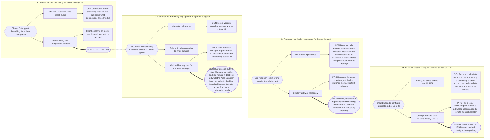
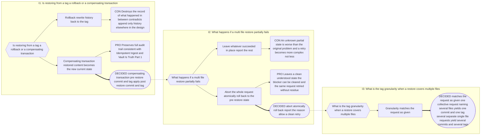
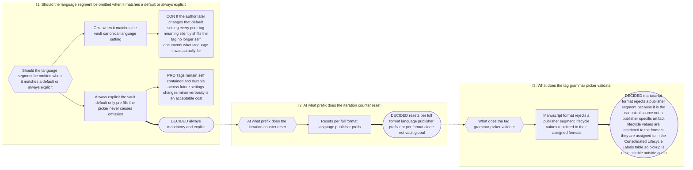

# Part 17: Version Control (Git)

## Part 17: Version Control (Git)

**Goal:** local versioning for compile history, editorial snapshots, and back-out
safety for destructive rewrites (the Alias Manager). Optional feature.

### 17.1 Scope & Enablement

- **One Git repository for the whole vault** — not per-Realm, not
  Narradin-files-only. Realm scoping (§5.5) applies only to _tag names_ (§17.6), never
  to repository boundaries. This also recovers from accidental Narradin overreach into
  non-Narradin notes elsewhere in the vault.
- **No branching.** Edition divergence (print/ebook/audio) is handled by Companions
  (§17.7), not branches.
- **No remote, no Git LFS.** Narradin configures neither. This is local versioning, not
  a backup solution. Binaries (covers, logos, inserts) are tracked directly in the
  repository. Advanced users may add a remote themselves, outside Narradin's UI.
- **Alias Manager dependency — a hard gate.** The Alias Manager (Part 10) cannot be
  enabled unless Git is enabled: Git is its back-out mechanism. Every rename pass is
  bracketed by an auto-generated pre-rename commit+tag and an auto-generated
  post-rename commit+tag, giving the author two recovery anchors.
  - Disabling Git while the Alias Manager is on shows a confirmation modal warning
    that this will also disable the Alias Manager. If the author proceeds, the Alias
    Manager first flushes any outstanding `narradin__fka` backlog (§10.7), then both
    are disabled.
  - In the Settings UI, the Alias Manager toggle is **dimmed** whenever Git is
    disabled, so the dependency is visible, not just silently enforced.

### 17.2 `.gitignore`

Auto-generated on initialisation: excludes `.*` (dotfiles and dot-directories), with
`!.gitignore` re-included so the file itself is always tracked. User-editable
afterward — Narradin never rewrites it again post-initialisation.

### 17.3 Operational Commits (Untagged)

Background commits that just keep the repository current — Alias Manager
pre/post-rename commits excepted, which get tags per §17.1 — are **not** tagged. Tags
are reserved for author-meaningful events (§17.4). This keeps `git tag -l`
signal-only.

### 17.4 Author-Triggered Tags — Two Kinds

- **Release tags** — an audience-facing handoff. Public bumps MAJOR. Editor, Agent,
  Publisher, or Proof-reader bumps MINOR. None are mandatory; the author picks zero or
  more over a work's life.
- **Progress tags** — author-declared completed work, bumping PATCH. Semantic type —
  `prose` · `world-building` · `character-arc` · `plotting` · `marketing` · `errata` —
  plus freeform detail text.

**Explicitly dropped:** automated status-floor tagging, e.g. auto-tagging when every
note reaches at least some status (Decision Record B.22, I1). Also dropped: dedicated
POV-change and Setting-change tags — too granular; these remain inline Entity Property
markers (`{~pov=…}`, `{~setting=…}`, Part 16), not version events (B.22, I2).

Every tag — release or progress — requires the author to confirm or adjust a **scope**
(§17.5) before commit.

### 17.5 Scope Picker

A tree UI, prepopulated from the active note's narrative path and defaulting to the
active note's own level. The picker **walks upward** from there, listing each ancestor
boundary in turn; the author may truncate upward — dropping any number of the deepest
confirmed levels — to broaden the tag's scope. Because the hierarchy is now fully
generic and arbitrary-depth (§2.2), the picker caps its **visible** window at roughly
four levels at a time, with an expand affordance for hierarchies deeper than that — it
never assumes a fixed six-rung `Realm → Series → Book → Act → Chapter → Leaf` shape, and
never forces the author to drill down to leaf depth.

The confirmed path becomes the tag's build-metadata segment (§17.6), phrased as the
**Nearest Common Ancestor (NCA)** of the change: the narrowest node the author
confirms covers everything the tag is about.

### 17.6 Version Tag Grammar

```
MAJOR.MINOR.PATCH-format[.language].publisher.lifecycle.iteration+ScopePath
```

`ScopePath` is the confirmed scope path (§17.5), rendered as dot-joined segment names
from Realm downward to the confirmed NCA — however many levels that actually is. There
is **no fixed slot count**: the old `+Realm.Series.Book.NCA` framing described one
common depth, not a structural limit. The build-metadata segment is **variable-length**,
capturing the full confirmed path exactly as deep as it actually goes, and the picker's
display window (§17.5) never truncates what gets written into the tag — the visible
window is a UI convenience, not a data limit.

Segment table:

| Segment      | Values                                                                                                                                                                                                                                                          | Optional?                                                               |
| ------------ | --------------------------------------------------------------------------------------------------------------------------------------------------------------------------------------------------------------------------------------------------------------- | ----------------------------------------------------------------------- |
| `MAJOR`      | Integer — bumped on a Public release tag                                                                                                                                                                                                                        | No                                                                      |
| `MINOR`      | Integer — bumped on an Editor/Agent/Publisher/Proof-reader release tag                                                                                                                                                                                          | No                                                                      |
| `PATCH`      | Integer — bumped on a progress tag                                                                                                                                                                                                                              | No                                                                      |
| `format`     | `manuscript` · `print` · `ebook` · `audio`                                                                                                                                                                                                                      | No                                                                      |
| `language`   | BCP 47 (`en-us`, `en-gb`, `nl`, `fr`, …)                                                                                                                                                                                                                        | **No — always explicit** (see B.23)                                     |
| `publisher`  | Agent/publisher/platform shortcode (`kdp`, `penguin`, `acx`, …)                                                                                                                                                                                                 | Yes — omit if not applicable; **forbidden for `manuscript`** (see B.23) |
| `lifecycle`  | See Consolidated Lifecycle Labels table below                                                                                                                                                                                                                   | No                                                                      |
| `iteration`  | Integer, resets per `format.language.publisher` prefix                                                                                                                                                                                                          | No                                                                      |
| `+ScopePath` | Build metadata: the confirmed scope path (§17.5), truncated to the NCA, variable-length. **Not ignorable** — unlike default semver precedence rules, this segment is semantically load-bearing (identifies _which_ Realm/Book this version history belongs to). | No                                                                      |

Consolidated Lifecycle Labels:

| Label           | Phase                                          | Formats                    |
| --------------- | ---------------------------------------------- | -------------------------- |
| `draft`         | Internal authorial drafts                      | manuscript                 |
| `development`   | Developmental edit                             | manuscript                 |
| `revision`      | R&R — post-submission structural rework        | manuscript                 |
| `submission`    | Sent to agent or publisher                     | manuscript                 |
| `line`          | Line edit                                      | manuscript · print · ebook |
| `copy`          | Copyedit                                       | manuscript · print · ebook |
| `script`        | Dialogue/tag/beat adaptation for audio         | audio                      |
| `pronunciation` | Pronunciation guide + invented word resolution | audio                      |
| `direction`     | Performance notes, pacing, character voice     | audio                      |
| `pickup`        | Post-recording text/audio correction pass      | audio                      |
| `proof`         | Final proofread / QC                           | all                        |
| `publish`       | Released to audience                           | all                        |

Validation rules (enforced by the tag-picker UI, see B.23):

- `manuscript` format **rejects** a `publisher` segment.
- `lifecycle` value must belong to the selected `format`'s allowed set above.

Examples:

```
0.2.14-manuscript.en-us.development.2+DiscWorld.Book16
1.1.6-print.nl.penguin.copy.1+DiscWorld.Book16.Act2
1.1.6-audio.en-us.acx.pronunciation.1+DiscWorld.Book16
1.2.0-audio.en-us.acx.pickup.2+DiscWorld.Book16.Act3.Ch7
1.2.0-ebook.en-gb.kdp.proof.1+DiscWorld.Book16
```

### 17.7 Companions for Format Divergence

- `__audio` is a Companion type (ordinary Companion contract, §6.1) seeded as a copy of
  `__prose`; the author edits it to diverge — stage directions, adapted dialogue tags,
  etc. (e.g. `"You are serious?" He laughed.` becomes `[laughing] "You are serious?"`).
- `print` and `ebook` have **no dedicated companion** in the common case — they are
  verbatim `__prose`, with formatting handled downstream by tools like Vellum.
- **No auto-sync.** Errata fixes are not propagated between companions automatically.
- **Diff tool.** The author picks any two companions of a host note (typically
  `__prose` vs. `__audio`) and gets a side-by-side diff — green add, red delete, gaps
  on the opposite side for inserts/deletes, the standard diff convention.
- **Deferred:** pushing or pulling individual chunks between companions from the diff
  view. Future work, not in scope now.

### 17.8 Restore Semantics

Restoring from a tag is **never a rollback** — it is a compensating transaction. The
restored content becomes the new current state; history is append-only (Decision
Record B.21, I1).

Sequence:

1. Commit and tag outstanding changes ("pre-restore").
2. Apply the restore — a full tag, or a chosen file subset.
3. Commit and tag the result ("post-restore").

**Tag granularity matches the request as given, not the file count.** One restore
request naming three files yields one commit and one tag covering all three. Three
separate single-file requests yield three commits and three tags (B.21, I3).

**Atomicity.** If any file in a restore request fails to apply, abort the entire
request, roll back to the pre-restore state, report the specific blocking reason, and
let the author clear the blocker before retrying. A partial restore is never left in
place (B.21, I2).

**Preview required.** Before committing a restore, show a diff preview — the same
side-by-side convention as §17.7 — of every file the restore will change. No restore
commits without the author having seen this preview.

### 17.9 Surfaces

Commands for enabling Git, tagging releases/progress, restoring, and comparing
companions live in the shared command table, Part 13 §13.1. Git's own log and tag list
are the authoritative record (Leverage Native Mechanics, Part 1) — no new
`_narradin/` file is introduced for this feature.

> [TODO: confirm commit message wording during implementation] — applies to every
> auto-generated commit in this Part (pre/post-rename, pre/post-restore, and every
> release/progress tag commit).

---

## Decision Record

## B.20 Git Feature Shape

**Chain:** I1 branching → I2 mandatory vs. optional-but-gated → I3 repo scope → I4
remote and LFS.



---

## B.21 Restore Semantics

**Chain:** I1 rollback vs. compensating transaction → I2 partial-failure handling → I3
tag granularity for restores.



---

## B.22 Author Tagging Model — Releases, Progress, and What Was Dropped

**Chain:** I1 status-floor auto-tagging → I2 POV/Setting-shift tags → I3 what
MAJOR.MINOR.PATCH represents → I4 format divergence without branches.

```mermaid
flowchart LR
    subgraph S1["I1: Should Narradin auto tag when the manuscript overall status floor rises"]
        I1{{Should Narradin auto tag when the manuscript overall status floor rises}}
        P1[Yes automated status floor tagging]
        P2[No drop status driven tagging entirely]
        I1 --> P1
        I1 --> P2
        C1(CON Late arriving notes and status fallbacks make the floor unstable a tag implying everything is now at a level can lie the moment one note regresses sends the wrong signal)
        P1 --> C1
        D1([DECIDED dropped])
        P2 ==> D1
    end
    D1 -.-> I2
    subgraph S2["I2: Should POV changes and Setting changes get their own version tags"]
        I2{{Should POV changes and Setting changes get their own version tags}}
        P2a[Yes dedicated tags they are structurally significant]
        P2b[No too granular for a version event already tracked as inline Entity Properties Part 16]
        I2 --> P2a
        I2 --> P2b
        D2([DECIDED no dedicated tags stays inline only])
        P2b ==> D2
    end
    D2 -.-> I3
    subgraph S3["I3: What does the MAJOR MINOR PATCH core represent"]
        I3{{What does the MAJOR MINOR PATCH core represent}}
        P3a[Arbitrary author choice no fixed meaning]
        P3b[Tied to audience reach Public equals MAJOR closed audiences equal MINOR declared progress equals PATCH]
        I3 --> P3a
        I3 --> P3b
        D3([DECIDED audience tied Public is MAJOR Editor Agent Publisher and Proof reader are MINOR the authors own declared progress is PATCH])
        P3b ==> D3
    end
    D3 -.-> I4
    subgraph S4["I4: How is print ebook and audio divergence represented without branches"]
        I4{{How is print ebook and audio divergence represented without branches}}
        P4a[Inline format conditional markers in the prose itself]
        P4b[Companion files per format diffable on demand]
        I4 --> P4a
        I4 --> P4b
        C4a(CON Pollutes the manuscript source with tooling concerns)
        P4a --> C4a
        A4a(PRO Keeps divergence contained to files that are the audio teams problem without forking the whole manuscript history)
        P4b --> A4a
        D4([DECIDED Companions explicit sync and chunk push deferred])
        P4b ==> D4
    end
```



**I1 was tempting and wrong.** Status-floor tagging felt powerful in early sketches but
proved brittle: a floor can lie the instant one note regresses. Not revisited without a
materially different mechanism.

---

## B.23 Version Tag Grammar — Language and Validation

**Chain:** I1 language optionality → I2 iteration-counter scope → I3 grammar
validation constraints.



---
