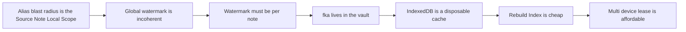
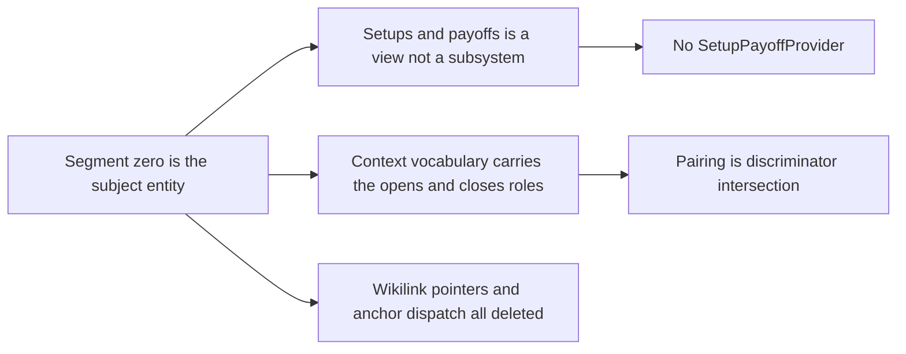
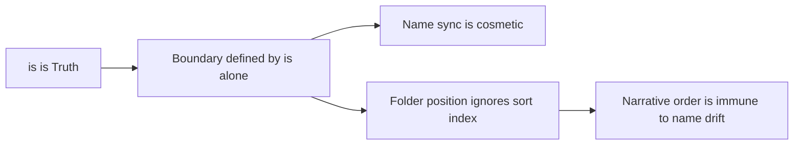
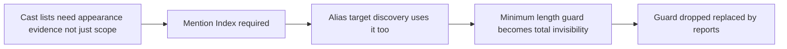
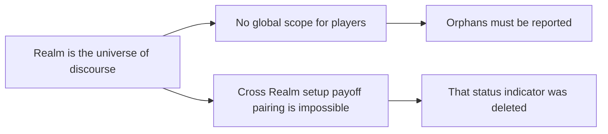

# Appendix B: Decision Record

IBIS graphs for every non-trivial decision in the Narradin design. Appendix A lists
_what_ was rejected; this appendix records _why_, and — more importantly — _what else
depends on it_.

## Numbering registry

Check here before assigning a new `B.N`. Every number currently in use, its title, and
the file that holds it:

| B.N  | Title                                   | File                                       |
| ---- | --------------------------------------- | ------------------------------------------ |
| B.1  | Boundary Identity                       | `04-structural-boundaries.md`              |
| B.2  | Scope, Islands, and the Membrane        | `05-scope.md`                              |
| B.3  | Narrative Ordering                      | `07-hierarchy-and-narrative-order.md`      |
| B.4  | Where the Alias Ledger Lives            | `10-the-alias-manager.md`                  |
| B.5  | Alias Replacement Safety                | `10-the-alias-manager.md`                  |
| B.6  | Inline Property Grammar                 | `09-entity-properties.md`                  |
| B.7  | Architecture                            | `12-architecture.md`                       |
| B.8  | Compiler Output                         | `08-the-compiler.md`                       |
| B.9  | POV as a Positional Value               | `16-views.md`                              |
| B.10 | Load-Bearing Chains                     | `appendix-b-notation-and-cross-cutting.md` |
| B.11 | Open Issues                             | `15-open-questions.md`                     |
| B.12 | Maintaining This Appendix               | `appendix-b-notation-and-cross-cutting.md` |
| B.13 | Editorial Property Grammar              | `09-entity-properties.md`                  |
| B.14 | RealmId Synchronization                 | `12-architecture.md`                       |
| B.15 | In-Memory Cache Ownership and Lifecycle | `12-architecture.md`                       |
| B.16 | Developer Logging and Metrics           | `appendix-b-notation-and-cross-cutting.md` |
| B.17 | Narrative Hierarchy Structure           | `02-configuration-model.md`                |
| B.18 | Self-Write Suppression Retirement       | `12-architecture.md`                       |

**Next available number: B.19**

## Reading the graphs

| Shape           | IBIS role                                                   |
| --------------- | ----------------------------------------------------------- |
| `{{ hexagon }}` | **Issue** — a question that had to be answered              |
| `[ rectangle ]` | **Position** — a candidate answer                           |
| `( rounded )`   | **Argument** — PRO or CON, attached to a position           |
| `([ stadium ])` | **Decision** — the position taken. Reached by a thick arrow |

A dotted arrow means _this decision forced that issue to be reopened_.

When a graph node's text says "scope" generically, it refers to the term formally defined
in §5.5 Scope Taxonomy — check context (blast radius, watermark, replacement, etc.) to
determine which named scope applies.

**Before overturning any decision, check §B.10.** Several are load-bearing for
decisions taken later, and reversing one in isolation reintroduces a problem that was
solved elsewhere.

---

## B.10 Load-Bearing Chains

Which decisions cannot be reversed alone.

---

## B.12 Maintaining This Appendix

When a decision is revisited, **do not edit the graph in place.** Add a new Issue node
whose incoming dotted arrow comes from the decision that forced the reopening, and mark the superseded Decision node as such. The value here is the trail, not the current state — the current state is the spec.

Every entry in Appendix A should resolve to a CON node somewhere in this appendix. If it does not, the rejection was never argued and is worth re-examining.

---

## B.16 Developer Logging and Metrics

**Chain:** I1 two independent axes → I2 storage location → I3 plain text vs markdown → I4
redaction convention → I5 library vs hand-written implementation.

```mermaid
flowchart LR
    subgraph S1["I1: Should dev time code stripping and runtime diagnostic logging be the same gated mechanism or two independent axes"]
        I1{{Should dev time code stripping and runtime diagnostic logging be the same gated mechanism or two independent axes}}
        P1[One system gate the runtime logger behind DEV the same way dev only code is stripped]
        P2[Two independent axes DEV stays a build time strip the runtime logger is separate and ships in production]
        I1 --> P1
        I1 --> P2
        C1(CON DEV code never reaches a production build so a real user hitting a real bug could never produce a log)
        P1 --> C1
        A1(PRO Real users need to capture logs when they hit real bugs which requires the logger to exist in the shipped bundle)
        A2(PRO DEV keeps its narrow job invariant assertions and test harness hooks too expensive to run for every user)
        P2 --> A1
        P2 --> A2
        D1([DECIDED two independent axes DEV unchanged a new LoggerPort ships in production silent until the user opts in])
        P2 ==> D1
    end
    D1 -.-> I2
    subgraph S2["I2: Where should the log file be stored"]
        I2{{Where should the log file be stored}}
        P2a[OS filesystem outside the vault]
        P2b[Network endpoint]
        P2c[Inside the vault under a narradin logs subfolder]
        I2 --> P2a
        I2 --> P2b
        I2 --> P2c
        C2a(CON Outside the vault and harder for a non technical user to find and attach to a bug report)
        C2b(CON Violates the no hidden telemetry no network transport constraint AGENTS is binding on)
        P2a --> C2a
        P2b --> C2b
        A2a(PRO Inside the vault so the user already knows where their own files live)
        A2b(PRO No network transport at all satisfies the local offline default)
        P2c --> A2a
        P2c --> A2b
        D2([DECIDED narradin logs narradin dot log inside the vault])
        P2c ==> D2
    end
    D2 -.-> I3
    subgraph S3["I3: Should the log file be markdown or plain text"]
        I3{{Should the log file be markdown or plain text}}
        P3a[Markdown]
        P3b[Plain text]
        I3 --> P3a
        I3 --> P3b
        C3a(CON Would be picked up by Narradin own markdown indexer and compiler and treated as a concept note)
        P3a --> C3a
        A3a(PRO Sits outside every markdown only pipeline Narradin owns so the log can never be misread as narrative content)
        P3b --> A3a
        D3([DECIDED plain text narradin dot log not markdown])
        P3b ==> D3
    end
    D3 -.-> I4
    subgraph S4["I4: How should vault derived content appearing in a log line be handled"]
        I4{{How should vault derived content appearing in a log line be handled}}
        P4a[No special marking log everything plainly]
        P4b[Wrap vault derived content in guillemets leave structural information unwrapped]
        I4 --> P4a
        I4 --> P4b
        C4a(CON A bug report pasted into a public issue tracker could leak private vault content the user never meant to share)
        P4a --> C4a
        A4a(PRO A single find and replace pass between the guillemet characters strips every vault derived value before sharing)
        A4b(PRO Structural information timings counts stack traces stays intact because it was never wrapped)
        P4b --> A4a
        P4b --> A4b
        D4([DECIDED guillemet wrapping is the callers responsibility core code wraps vault derived arguments before calling log])
        P4b ==> D4
    end
    D4 -.-> I5
    subgraph S5["I5: Should the logger be a library or hand written and where does it sit in the architecture"]
        I5{{Should the logger be a library or hand written and where does it sit in the architecture}}
        P5a[Adopt tslog]
        P5b[Adopt LogLayer]
        P5c[Hand written logger behind a LoggerPort with an Obsidian backed adapter]
        I5 --> P5a
        I5 --> P5b
        I5 --> P5c
        C5a(CON Its value add is pretty printing and multi transport fan out neither applies to one plain text vault file)
        C5b(CON A facade over other loggers duplicates the seam LoggerPort already exists to provide)
        C5c(CON Neither library ships a transport for writing into an Obsidian vault so that adapter gets hand written regardless)
        P5a --> C5a
        P5a --> C5c
        P5b --> C5b
        P5b --> C5c
        A5a(PRO Consistent with the existing MetadataPort FileContentPort hexagon ports shape core depends on the interface never the adapter)
        A5b(PRO No unbundled runtime dependency per AGENTS bundle everything into main dot js)
        P5c --> A5a
        P5c --> A5b
        D5([DECIDED hand written LoggerPort plus ObsidianLoggerAdapter no logging library dependency])
        P5c ==> D5
    end
```

**Why this is cross-cutting, not a Part.** No single spec Part owns "developer
diagnostics" the way Part 8 owns compilation or Part 10 owns aliasing — logging is a
concern that will eventually touch every layer, so it lives here alongside B.10/B.12
rather than being force-fit into an unrelated topic file.

**Consequences to honour.** `LoggerPort` (`src/ports/logger-port.ts`) and its adapter
(`ObsidianLoggerAdapter`, `src/adapters/`) are documented in
`docs/spec/12-architecture.md` §12.9 alongside `MetadataPort`/`FileContentPort`/
`PersistencePort`/`VaultWritePort` — D1/D5 together are why it is a fifth port rather
than a special case. D4's redaction convention is enforced by convention and code
review, not by any automatic detection in the port or adapter — see `LoggerPort`'s doc
comment. Every CON node above already has a matching row in Appendix A (usage
analytics/telemetry; the `tslog`/`LogLayer` rejection) per the §B.12 cross-check rule.
